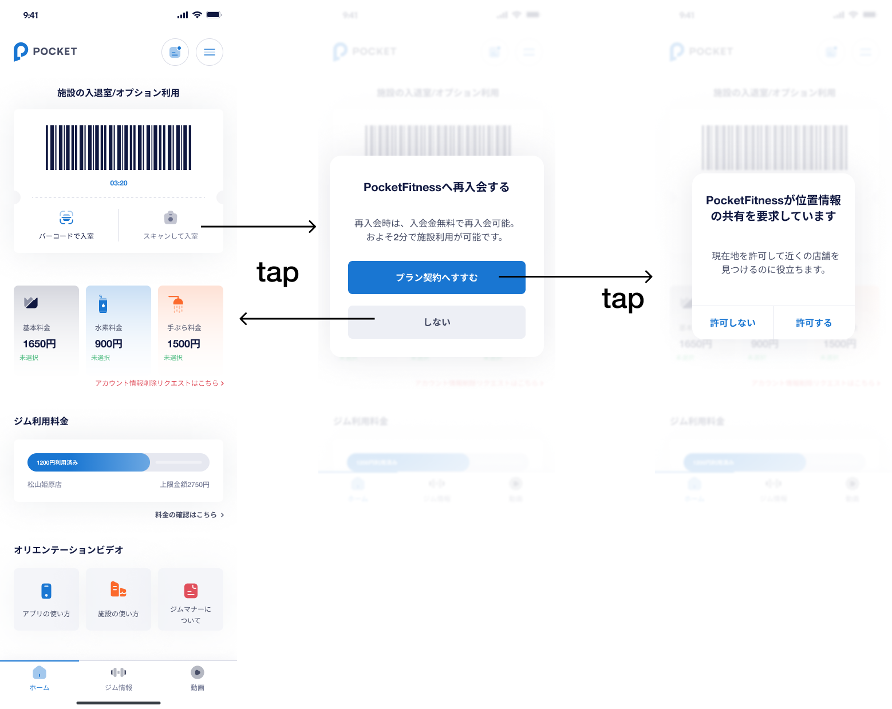
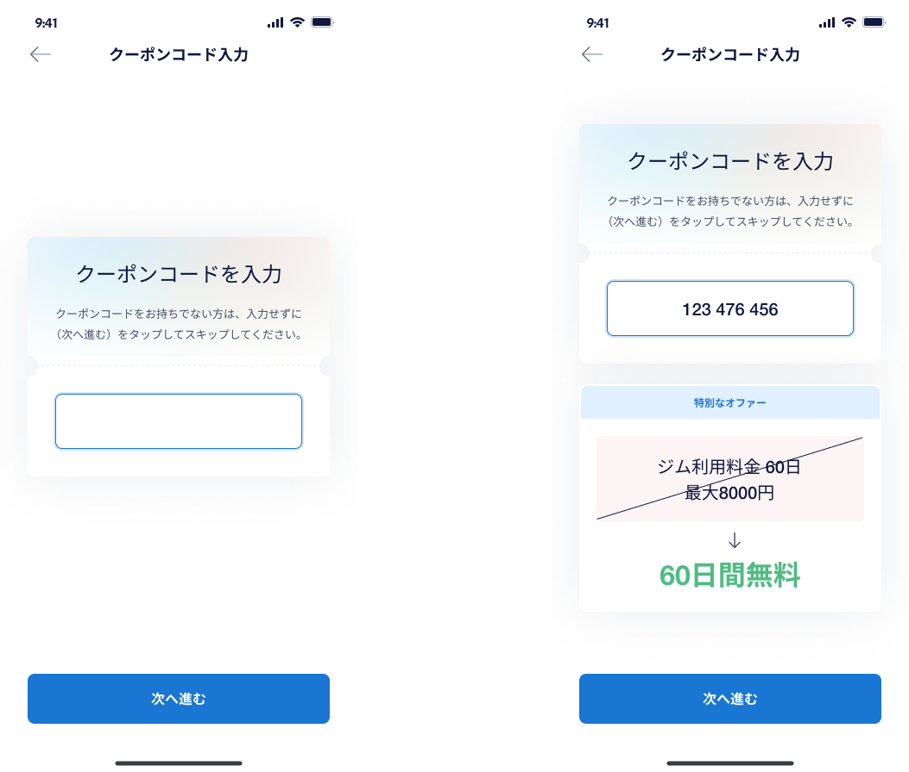
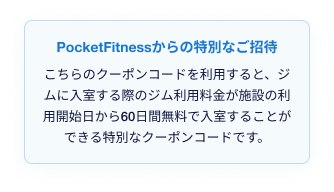
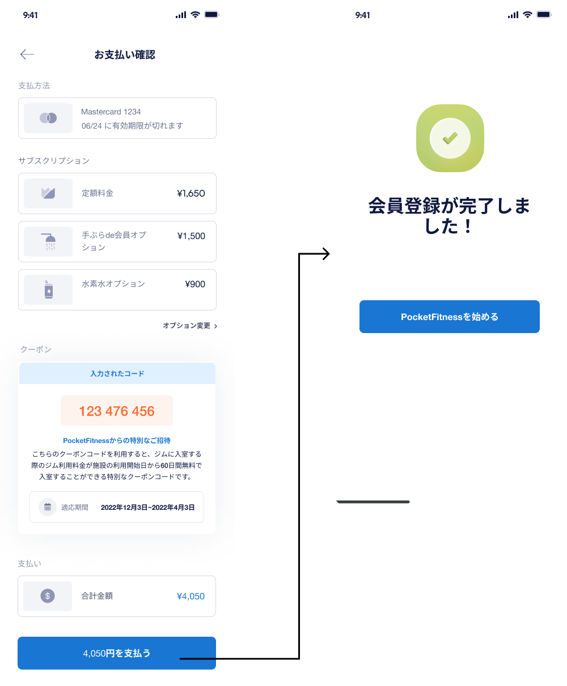

# 【MB】 **Re-register**

- Sau khi user unsubscribe và hết thời hạn sử dụng basic plan, thì mỗi lần mở app sẽ hiện pop-up đăng kí lại. Hoặc ở màn hình **Home** nếu user tap vào nút `カメラでQRコードを読み取る場合はこちらをTAP` thì cũng sẽ hiện pop-up đăng kí lại.
    - Khi tap nút `プラン契約へすすむ`,
        - Nếu device đã có quyền truy cập vị trí thì redirect qua màn hình **店舗選択** . Tham khảo trang **会員登録** 
        - Nếu device chưa có quyền truy cập vị trí thì hiển thị pop-up xin quyền truy cập vị trí. tap vào nút `許可する` hoặc nút `許可しない` thì đều redirect qua màn hình **店舗選択** . Tham khảo trang **会員登録** 
    - Nếu tap nút `しない` thì sẽ quay lại màn hình **Home** 

## Màn hình **店舗選択**

- Tham khảo trang **会員登録** 

## Màn hình **プラン選択**

- Tham khảo trang **会員登録** 

## Màn hình  **オプション選択** - Select option

### Định nghĩa các thành phần có Action

##### 戻る - Back `Button`

- Tap nút này sẽ quay lại màn hình **プラン選択**

##### 手ぶらde会員 - Tebura `Block`

- Hiển thị thông tin option tebura của cửa hàng mà user đang chọn. Tuỳ vào mỗi cửa hàng mà thông tin chi tiết option sẽ khác nhau, có thể chỉnh sửa ở site manager
- API data：
    - `手ぶらde会員`：　tên option
    - `1500`：　tiền tháng
    - `ウェア、シューズ、タオルのレンタルが使い放題。手ぶらでフィットネスが楽しめます！`：　description

###### 水素水 - Water `Block`

- Hiển thị thông tin option nước của cửa hàng mà user đang chọn. Tuỳ vào mỗi cửa hàng mà thông tin chi tiết option sẽ khác nhau, có thể chỉnh sửa ở site manager
- Mặc định option này sẽ được chọn
- API data：：
    - `水素水`tên option
    - `900`tiền tháng
    - `フィットネスの効果を高める水素水が飲み放題。より健康で美しい身体を手に入れることができます！`：　description
    - `※ 専用のボトルの別途購入をお願いしています。`：　description

##### 次へ進む - Next `Button`

- Tap nút này sẽ hiển thị calendar để user chọn ngày bắt đầu
    - Nếu cửa hàng đang chọn chưa OPEN thì hiển thị icon này   . Nếu cửa hàng đang chọn đã OPEN rồi thì không hiển thị icon đó
    - Nếu cửa hàng đang chọn chưa OPEN thì mặc định ngày bắt đầu là ngày OPEN của phòng gym. Nếu cửa hàng đang chọn đã OPEN thì mặc định ngày bắt đầu là ngày hôm nay
    - Khoảng thời gian mà user có thể chọn: (today/open day + 1 tháng)
    - Tap nút `OK` sẽ redirect qua màn hình **チェックと支払い** 
    - Nếu tap vào vùng ngoài calendar thì đóng calendar và quay lại màn hình **オプション選択**

### Error List

`None`

## Màn hình **Enter coupon**

- Nếu user sử dụng coupon để tham gia phòng gym thì từ ngày bắt đầu sử dụng gym、 user sẽ được miễn phí tiền mở cửa theo số ngày ghi trên coupon

### Định nghĩa các thành phần có Action

##### 戻る - Back `Button`

- Tap nút này sẽ quay lại màn hình **Select option**

##### クーポン入力 - Enter coupon `Input`

- Không bắt buộc
- Không nhập được quá 9 kí tự9
- Sau khi nhập 9 kí tự sẽ tự động gọi API để check coupon
    - Nếu coupon hợp lệ sẽ hiển thị block chi tiết coupon phía dưới input này
    - Nếu coupon không hợp lệ hoặc hết hạn sẽ hiển thị message lỗi dưới input
- Nếu block chi tiết coupon đang hiển thị mà xoá code(1 kí tự hoặc xoá hết) thì sẽ ẩn block chi tiết coupon đi

##### クーポン詳細- Coupon detail `Block`

- Chỉ được hiển thị nếu user nhập mã coupon đúng
- API data:
    - `PocketFitnessからの特別なご詳細` : Title của coupon campaign đã set ở STEP1 tạo coupon campaign ở CMS
    - `こちらのクーポンコードを利用すると、ジムに入室する際のジム利用料金が施設の利用開始日から60日間無料で入室することができる特別なクーポンコードです。`：Detail của coupon campaign đã set ở STEP1 tạo coupon campaign ở CMS

##### 次へ進む - Next `Button`

- Tap nút này sẽ validate thông tin user nhập
- Nếu không có lỗi sẽ redirect qua màn hình  **チェックと支払い** 

### Error List

#### Item Error

- 1−8 kí tự： `無効のクーポンコードが入力されました。`
- Coupon không hợp lệ：`無効のクーポンコードが入力されました。`
- Coupon hết hạn：`期限切れのクーポンコードが入力されました。`

## Màn hình  **チェックと支払い** 

### Định nghĩa các thành phần có Action

##### 戻る - Back `Button`

- Tap nút này sẽ quay lại màn hình **Enter coupon** 

##### カード番号   `Number`

- Required, 16 số
- Nhập đủ 16 số, nếu check được card nào thì sẽ hiển thị icon của card và icon checked

##### 名前  `Text`

- Required, Max 25 chữ alphabet

##### CVC   `Number`

- Required, 3 số

##### 有効期限   `Date`

- Required, 4 số, format [MM/YY]

##### 次へ進む   `Button`
- Tap nút này thì
    - Validate input, nếu không có lỗi thì gọi API Stripe để update lại thẻ chính của user
    - Sau khi xử lí xong thì redirect qua màn hình  **レビューとチェックアウト** 

### Error List

#### Item Error

##### カード番号  `Number`

- Required: `カード番号が必要です`
- 16 số: `カード番号を16桁で入力してください`

##### 名前  `Text`

- Required: `名前が必要です`
- 25 chữ alphabet: `名前をアルファベット２５文字以内で入力してください`

##### CVC   `Number`

- Required: `CVCが必要です`
- 3 số: `CVCを３桁で入力してください`

##### 有効期限 `Date`

- Required: `有効期限が必要です`
- 4 số: `有効期限を４桁で入力してください`

#### Screen Error

- Invalid card: `クレジットカード情報が誤っています。再入力してください。`

## Màn hình  **レビューとチェックアウト**

### Định nghĩa các thành phần có Action

##### 戻る - Back `Button`

- Tap nút này sẽ quay lại màn hình **チェックと支払い** 

##### 支払い方法 `Block`

- Hiển thị thông tin card user đã nhập ở bước trước

###### サブスクリプション `Block`

- Hiển thị thông tin plan/option mã user đang chọn
- Tap vào nút `オプション変更` sẽ quay lại màn hình　**オプション選択** . Ở màn hình **オプション選択** phần calendar nếu tap nút `OK` sẽ quay lại màn hình này

##### クーポン- Coupon `Block`

- Hiển thị thông tin coupon mà user đã nhập vào
- APIデータ：
    - `123 476 456`：　Mã coupon
    - `PocketFitnessからの特別なご詳細` : Title của coupon campaign đã set ở STEP1 tạo coupon campaign ở CMS
    - `こちらのクーポンコードを利用すると、ジムに入室する際のジム利用料金が施設の利用開始日から60日間無料で入室することができる特別なクーポンコードです。`：Detail của coupon campaign đã set ở STEP1 tạo coupon campaign ở CMS
    - `2022年12月3日~2022年4月3日`：　Thời gian free checkin khi sử dụng coupon. Format: YYYY年mm月dd日 ~ YYYY年mm月dd日

##### 支払い `Block`

- Hiển thị số tiền cần trả

##### XXXX円を支払う `Button`

- Tap nút này sẽ gọi API Stripe để charge tiền, nếu charge thành công thì redirect qua màn hình **会員登録完了** 

### Error List

#### Screen Error

- Thanh toán thất bại:   `カードを処理できませんでした。もう一度お試しいただくか、別のカードをお試しください。`

## Màn hình **会員登録完了**

- Tham khảo trang **会員登録** 