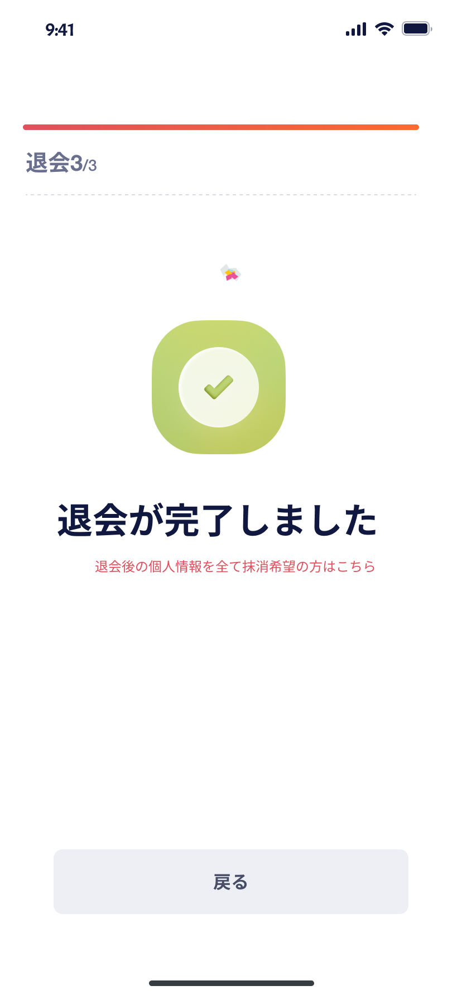
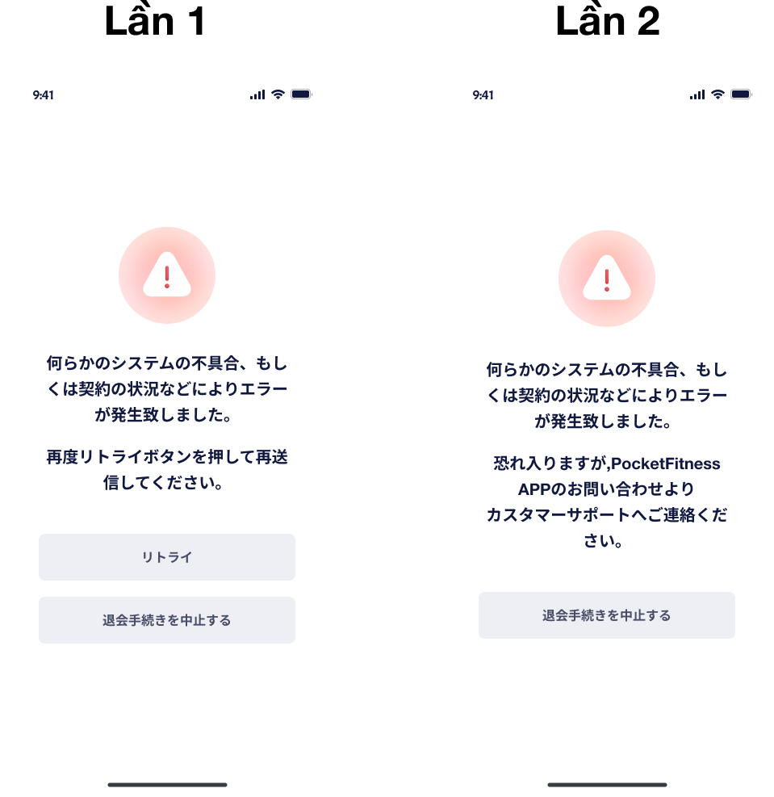
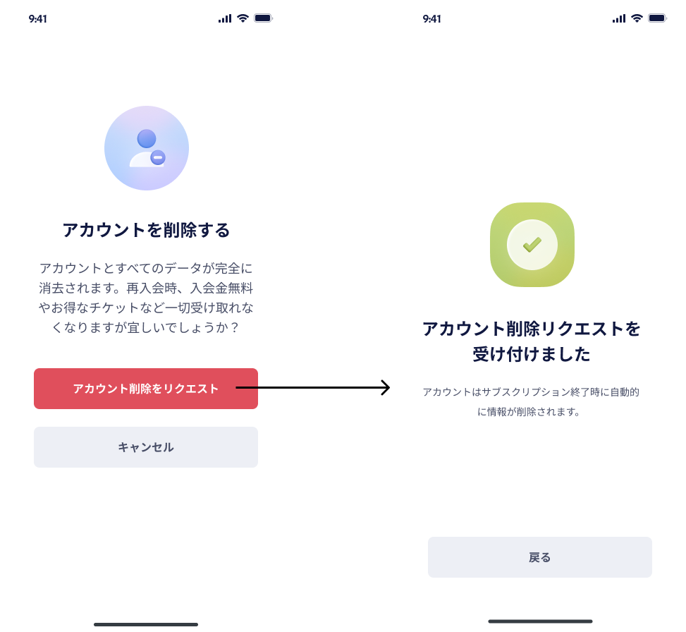
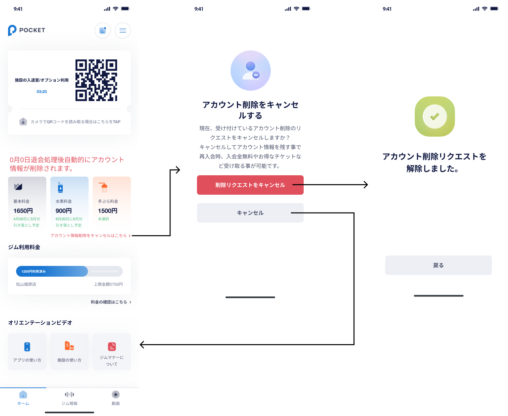

# 【MB】 **Unsubscribe & account deletion**

- Trong FAQ của màn hình **Customer support** , khi tap vào nút `退会する`　thì sẽ bắt đầu flow un-subscribe. Sau khi unsubscribe xong thì user có thể yêu cầu xoá tài khoản. Sau khi thời hạn sử dụng của basic plan hết thì hệ thống sẽ tự động xoá tài khoản của user đó

## Màn hình **Unsubscribe step 1** 

### Định nghĩa các thành phần có Action

##### 戻る- Back `Button`

- Tap nút này sẽ quay lại màn hình **Customer support** 

##### 理由一覧 - Lí do unsubscribe `Checkbox`

- Hiển thị những lí do vì sao unsubscribe, list này lấy từ API. Có thể chọn nhiều options

##### その他- other `Input`

- Nhập tối đa 255 kí tự
- Input này có thể không cần nhập cũng được

##### 次へ進む `Button`

- Phải check ít nhất 1 option hoặc nhập input other thì nút này mới enable. Input nhập space sẽ không được tính
- Nếu tap nút này thì
    - Validate data
    - Nếu không có lỗi thì redirect qua màn hình **Unsubscribe step 2** 

### Error List

#### Item Error

- Max： `255文字以内で入力してください`

## **Unsubscribe step 2** 画面

### Định nghĩa các thành phần có Action

##### 戻る - Back `Button`

- Tap nút này sẽ quay lại màn hình **Unsubscribe step 1** 

##### 退会前のプラン確認 - Confirm detail `Block`

- APIデータ：
    - `2022年12月22日`: YYYY年mm月dd日　ngày cuối cùng sử dụng basic plan

##### 次へ進む - Next `Button`

- Tap nút này sẽ gọi API Stripe để unsubscribe tất cả các plan/option mà user đang đăng kí và update lại DB
    - Nếu thành công thì redirect qua màn hình **Unsubscribe success** 
    - Nếu có lỗi thì redirect qua màn hình **Unsubscribe error** 
- Sau khi unsubscribe xong thì ngày sử dụng của option cũng sẽ update lại giống vs basic plan. Ví dụ có 1 case như sau:
    - Nếu user đăng kí ngày 2022/10/20, không chọn campaign và đăng kí 2 option.
    - Mặc dù option được free 2 tháng tuy nhiên vào ngày 2022/10/25 user unsubscribe thì ngày cuối cùng sử dụng của basic plan, tebura, water sẽ đều là ngày 2022/11/19

### Error List

`None`

## Màn hình **Unsubscribe success** 

### Định nghĩa các thành phần có Action

##### アカウント削除希望- Request delete account `Button`

- Tap nút này sẽ redirect qua màn hình **Request account deletion** 

##### 戻る - Back `Button`

- Tap nút này sẽ quay lại màn hình **Home** 

### Error List

`None`

## Màn hình **Unsubscribe error** 

- Nếu bị lỗi thì user có thể thử unsubscribe lại 1 lần nữa, nếu vần lỗi thì sẽ huỷ unsubscribe và quay lại màn hình **Home**

### Định nghĩa các thành phần có Action 

##### リトライ - Retry `Button`

- Tap nút này sẽ thử unsubscribe lại lần nữa.
    - Nếu thành công thì redirect qua màn hình **Unsubscribe success** 
    - Nếu có lỗi thì xoá nút này và quay lại màn hình **Unsubscribe error** 

##### 退会手続きを中止する - Cancel `Button`

- Tap nút này sẽ quay lại màn hình **Home** 

### Error List

`None`

## Màn hình **Request account deletion** 

### Định nghĩa các thành phần có Action

##### アカウント削除をリクエスト- Request account deletion `Button`

- Tap nút này sẽ nhận request xoá tại khoản của user và hiển thi màn hình `アカウント削除リクエストを受け付けました` 
    - Tap nút `戻る` sẽ quay lại màn hình **Home** 
- Sau khi ngày cuối cùng sử dụng basic plan kết thúc thì chạy 1 con batch để chuyển user đó qua 1 bảng khác và clear hết sesion token của user đó
- Sau khi phần xử lí xoá tài khoản xong thì nếu user mở app sẽ bị logout, và user có thể dùng sdt cũ để đăng kí mới

##### キャンセル - Cancel `Button`

- Tap nút này sẽ quay lại màn hình **Home** 

### Error List

`None`

## Màn hình **Cancel request account deletion** 

### Định nghĩa các thành phần có Action

##### 削除リクエストをキャンセル - Cancel request `Button`

- Tap nút này sẽ huỷ request xoá tài khoản của user và hiển thị màn hình `アカウント削除リクエストを解除しました。` 
    - Tap nút `戻る` sẽ quay lại màn hình **Home** 

##### キャンセル - Cancel `Button`

- Tap nút này sẽ quay lại màn hình **Home** 

### Error List

`None`