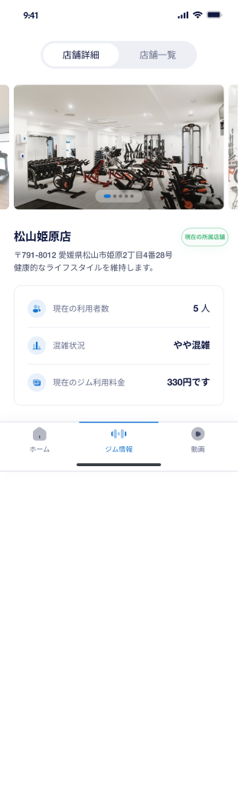
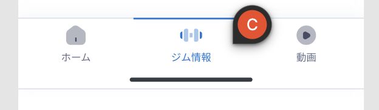

# 【MB】 ** Gym page  

## **103.1 Gym**  `Gym`
- Sau khi tap vào tab GYM  (icon thứ 2 trên tab bar) Màn hình sẽ được chuyển đến trang GYM

### Định nghĩa các thành phần có Action 

##### **103.1.1** Top tab bar - bao gồm 2 Tab Item  - Gym Details(**店舗詳細**) và Gym List (**店舗一覧**)

- Hiện hiển thị Details thì hightlight (**店舗詳細**)
- Sau khi tap vào (店舗詳細) :
    - Nếu đang ở Details thì không làm gì.
    - Nếu đang ở Gym List thì chuyển lại trang details và highlight (**店舗詳細**).

- Sau khi tap vào (店舗一覧)
    - Nếu đang ở Gym List thì không làm gì.
    - Nếu đang ở Details thì chuyển lại trang Gym List và highlight (**店舗一覧**). **103.3**

##### **103.1.2** Gym images slider - bao gồm Slider hình ảnh của phòng gym có page indicator 

- Slider cho phép vuốt ngang trái phải để thay đổi hình ảnh.
- Page indicator sẽ highlight theo vị trí hiện tại của ảnh.
- Tap lên một ảnh sẽ mở **Popup Slider** cho phép xem hình ảnh to hơn.
- QA - Slider có hiệu ứng circle không ? trong trường hợp slider có ít hơn 2 ảnh không đảm bảo circle thì giải quyết như thế nào ?
##### Bottom Tab bar  **Tab Bar**

- Tap để chuyển giữa các trang Home - Gym - Videos
- Highlight icon và label tương ứng với Page hiện tại.

## **103.2 Image Zoom**  `Image Zoom`
-  Sau khi tap vào image Slider trên 103.1 sẽ xuất hiện popup gồm slider khác cho phép xem hình ảnh lớn hơn. 
- Không show Image Zoom nếu không có hình ảnh nào cần xem.

##### **103.2.1** Image Slider
- Cho phép lướt ngang để chuyển giữ các hình ảnh.
- Page indicator sẽ thể hiện vị trí ảnh hiện tại trên slider (current/lenght  vị trí bắt đầu là 1)

##### **103.2.2** Close button.
- Cho phép thoát khỏi màn hình Image Zoom và trở về ngữ cảnh hiện tại.

## **103.3 Gym List**  `Gym List`

