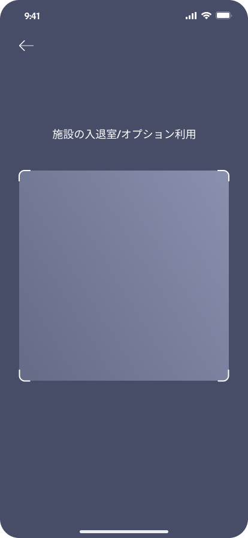
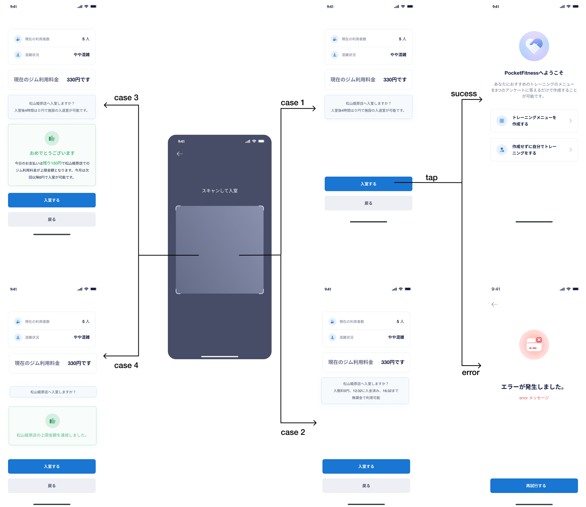
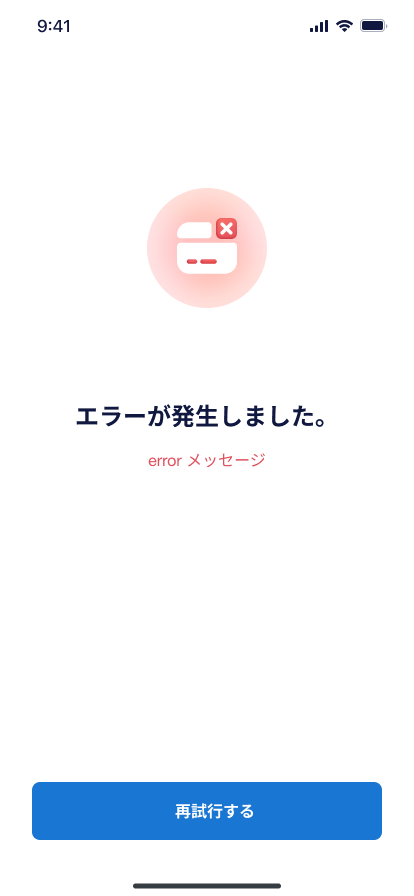
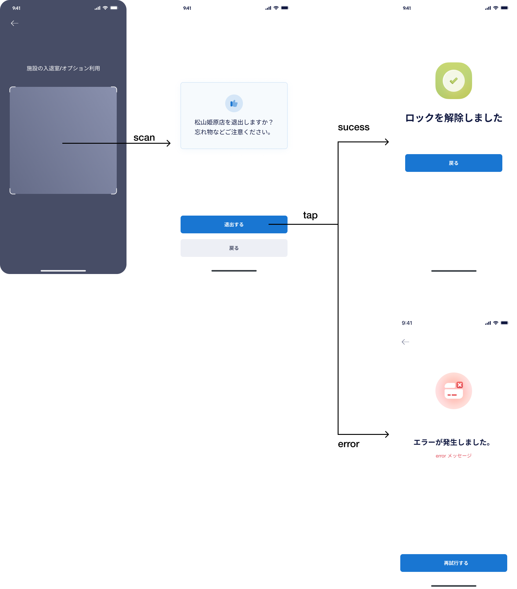

# 【MB】 **チェックイン**

- ユーザーがQRコードをスキャンして、またバーコードでかざして、Pocketサービスを利用することができます：
    - チェックイン
    - 手ぶら会員オプション
    - 水素水
    - チェックアウト
- ナビゲーションメーニューの１番目アイコンをタップしたら、**ホーム** 画面に移動される

## **ホーム** 画面

### 項目／イベント定義

##### ユーザーのバーコード`区画`

- **ホーム**の画面に入ると、ユーザのバーコードが生成され、表示される。バーコードの有効期限は５分です。有効期限が切れたら、自動的に更新される。
- このバーコードは、`Gate Keeper`のアプリにかざして、Pocketサービスを利用する。

##### バーコードで入室 `ボタン`

- 無効ボタン

##### スキャンして入室   `ボタン`

- タップしたら、
  - デバイスにカメラの許可が付与されている場合は、**QRコードスキャン** 画面に移動される。
  - デバイスにカメラの許可が付与されない場合は、カメラの許可をrリクエストするポップアップが表示される。許可するボタンタップしたら、**QRコードスキャン** 画面に移動される。許可しないボタンをタップしたら、**ホーム** 画面に戻る

##### 現在お客様がご利用中の月額プラン-基本料金 `区画`

- 基本料金プランの状態が表示される。契約・解約状態、月額料金、利用期間、引き落とし日付を含める。
- 青色のテキストは、ユースケースに応じて異なる方法で表示される：
  - 3ヶ月キャンペーン：`3ヶ月間の基本料金支払い済み。mm月dd日に〇月分引き落とし予定`
  - 6ヶ月キャンペーン：`6ヶ月間の基本料金支払い済み。mm月dd日に〇月分引き落とし予定`
  - 通常：`mm月dd日に〇月分引き落とし予定`
  - 退会したが、まだ利用期間中：`mm月dd日に退会処理を受け付けました。mm月dd日まで利用可能です。`
  - 退会済み：`未選択`

##### 現在お客様がご利用中の月額プラン-水素水・手ぶら `区画`

　

- 水素水・手ぶらオプションの状態が表示される。契約・解約状態、月額料金、利用期間、引き落とし日付を含める。
- 青色のテキストは、ユースケースに応じて異なる方法で表示される：
  - 無料期間中：`現在オプション無料期間中。mm月dd日に〇月分引き落とし予定。*オプションの解約希望の場合、事前にプラン変更を行なってください`
  - 通常：`mm月dd日に〇月分引き落とし予定`
  - 解約したが、まだ利用期間中：`mm月dd日に解約処理を受け付けました。mm月dd日まで利用可能です。`
  - 解約済み：`未選択`

##### ジム利用料金 `区画`

- APIデータ：
  - `1200`：利用済み料金
  - `2750`：店舗の上限料金
  - `松山姫原店`：店舗名
- ユーザーが今月に利用しているすべての店舗の利用料金が表示される。
- 上限料金は月ごとに計算される
- 今月の上限料金に達成したら、無料で入室出来る。
- `料金の確認はこちら`のボタンをタップしたら、**料金の確認** 画面に移動される。

##### オリエンテーションビデオ `区画`

- 各アイコンをタップしたら、ビデオが再生される
  - アプリの使い方：未確定
  - アプリの使い方：未確定
  - ジムマナーについて：未確定

### エラー一覧（Error List）

`None`

## **QRコードスキャン** 画面

### 項目／イベント定義

##### 戻る`ボタン`

- このボタンをタップしたら、**ホーム**の画面に戻る

##### QRコードスキャンフレーム`フレーム`

- この画面に入ると、QRコードが自動的にスキャンされる
- QRコードを正常に読み取った後、**サービス利用確認** 画面に移動される。QRコードに応じて異なる画面に移動される。QRコードは４つパータンがあります：
  - 入れ口ーチェックイン
  - 手ぶら
  - 水素水
  - 出口ーチェックアウト

### エラー一覧（Error List）

`None`

## **サービス利用確認 (入れ口)** 画面

- 今画面にて、4つパータンが想定される。
  - ケース１：通常
  - ケース２：チェックアウトを問わず、４時間以内再入室
  - ケース３：最終課金。支払う金額が現在利用料金より少ない
  - ケース４：上限料金達成後

### 項目／イベント定義

##### 店舗情報　`区画`

- API データ
  - `5`：現在利用者数
  - `やや混雑`：現在利用者数に対する混雑状況。まだ設定されない場合は、`未設定`で表示される
  - `300`：現在利用者数に対する利用料金。まだ設定されない場合は、`300円です`の代わりに`未設定`で表示される

##### 入室確認情報　`青い背景区画`

- ケース１・３・４：デーザイン通りに表示する
- ケース２：
  - `12:32`：支払いして、初回入室時間
  - `16:32`：無料で入室できる最終時間

##### 上限金額情報　`緑背景区画`

- ケース１・２：この区画が表示されない表示されない
- ケース３- API データ：
  - `150`：支払う金額
  - `松山姫原店`：店舗名
- ケース４- API データ：
  - `松山姫原店`：店舗名

##### 入室する`ボタン`

- このボタンをタップしたら、以下の処理順で処理される：   
  - スマートロックが接続を確認する処理。接続されない場合は、**処理エラー** 画面に移動される。
  - スマートロックの接続が確認出来たら、StripeにAPIを呼び出して、決済する。決済出来ない場合は、**処理エラー** 画面に移動される。**ケース２の場合は、決済不要**
  - 決済出来たら、入れ口のスマートロックを解錠する。解錠できたら、**トレーニングメーニュー作成** 画面に移動される。
- ユーザーがボタンをタップして、ドアを開けたが、支払う金額が現在のジム利用料金と異なる場合でも、画面に表示されている金額が請求される。

##### 戻る`ボタン`

- このボタンをタップしたら、**ホーム**の画面に戻る

### エラー一覧（Error List）

`None`

## **処理エラー** 画面

### 項目／イベント定義

##### 戻る`ボタン`

- このボタンをタップしたら、**ホーム**の画面に戻る

##### エラーメッセージ　`区画`

- エラーメッセージが表示する。２つパータンが想定する：
  - スマートロック切断エラー：`内部サーバーエラー`
  - 決済出来ないエラー：APIに返されたエラーメッセージをそのまま表示する

##### 再試行する　`ボタン`

- **サービス利用確認　(入れ口)**　画面の`入室するボタン`と同じ

### エラー一覧（Error List）

#### 画面エラー（Screen Error）

- スマートロック切断エラー：`内部サーバーエラー`
- 決済出来ないエラー：APIに返されたエラーメッセージをそのまま表示する

## **トレーニングメーニュー作成** 画面

### 項目／イベント定義

##### トレーニングメニューを作成する `ボタン`

- このボタンをタップしたら、**プラン質問１**画面に移動される

##### 作成せずに自分でトレーニングをする `ボタン`

- このボタンをタップしたら、チェックイン後の**ホーム**画面に戻る

### エラー一覧（Error List）

`None`

## **サービス利用確認 (手ぶら)** 画面

- 今画面にて、2つパータンが想定される。
  - ケース１：手ぶら会員オプション契約しているユーザー
  - ケース２：手ぶら会員オプション契約していないユーザー。毎回利用したら、500円がチャージされる。

### 項目／イベント定義

##### 理容料金　`区画`

- ケース２のみ
- API データ
  - `500`：理容料金。入金出来てから４時間以内の場合は、`0`で表示される

##### プラン変更　`ボタン`

- ケース２のみ
- このボタンをタップしたら、**プランの変更** 画面に移動される。**画面ホーム＆メニュー（Home Menu)** ページ参考。

##### 使用する`ボタン`

- このボタンをタップしたら、以下の処理順で処理される：   
  - スマートロックが接続を確認する処理。接続されない場合は、**処理エラー** 画面に移動される。
  - スマートロックの接続が確認出来たら、StripeにAPIを呼び出して、決済する。決済出来ない場合は、**処理エラー** 画面に移動される。**ケース１の場合は、決済不要**
  - 決済出来たら、手ぶらのスマートロックを解錠する。解錠できたら、解錠済み確認の画面に移動される。

##### 戻る`ボタン`

- このボタンをタップしたら、**ホーム**の画面に戻る

### エラー一覧（Error List）

`None`

## **サービス利用確認 (水素水)** 画面

- 今画面にて、2つパータンが想定される。
  - ケース１：水素水オプション契約しているユーザー
  - ケース２：水素水オプション契約していないユーザー。水素水オプション利用できない

### 項目／イベント定義

##### 使用する`ボタン`

- ケース1のみ
- このボタンをタップしたら、以下の処理順で処理される：   
  - 水素デバイスが接続を確認する処理。接続されない場合は、**処理エラー** 画面に移動される。
  - 水素デバイスの接続が確認出来たら、水素のロックを解除する。ロックが解除できたら、解除できた確認の画面に移動される。

##### 戻る`ボタン`

- このボタンをタップしたら、**ホーム**の画面に戻る

### エラー一覧（Error List）

`None`

## **サービス利用確認 (出口)** 画面

### 項目／イベント定義

##### 使用する`ボタン`

- このボタンをタップしたら、以下の処理順で処理される：   
  - スマートロックが接続を確認する処理。接続されない場合は、**処理エラー** 画面に移動される。
  - スマートロックの接続が確認出来たら、出口のスマートロックを解錠する。解錠できたら、解錠済み確認の画面に移動される。

##### 戻る`ボタン`

- このボタンをタップしたら、**ホーム**の画面に戻る

### エラー一覧（Error List）

`None`