# 【MB】 **ホーム＆メーニュー** `Home & Menu`

- ユーザーが会員登録しているかどうかによって、ホームページのレイアウトが異なります。
    - 会員登録しないユーザー： **ホーム - ビジター用** 画面
    - 会員登録完了したユーザー： **ホーム** 画面

## **ホーム - ビジター用** 画面

### 項目／イベント定義

##### お知らせ一覧 `ボタン`

- 無効ボタン

##### 設定画面 `ボタン`

- 無効ボタン

##### プラン契約へすすむ `ボタン`

- ボタンをタップしたら、会員登録のフローに進む。 **会員登録** ページ参考。

##### HPで詳細を確認する `ボタン`

- ホームページの URL [https://pocketfitness.jp/] を webview で開く

##### 下部のナビゲーション メニュー   `ナビゲーション`

- 各メーニューをタップしたら、そのメーニューをハイライトする。
    - ホーム：　ホームページにいる場合、タップしたら何も反応されない
    - ジム情報：　タップしたら、会員登録ポップアップが表示される
    - 動画： **ビデオ一覧** 画面に移動する。 **オンラインビデオ** ページ参考。

##### オリエンテーションビデオ `区画`

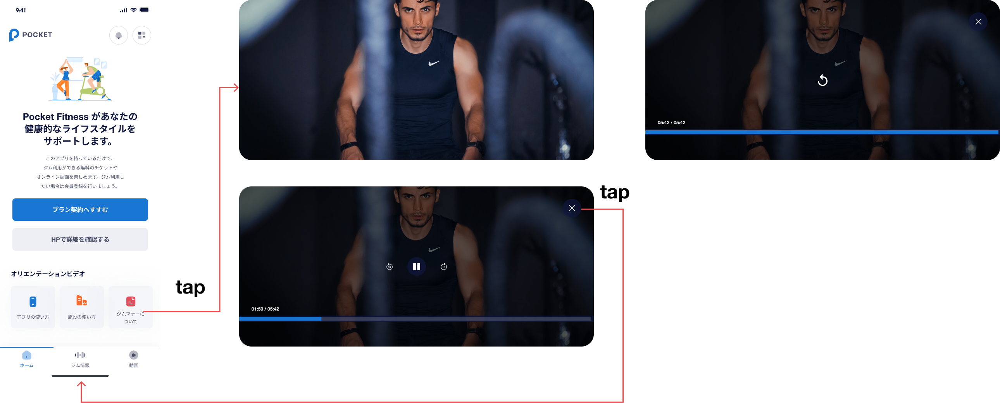

- 各アイコンをタップしたら、全画面でビデオを再生する。
    - アプリの使い方：URL未確定
    - アプリの使い方：URL未確定
    - ジムマナーについて：URL未確定
- ビデオ全画面表示：
    - ビデオのフレームをタップしたら、すべてのビデオ関連のボタンが表示されます。
    - ビデオに関連するボタンがビデオ フレームに表示されている場合、ユーザーがもう一度タップすると非表示になります。 ユーザーが何もしない場合、ボタンは 5 秒後に非表示になります
    - `一時停止・再生`ボタンをタップしたら、ビデオを一時停止または再生する。 ユーザーが一時停止ボタンをタップしてからビデオを一時停止し、一時停止ボタンを再生ボタンに変更する、またはその逆の場合
    - `次の10秒`ボタンをタップしたら、動画を次の10秒進む
    - `10秒前`ボタンをタップしたら、動画を10秒前戻る
    - `動画終了`ボタンをタップしたら、動画を終了して、 **ホーム - ビジター用** 画面にに戻る
    - 動画のタイムラインをタップすると、タップした時間に動画が再生されます
- 動画終了画面：
    - `再生`ボタンをタップしたら、動画を再生する。 
    - `動画終了`ボタンをタップしたら、動画を終了して、 **ホーム - ビジター用** 画面にに戻る
    - 動画のタイムラインをタップすると、タップした時間に動画が再生されます

### エラー一覧（Error List）

`None`

## **ホーム** 画面

### 項目／イベント定義

#### お知らせ一覧 `ボタン`

- ボタンをタップしたら、 **お知らせ一覧** 画面に移動される。

##### 設定画面 `ボタン`

- ボタンをタップしたら、 **設定画面** 画面に移動される。

##### ユーザーのQRコード`区画`

- **ホーム**の画面に入ると、ユーザのQRコードが生成され、表示される。QRコードの有効期限は５分です。有効期限が切れたら、自動的に更新される。
- このQRコードは、`Gate Keeper`のアプリにかざして、Pocketサービスを利用する。

##### カメラでQRコードを読み取る場合はこちらをTAP   `ボタン`

- タップしたら、
    - デバイスにカメラの許可が付与されている場合は、 **QRコードスキャン** 画面に移動される。 **チェックイン** ページに参考
    - デバイスにカメラの許可が付与されない場合は、カメラの許可をrリクエストするポップアップが表示される。許可するボタンタップしたら、 **QRコードスキャン** 画面に移動される。許可しないボタンをタップしたら、 **ホーム** 画面に戻る

##### 現在お客様がご利用中の月額プラン `区画`

- 退会手続きを行ったら、アカウント削除をリクエスト情報がこの区画に表示される。 **退会とアカウント削除** ページに参考
- ２つケースが想定される：
    - ケース１：退会手続きが行ったが、アカウント削除しない
    - ケース２：アカウント削除リクエストした
- ケース１：`アカウント情報削除リクエストはこちら`ボタンがショーアップされ、ボタンをタップしたら、 **アカウント削除リクエスト** 画面に移動される。 **退会とアカウント削除** ページに参考
- ケース２：アカウント削除する日付が表示されると、`アカウント情報削除をキャンセルはこちら`ボタンがショーアップされる。ボタンをタップしたら、 **アカウント削除リクエストのキャンセル** 画面に移動される。 **退会とアカウント削除** ページに参考。APIデータ：
    - `0月0日`: mm月dd日 アカウント削除日

##### 現在お客様がご利用中の月額プラン-基本料金 `区画`

- 基本料金プランの状態が表示される。契約・解約状態、月額料金、利用期間、引き落とし日付を含める。
- 青色のテキストは、ユースケースに応じて異なる方法で表示される：
    - 3ヶ月キャンペーン：`3ヶ月間の基本料金支払い済み。mm月dd日に〇月分引き落とし予定`
    - 6ヶ月キャンペーン：`6ヶ月間の基本料金支払い済み。mm月dd日に〇月分引き落とし予定`
    - 通常：`mm月dd日に〇月分引き落とし予定`
    - 退会したが、まだ利用期間中：`mm月dd日に退会処理を受け付けました。mm月dd日まで利用可能です。`
    - 退会済み：`未選択`

##### 現在お客様がご利用中の月額プラン-水素水・手ぶら `区画`

　

- 水素水・手ぶらオプションの状態が表示される。契約・解約状態、月額料金、利用期間、引き落とし日付を含める。
- 青色のテキストは、ユースケースに応じて異なる方法で表示される：
    - 無料期間中：`現在オプション無料期間中。mm月dd日に〇月分引き落とし予定。*オプションの解約希望の場合、事前にプラン変更を行なってください`
    - 通常：`mm月dd日に〇月分引き落とし予定`
    - 退会したが、まだ利用期間中：`mm月dd日に退会処理を受け付けました。mm月dd日まで利用可能です。`
    - 解約したが、まだ利用期間中：`mm月dd日に解約処理を受け付けました。mm月dd日まで利用可能です。`
    - 退会済み・解約済み：`未選択`

##### ジム利用料金 `区画`

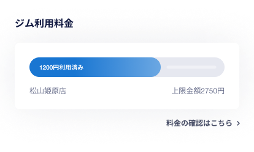

- APIデータ：
    - `1200`：利用済み料金
    - `2750`：店舗の上限料金
    - `松山姫原店`：店舗名
- ユーザーが今月に利用しているすべての店舗の利用料金が表示される。
- 上限料金は月ごとに計算される
- 今月の上限料金に達成したら、無料で入室出来る。
- `料金の確認はこちら`のボタンをタップしたら、 **料金の確認** 画面に移動される。

##### オリエンテーションビデオ `区画`

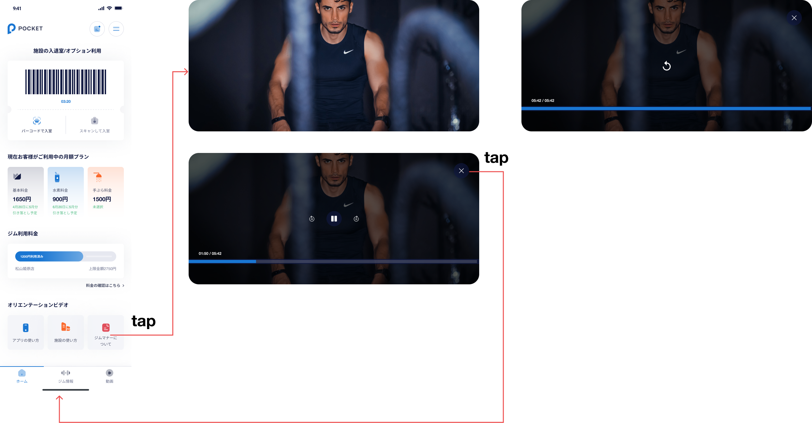

- 各アイコンをタップしたら、全画面でビデオを再生する。
    - アプリの使い方：URL未確定
    - アプリの使い方：URL未確定
    - ジムマナーについて：URL未確定
- ビデオ全画面表示：
    - ビデオのフレームをタップしたら、すべてのビデオ関連のボタンが表示されます。
    - ビデオに関連するボタンがビデオ フレームに表示されている場合、ユーザーがもう一度タップすると非表示になります。 ユーザーが何もしない場合、ボタンは 5 秒後に非表示になります
    - `一時停止・再生`ボタンをタップしたら、ビデオを一時停止または再生する。 ユーザーが一時停止ボタンをタップしてからビデオを一時停止し、一時停止ボタンを再生ボタンに変更する、またはその逆の場合
    - `次の10秒`ボタンをタップしたら、動画を次の10秒進む
    - `10秒前`ボタンをタップしたら、動画を10秒前戻る
    - `動画終了`ボタンをタップしたら、動画を終了して、 **ホーム** 画面にに戻る
    - 動画のタイムラインをタップすると、タップした時間に動画が再生されます
- 動画終了画面：
    - `再生`ボタンをタップしたら、動画を再生する。 
    - `動画終了`ボタンをタップしたら、動画を終了して、 **ホーム** 画面にに戻る
    - 動画のタイムラインをタップすると、タップした時間に動画が再生されます

##### トレーニングモードに戻る   `ボタン`

- ユーザーチェックインしてから、このボタンが表示される。チェックアウトしたら、このボタンが消される。
- このボタンをタップしたら、 **トレーニングメーニュー作成** 画面に移動される。 **本日のトレーニングメーニュー** ページに参考。

### エラー一覧（Error List）

`None`

## **お知らせ一覧** 画面

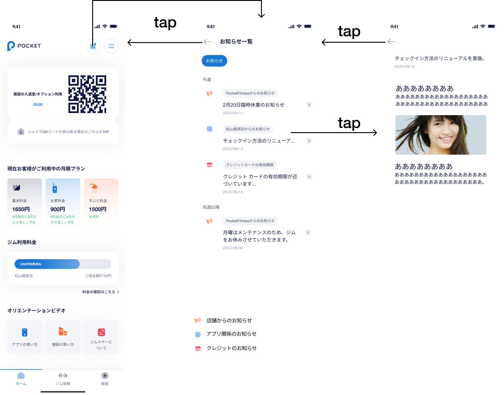

### 項目／イベント定義

##### 戻る `ボタン`

- このボタンをタップしたら、 **ホーム** 画面に戻る

##### 今週のお知らせ一覧 `区画`

- 今週のお知らせ一覧を表示する。お知らせが無かったら、この区画を隠れる

##### 先週以降のお知らせ一覧 `区画`

- 先週以降のお知らせ一覧を表示する。お知らせが無かったら、この区画を隠れる

##### 各のお知らせ `区画`

- お知らせは3タイプがあります。タイプによって、お知らせのタイトルとアイコンが異なる：
    - PocketFitnessからのお知らせ
    - 店舗からのお知らせ. お気に入り店舗に登録しているユーザーは、そのお気に入り店舗からの通知も受け取ります
    - クレジットのお知らせ

- 各お知らせには、タイプ、アイコン、タイトル、発行日が表示される
    - `チェックイン方法のリニューアルを実施。`：タイトル
    - `2022/09/10`：発行日
    - `松山姫原店`：発行した店舗
- クレジットのお知らせタイプのタイトルは：`未決済の支払いについて`
- お知らせをタップしたら、その **お知らせ詳細** 画面に移動される。

### エラー一覧（Error List）

`None`

## **お知らせ詳細** 画面

### 項目／イベント定義

##### 戻る `ボタン`

- このボタンをタップしたら、**お知らせ一覧** 画面に戻る

##### お知らせ詳細 `区画`

- お知らせの詳細を表示する。APIデータ：
    - `チェックイン方法のリニューアルを実施。`：タイトル
    - `2022/09/10`：発行日
    - お知らせ詳細

- クレジットのお知らせタイプのタイトルと内容は
    - タイトル: `未決済の支払いについて` 
    - 内容: 

    `0月0日の****の支払いが確認ができませんでした。支払いの確認ができるまで施設のご利用を一時的に停止しています。`

    `支払いに関するご質問や未払金のお支払いはLineからカスタマーサポートへお問い合わせください。また未払いの決済内容は自動的に支払いの要求が行われる為、支払い完了とこちらのお知らせと行き違いとなる可能性がございますのでご了承ください。`

    `未払いの内容に関しては、ホーム画面の「料金の確認はこちら」より確認が可能です。`

    `Lineでサポートスタッフへご相談はこちら`

- ゆーケースによって、内容のコンテンツが異なる：
    - `0月0日` : 決済確認できない日付け
    - `****`: 決済内容：
    - チェックイン: `店舗名のジム利用料金`
    - 手ぶら利用料金`店舗名の手ぶら利用料金` 
    - 基本料金サブスクリプション: `基本料金`
    - 手ぶらサブスクリプション: `手ぶら`
    -水素サブスクリプション: `水素`

##### Line で直接相談する `ボタン`

- このボタンは、Stripe エラー支払いに関する通知の詳細ページにのみ表示されます
- このボタンをタップしたら、PocketのLineアプリを開く。端末にLineアプリがインストールされない場合は、ストアに移動される。
- URL [https://lin.ee/6AI17uM]

### エラー一覧（Error List）

`None`

## **料金の確認** 画面

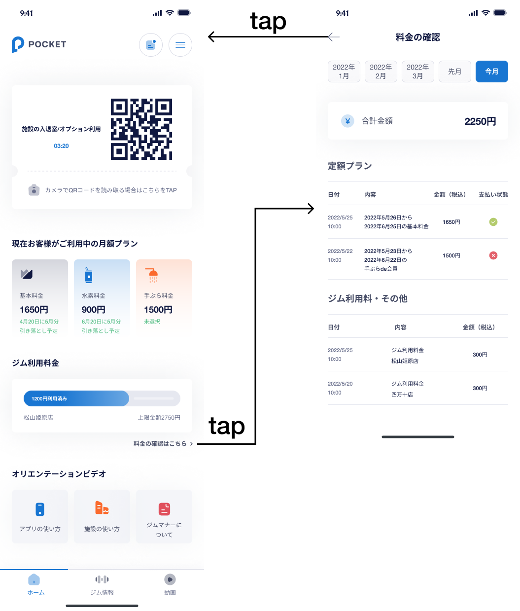

### 項目／イベント定義

##### 戻る `ボタン`

- このボタンをタップしたら、 **ホーム** 画面に戻る

##### 月一覧 `スライダー`

- ユーザーが月ごとの料金確認をフィルタできるように、月のリストを表示する：
    - 今月：左側に表示される
    - 先月：今月の右側に表示される。1ヶ月しかない場合は表示されない。
- 左右スワイプして、他の月を見える。
- 月タブをタップしたら、その月の料金確認を表示する。

##### 合計金額 `区画`

- フィルタした月の総支払額を表示する

##### 定額プラン `区画`

- 基本料金・手ぶら・水素の支払い情報を表示する
- APIデータ：
    - `2022/5/25 10:00`：支払いした日付
    - `2022年5月26日から2022年6月25日の基本料金`：支払い内容
    - `1650円`：支払い金額（税込）
    - 支払い状態によって、アイコンが異なる
- 支払い内容フォーマット。1つ目の日付は開始日、2つ目の日付は終了日：
    - 基本料金：　`yyyy年mm月dd日からyyyy年mm月dd日の基本料金`
    - 手ぶらde会員：　`yyyy年mm月dd日からyyyy年mm月dd日の手ぶらde会員`
    - 水素水：　`yyyy年mm月dd日から2yyyy年mm月dd日の水素水`
- 例：　ユーザーは2022年1月10日にに手ぶら会員オプションと6月キャンペインを選択して、会員登録したユーケース：
    - 2022年1月タブ：　`2022年1月10日から2022年7月9日の基本料金`　が表示される
    - 2022年3月タブ：　`2022年3月10日から2022年4月9日の手ぶらde会員`が表示される
    - 2022年7月タブ：　`2022年7月10日から2022年8月9日の基本料金` と　`2022年7月10日から2022年8月9日の手ぶらde会員`が表示される
- 例： 2022年7月にお客さんのお金を引き落としましたが、カードの問題で決済できなかった。2022年8月に決済できても、その情報が2022年7月タブに表示される

##### ジム利用料・その他 `区画`

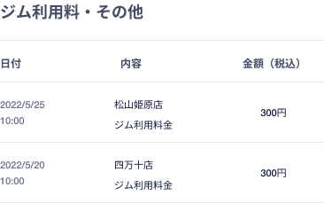

- ジム利用料・その他の支払い情報を表示する
- APIデータ：
    - `2022/5/25 10:00`：支払いした日付
    - `ジム利用料金`：支払い内容
    - `松山姫原店`：店舗名
    - `300円`：支払い金額（税込）
- 支払い内容ケース：
    - チェックイン：　`ジム利用料金`
    - 手ぶら利用：　`ジム利用料金`

### エラー一覧（Error List）

`None`

## **設定画面** 画面

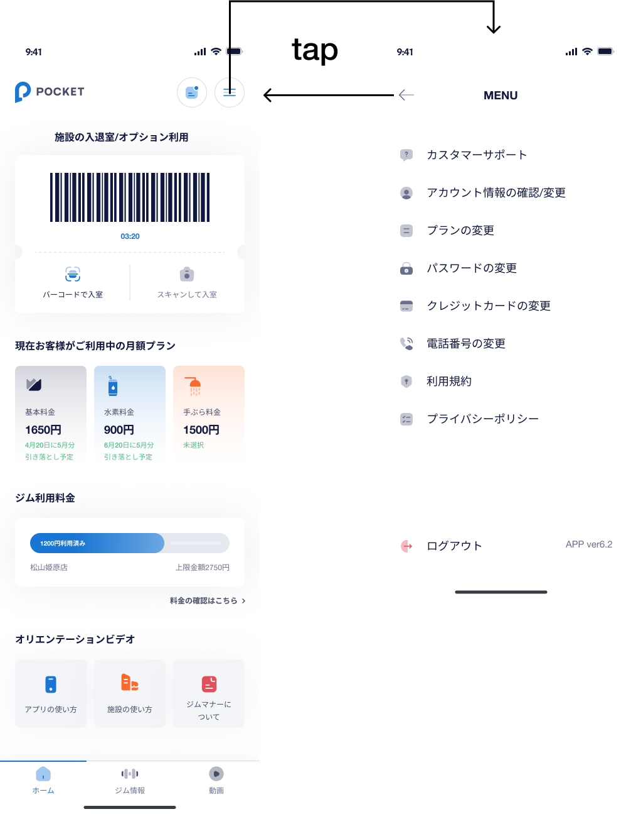

### 項目／イベント定義

##### 戻る `ボタン`

- このボタンをタップしたら、 **ホーム** 画面に戻る

##### カスタマーサポート `ボタン`

- ボタンをタップしたら、 **カスタマーサポート** 画面に移動される。

##### アカウント情報の確認/変更 `ボタン`

- ボタンをタップしたら、 **アカウント情報の確認/変更** 画面に移動される。

##### プランの変更 `ボタン`

- ボタンをタップしたら、 **プランの変更** 画面に移動される。
- 特別ケースが２つあります：
    - ケース１：退会しましたが、まだ利用期間中。
    - ケース２：退会ずみ
- ケース１：
    - ボタンのラベルが　`0月0日退会予定の為プラン変更不可`に変更して、テキストが赤になる。`0月0日` mm月dd日　は基本料金の利用最終日
    - ボタンが無効になる
- ケース２：
    - ボタンのラベルが　`退会済みの為プラン変更不可`に変更して、テキストが赤になる。
    - ボタンが無効になる

##### パスワードの変更 `ボタン`

- ボタンをタップしたら、 **パスワードの変更** 画面に移動される。

##### クレジットカードの変更 `ボタン`

- ボタンをタップしたら、 **クレジットカードの変更** 画面に移動される。

##### 電話番号の変更 `ボタン`

- ボタンをタップしたら、 **電話番号の変更** 画面に移動される。

##### 利用規約 `ボタン`

- 利用規約ページの URL [ https://pocketfitness.jp/terms ] を webview で開く

##### プライバシーポリシー `ボタン`

- プライバシーポリシーページの URL [ https://pocketfitness.jp/privacy ] を webview で開く

##### ログアウト `ボタン`

- ログアウトし、セッションをクリアしてから、 **ログイン** 画面に移動する

##### バージョン番号 `区画`

- インストールしているバージョン番号を表示する

### エラー一覧（Error List）

`None`

## **カスタマーサポート** 画面

### 項目／イベント定義

##### 戻る `ボタン`

- このボタンをタップしたら、 **設定画面** 画面に戻る

##### Line で直接相談する `ボタン`

- このボタンをタップしたら、PocketのLineアプリを開く。端末にLineアプリがインストールされない場合は、ストアに移動される。
- URL [https://lin.ee/6AI17uM]

##### FAQカテゴリ一覧 `スライダー`

- FAQカテゴリーごとのFAQをフィルタできるように、FAQを表示する
- 左右スワイプして、他のFAQカテゴリーを見える。
- FAQカテゴリーをタップしたら、タブをハイライトし、そのカテゴリーのFAQを表示する。

##### FAQ `区画`

- デフォルトではFAQのタイトルのみを表示される。FAQをタップしたら、アイコン (+)、(-) が変わり、FAQの内容が表示される。

### エラー一覧（Error List）

`None`

## **アカウント情報の確認/変更** 画面

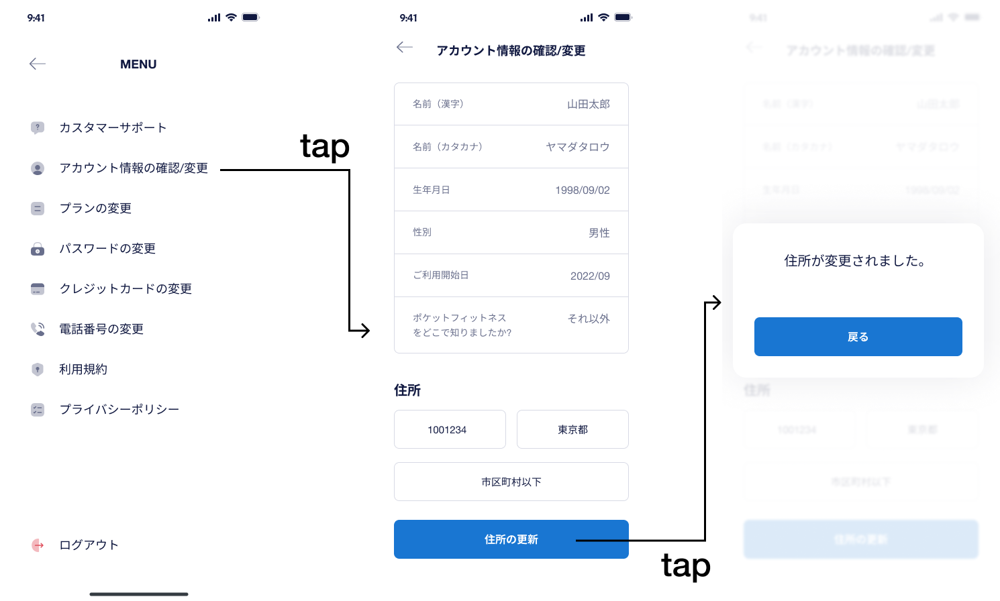

### 項目／イベント定義

##### 戻る `ボタン`

- このボタンをタップしたら、 **設定画面** 画面に戻る

##### ユーザー情報 `区画`

- ユーザが登録された情報を表示する。こちらの情報が更新できない

##### 住所 `区画`

- 必須、郵便番号は 7 文字、都市は最大 8 文字、住所は最大 255 文字である必要があります
- 郵便番号を7桁で入力したら、APIを自動呼び出して、市区町村を取得し、郵便番号から住所を取得します（複数の結果、最初の値のみを取得します）
    - 成功した場合、都市、住所を更新
    - エラーの場合、入力された都市、住所を更新しない

##### 住所の更新 `ボタン`

- 入力された住所を検証する
- 成功したら、データベースに情報を更新し、 `住所が変更されました。` のポップアップが表示される。
    - 戻るボタンをタップしたら、ポップアップを閉じて、 **アカウント情報の確認/変更** 画面に戻る

### エラー一覧（Error List）

#### 項目エラー（Item Error）

##### 住所  `Address`  **Text**

必要:   `入力が必要です`

## **プランの変更** 画面

### 項目／イベント定義

##### 戻る `ボタン`

- このボタンをタップしたら、 **設定画面** 画面に戻る

##### オプション `区画`

- 現在の登録状況ですべてのオプション（手ぶらde会員・水素水）を表示する。
- 手ぶらde会員オプション情報 - APIデータ：
    - `手ぶらde会員`：オプション名
    - `1500`：月額料金
    - `ウェア、シューズ、タオルのレンタルが使い放題。手ぶらでフィットネスが楽しめます！`：オプション詳細。マスターで編集可能。
- 水素水情報 - APIデータ：
    - `水素水`：オプション名
    - `900`：月額料金
    - `フィットネスの効果を高める水素水が飲み放題。より健康で美しい身体を手に入れることができます！`：オプション詳細。マスターで編集可能。
    - `※ 専用のボトルの別途購入をお願いしています。`：オプション詳細。マスターで編集可能。
- オプション状態のアイコン：
    - 未契約：アイコンを表示しない
    - 契約中：`契約中`
    - 解約しましたが、まだ利用期間中：`解約済み`
    - 解約したと、利用期間終了：アイコンを表示しない

##### プランの変更 `ボタン`

- オプション状態によって、ボタンのラベル表示が異なる。
    - 未契約：`プランの変更`
    - 契約中：`プランの変更`
    - 解約しましたが、まだ利用期間中：`YYYY/mm/dd日まで利用可能` 。このケースはボタンが無効になる。
    - 解約したと、利用期間終了：`プランの変更`
- オプション状態によって、ボタンをタップしたら、異なり処理が行う。２つのケースが想定される：
    - ケース１：未契約また再契約
    - ケース２：契約中

 

- ケース１：ボタンをタップしたら、契約内容のポップアップが表示される。
    - `内容に同意して契約する` ボタンをタップしたら、StripeにAPIを呼び出して、チャージする。チャージが成功したら、オプションを契約する。
    - `いいえ` ボタンをタップしたら、 **プランの変更** 画面に戻る
- ケース１- APIデータ
    - `水素水` ・ `手ぶらde会員` : オプション名
    - `0月0日` : mm月dd日　今回の契約にサービスを利用できる最後の日
    - `000円` : 日割り料金 

 

- ケース２：ボタンをタップしたら、解約内容のポップアップが表示される。
    - `はい` ボタンをタップしたら、StripeにAPIを呼び出して、オプションを解約する
    - `いいえ` ボタンをタップしたら、 **プランの変更** 画面に戻る
- ケース２- APIデータ
    - `水素水` ・ `手ぶらde会員` : オプション名
    - `2022/2/30` : YYYY/mm/dd　サービスを利用できる最後の日

### エラー一覧（Error List）

`None`

## **パスワードの変更** 画面

### 項目／イベント定義

##### 戻る `ボタン`

- このボタンをタップしたら、 **設定画面** 画面に戻る

##### 以前のパスワード `インプット`

- 必要、８−１６文字以内、小文字、大文字、数字が含まれる
- 16文字以上入力できない

##### 新しいパスワード `インプット`

- 必要、８−１６文字以内、小文字、大文字、数字が含まれる
- 16文字以上入力できない

##### 目アイコン `ボタン`

- ボタンをタップしたら、パスワードを隠すかまた明らかにする

##### パスワードの変更 `ボタン`

- インプットが両方入力されなかったら、ボタンが無効になる
- 入力された情報を検証する
- 成功したら、データベースに情報を更新し、 `パスワードが正常に変更されました。` のポップアップが表示される。
    - 戻るボタンをタップしたら、ポップアップを閉じて、 **ホーム** 画面に戻る

### エラー一覧（Error List）

#### 項目エラー（Item Error）

- 必要： `パスワードを入力してください`
- Min-Max： `パスワードを8−16文字以内で入力してください`
- 無効なフォマット：`パスワードには必ずローマ字で8-16文字以内（大文字＋小文字＋数字）を入力してください。例：Pocket1234`

#### 画面エラー（Screen Error）

- 以前のパスワードが一致しません：　`以前のパスワードが一致しません`

## **クレジットカードの変更** 画面

### 項目／イベント定義

##### 戻る `ボタン`

- このボタンをタップしたら、 **設定画面** 画面に戻る

##### メインカード `区画`

- 現在のお引き落としクレジットカード情報を表示する
- メインカードをタップしたら、 **クレカ変更・追加フォーム** 画面に移動される

##### サブカード一覧 `区画`

- 登録したサブクレジットカード一覧を表示する
- 最大３枚まで登録できる
- サブカードカードをタップしたら、 **サブカードの変更** 画面に移動される

##### 新しいカードを追加 `ボタン`

- ３枚クレカ追加したら、ボタンが無効になる
- ボタンをタップしたら、 **クレカ変更・追加フォーム** 画面に移動される

### エラー一覧（Error List）

`None`

## **クレカ変更・追加フォーム** 画面

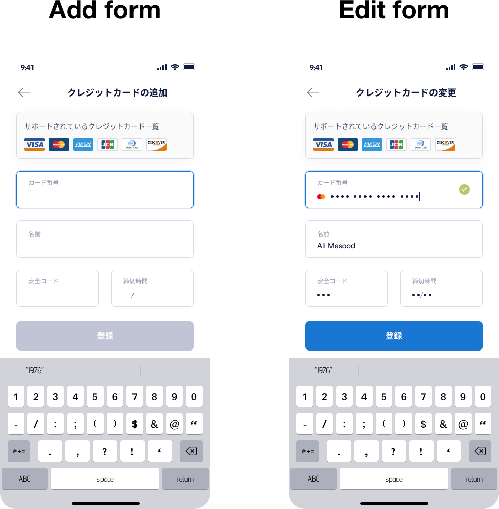

### 項目／イベント定義

##### 戻る `ボタン`

- このボタンをタップしたら、 **クレジットカードの変更** 画面に戻る

##### フォームタイトル `区画`

- 追加：`クレジットカードの追加 `
- 変更：`クレジットカードの変更 `

##### 入力フォーム `区画`

- **会員登録** ページを参考 

##### 登録・変更 `ボタン`

- 追加の場合は、ボタンをタップしたら、カードをサブカード一覧に追加して、 **クレジットカードの変更** 画面に移動される
- 変更の場合は、ボタンをタップしたら、メインカード更新して、 **クレジットカードの変更** 画面に移動される

### エラー一覧（Error List）

`None`

## **サブカードの変更** 画面

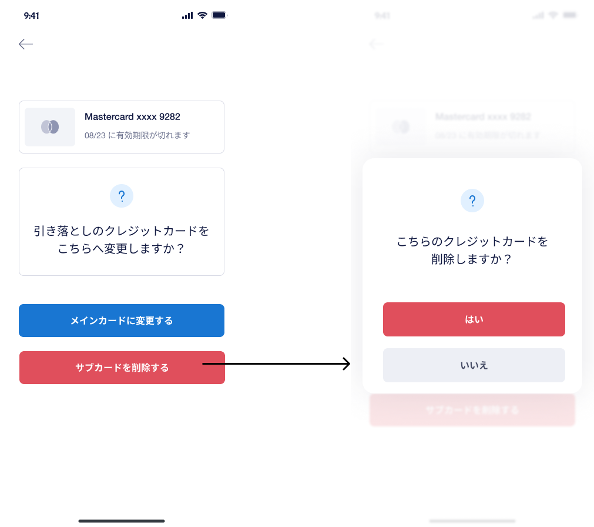

### 項目／イベント定義

##### 戻る `ボタン`

- このボタンをタップしたら、 **クレジットカードの変更** 画面に戻る

##### サブカード `区画`

- 選択したサブクレジットカード一覧を表示する

##### メインカードに変更する `ボタン`

- ボタンをタップしたら、確認のポップアップを表示される。
    - `はい`ボタンをタップしたら、サブカードをメインカードに変更して、 **クレジットカードの変更** 画面に移動される
    - `いいえ`ボタンをタップしたら、 **サブカードの変更** 画面に戻る

##### サブカードを削除する `ボタン`

- ボタンをタップしたら、確認のポップアップを表示される。
    - `はい`ボタンをタップしたら、サブカードを削除して、 **クレジットカードの変更** 画面に移動される
    - `いいえ`ボタンをタップしたら、 **サブカードの変更** 画面に戻る

### エラー一覧（Error List）

`None`

## **電話番号の変更** 画面

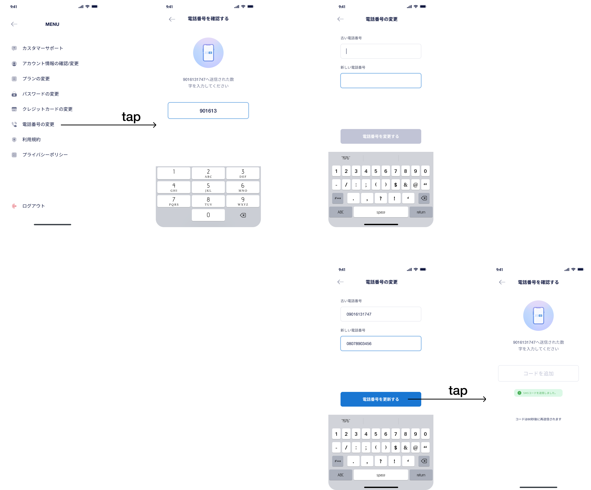

### 項目／イベント定義

##### 戻る `ボタン`

- このボタンをタップしたら、 **設定画面** 画面に戻る

##### 古い電話番号 `インプット`

- 必要、数字のみ
- 10−11桁、070、080、090スタート
- 11桁以上入力できない

##### 新しい電話番号 `インプット`

- 必要、数字のみ
- 10−11桁、070、080、090スタート
- 11桁以上入力できない

##### 電話番号を更新する `ボタン`

- インプットが両方入力されなかったら、ボタンが無効になる
- 入力された情報を検証する
- ボタンをタップしたら、新しい電話番号にSMSコードを送信され、 **認証コード確認** 画面に移動される

### エラー一覧（Error List）

#### 項目エラー（Item Error）

- 必要： `電話番号を入力してください`
- 無効フォーマット：　`電話番号のフォーマットが無効です`

#### 画面エラー（Screen Error）

- 以前の電話番号が一致しません：　`以前の電話番号が一致しません`
- 以前の電話番号が存在しています：　`この電話(090XXXXXXXXX)は既に存在しています`

## **認証コード確認** 画面

- この画面に入ると、認証コードがユーザーの電話番号に送信される。
- 認証コードは1分以内に有効です。有効期限が切れた場合、新しい認証コードが自動的に送信される
- 1日10回までしか認証コードが送信されない

### 項目／イベント定義

##### 戻る `ボタン`

- このボタンをタップしたら、 **電話番号の変更** 画面に戻る

##### 電話番号 `区画`

- APIデータ
    - `9016131747`: 新しい電話番号

##### 認証コード `インプット`

- 正しい認証コードを６桁入力したら、データベースに情報を更新し、 `電話番号が正常に変更されました。再ログインを行なってください。` のポップアップが表示される。
    - `再ログイン`ボタンをタップしたら、ログアウトして、 **ログイン** 画面に移動される。
- 間違った認証コードを入力したら、エラーメッセージと `コードの再送信` ボタンが表示される

##### 認証コードが送信できた `アラート`

- 毎回認証コードが送信できたら、アラートが表示される。5秒後自動的にアラートが消される

##### コードの再送信 `ボタン`

- このボタンはユーザーが間違った認証コードを入力した時のみ、表示される
- ボタンをタップしたら、新しいコードを送信する

### エラー一覧（Error List）

#### 画面エラー（Screen Error）

- 間違ったコードで入力：　`コードが誤っています。もう一度入力してください`
- 1日の送信回数が超えた： `SMSコードの送信回数が10回を超えた為、一時的にロックしました。恐れ入りますがカスタマサポートへお問い合わせください。`

## **ブロックユーザー** 画面

- ユーザーがブロックされている場合は、ログイン後にこのページに移動される

### 項目／イベント定義

##### サポート問い合わせ先 `ボタン`

- このボタンをタップしたら、PocketのLineアプリを開く。端末にLineアプリがインストールされない場合は、ストアに移動される。
- URL [https://lin.ee/6AI17uM]

### エラー一覧（Error List）

`None`