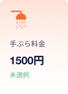
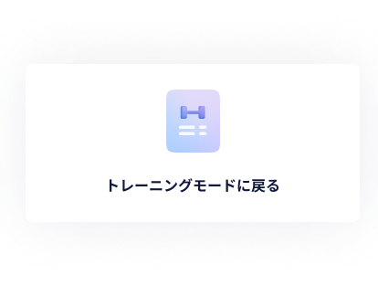

# 【MB】 **Home & Menu**

- Tuỳ vào user đã đăng kí hội viên hay chưa mà layout màn hình Home sẽ khác nhau
    - User chưa đăng kí hội viên： Màn hình **Home - visiter** 
    - User đã đăng kí hội viên: Màn hình **Home** 

## Màn hình **Home - visiter** 

### Định nghĩa các thành phần có Action 

##### お知らせ一覧 - List notification `Button`

- Disabled button

##### 設定画面 - Setting menu `Button`

- Disabled button

##### プラン契約へすすむ - Tiến hành đăng kí hội viên `Button`

- Tap vào nút này sẽ tiến hành đăng kí hội viên. Tham khảo trang **会員登録** 

##### HPで詳細を確認する - Xem HP `Button`

- Mở HP bằng Webview [https://pocketfitness.jp/] 

##### 下部のナビゲーション メニュー - Bottom navigation menu  `Navigation`

- Tap vào menu nào sẽ hightlight menu đó và:
    - ホーム - Home：　nếu đang ở trang home thì không làm gì cả
    - ジム情報 - Gym Information：　Hiển thị pop-up đăng kí hội viên
    - 動画 - Online video： Redirect qua màn hình **List video** . Tham khảo trang  **オンラインビデオ** 

##### オリエンテーションビデオ - Guidance video `Block`

- Khi tap vào từng icon thì sẽ play video của icon đó ở chế độ full màn hình. 
    - アプリの使い方：Hiện tại chưa có chi tiết cụ thể. Tạm thời lấy URL 1 video bất kì để code
    - アプリの使い方：Hiện tại chưa có chi tiết cụ thể. Tạm thời lấy URL 1 video bất kì để code
    - ジムマナーについて：Hiện tại chưa có chi tiết cụ thể. Tạm thời lấy URL 1 video bất kì để code
- Màn hình play video fullscreen
    - Tap vào video frame sẽ hiển thị những nút controller của video đó
    - Nếu các nút controller đang hiển thị và user tap vào video frame thì chúng sẽ ẩn đi. Hoặc nếu user không thao tác gì thì sau 5s những nút đó cũng sẽ được ẩn đi
    - Tap nút `一時停止・再生` thì sẽ pause/play video. Nếu user tap vào nút pause thì sẽ dừng video lại và đổi lại thành nút Play. Và ngược lại
    - Tap nút `Next 10s` thì sẽ tua video 10s tới
    - Tap nút `Next 10s` thì sẽ back lại video 10s trước
    - Tap nút `Close video` thì sẽ tắt video và quay lại màn hình **Home - visiter**
    - Tap vào timeline video thì sẽ play lại video đó ngay thời gian đã tap
- Màn hình end video ：
    - Tap nút `Replay` thì sẽ play lại video này
    - Tap nút `Close video` thì sẽ tắt video và quay lại màn hình **Home - visiter**
    - Tap vào timeline video thì sẽ play lại video đó ngay thời gian đã tap

### Error List

`None`

## Màn hình **Home** 

### Định nghĩa các thành phần có Action 

#### お知らせ一覧 - List notification `Button`

- Tap nút này sẽ redirect qua màn hình **List notification** 

##### 設定画面 - Setting menu `Button`

- Tap nút này sẽ redirect qua màn hình **設定画面** 

##### ユーザーのバーコード - User barcode `Block`

- Khi vào màn hình **Home**, thì QR code của user sẽ được tạo và hiển thị. Thời hạn hiệu lực của QR code là 5 phút, và sau khi hết thời gian thì QR code sẽ được tự động tạo lại. 
- User dùng app `Gate Keeper` đọc QR code để sử dụng các dịch vụ mà Pocket cung cấp.

##### カメラでQRコードを読み取る場合はこちらをTAP   `Button`

- Khi tap vào nút này,
    - Nếu device đã có quyền camera thì di chuyển qua màn hình **Quét mã QR** . Tham khảo trang  **Check-in** 
    - Nếu device chưa có quyền camera thì hiển thị pop-up xin quyền camera. Tap vào nút `許可する` thì di chuyển qua màn hình **Quét mã QR** . Tap vào nút `許可しない` thì quay lại màn hình **Home** .

##### Các plan/option `区画`

- Sau khi unsubscribe xong, thì block này sẽ hiển thêm nút để user yêu cầu xoá tài khoản, hoặc huỷ yêu cầu nếu đã yêu cầu xoá. Tham khảo trang **Unsubscribe & account deletion** 
- Có 2 case như sau：
    - Case １： Đã unsubscribe tuy nhiên không yêu cầu xoá tài khoản
    - Case ２： Đã yêu cầu xoá tài khoản
- Case １： Hiển thị nút `アカウント情報削除リクエストはこちら` để user yêu cầu xoá tài khoản. Tap nút này sẽ redirect qua màn hình **Request account deletion** . Tham khảo trang **Unsubscribe & account deletion** 
- Case ２： Hiển thị thông tin ngày xoá tài khoản và nút để user huỷ yêu cầu xoá tài khoản. Tap nút này sẽ redirect qua màn hình **Cancel request account deletion** . Tham khảo trang **Unsubscribe & account deletion** . API data:
    - `0月0日`: mm月dd日 ngày xoá tài khoản user

##### Các plan/option -Monthly plan `Block`

- Hiển thị chi tiết status của monthly plan: hiện có đăng kí hay không, tiền tháng, thời gian sử dụng, thời gian gia hạn tháng tiếp theo. 
- Phần chữ màu xanh lá cây, sẽ tuỳ vào pattern mà hiển thị khác nhau：
    - Campaign 3 tháng：`3ヶ月間の基本料金支払い済み。mm月dd日に〇月分引き落とし予定`. Note: mm月dd日 là ngày sẽ tự động rút tiền và gia hạn cho tháng tiếp theo, 〇月 là tháng gia hạn tiếp theo.
    - Campaign 6 tháng：`6ヶ月間の基本料金支払い済み。mm月dd日に〇月分引き落とし予定`. Note: mm月dd日 là ngày sẽ tự động rút tiền và gia hạn cho tháng tiếp theo, 〇月 là tháng gia hạn tiếp theo.
    - Bình thường sau khi hết campaign (charge từng tháng 1)：`mm月dd日に〇月分引き落とし予定`. Note: mm月dd日 là ngày sẽ tự động rút tiền và gia hạn cho tháng tiếp theo, 〇月 là tháng gia hạn tiếp theo.
    - Un-subscribe, tuy nhiên vẫn còn đang trong thòi gian sử dụng：`mm月dd日に退会処理を受け付けました。mm月dd日まで利用可能です。`. Note: mm月dd日 đầu tiên là ngày huỷ dịch vụ, mm月dd日 thứ 2 là ngày cuối cùng có thể sử dụng dịch vụ.
    - Un-subscribe và hết thời gian sử dụng: `未選択`

##### Các plan/option -Water/Tebura option (Dịch vụ nước uống, phòng thay đồ) `Block`

　

- Hiển thị chi tiết status của Water/Tebura option: hiện có đăng kí hay không, tiền tháng, thời gian sử dụng, thời gian gia hạn tháng tiếp theo. 
- Phần chữ màu xanh lá cây, sẽ tuỳ vào pattern mà hiển thị khác nhau：
    - Đang trong thời gian sử dụng miễn phí, sau khi đăng kí lần đầu được miễn phí 2 tháng：`現在オプション無料期間中。mm月dd日に〇月分引き落とし予定。*オプションの解約希望の場合、事前にプラン変更を行なってください`. Note: mm月dd日 là ngày sẽ tự động rút tiền và gia hạn cho tháng tiếp theo, 〇月 là tháng gia hạn tiếp theo.
    - Bình thường sau khi hết thời gian sử dụng free (charge từng tháng 1): `mm月dd日に〇月分引き落とし予定`. Note: mm月dd日 là ngày sẽ tự động rút tiền và gia hạn cho tháng tiếp theo, 〇月 là tháng gia hạn tiếp theo.
    - Un-subscribe, tuy nhiên vẫn còn đang trong thòi gian sử dụng：`mm月dd日に退会処理を受け付けました。mm月dd日まで利用可能です。`. Note: mm月dd日 đầu tiên là ngày huỷ dịch vụ, mm月dd日 thứ 2 là ngày cuối cùng có thể sử dụng dịch vụ.
    - Huỷ option, tuy nhiên vẫn còn đang trong thòi gian sử dụng：`mm月dd日に解約処理を受け付けました。mm月dd日まで利用可能です。`. Note: mm月dd日 đầu tiên là ngày huỷ option, mm月dd日 thứ 2 là ngày cuối cùng có thể sử dụng option.
    - Un-subscribe và hết thòi gian sử dụng：`未選択`
    - Huỷ option và hết thòi gian sử dụng：`未選択`

##### Số tiền đã sử dụng ở mỗi phòng gym `Block`

- API data：
    - `1200`：Số tiền đã sử dụng
    - `2750`：Số tiền tối đa mà user có thể sẽ trả khi check-in trong 1 tháng
    - `松山姫原店`：Tên phòng gym
- Hiển thị tất cả những phòng gym mà user đã check-in trong tháng hiện tại. 
- Số tiền tối đa sẽ được tính lại từ ngày 1 mỗi tháng
- Mỗi lần user check-in sẽ charge tiền, và số tiền này cộng lại mỗi lần sẽ không vượt quá số tiền tối đa. Khi đã đạt mức tiền tối đa thì user sẽ không tốn tiền mỗi lần check-in trong tháng đó nữa. 
- Tap vào nút `料金の確認はこちら`, sẽ di chuyển qua màn hình **Money confirmation** . 

##### オリエンテーションビデオ - Guidance video `Block`

- Khi tap vào từng icon thì sẽ play video của icon đó ở chế độ full màn hình. 
    - アプリの使い方：Hiện tại chưa có chi tiết cụ thể. Tạm thời lấy URL 1 video bất kì để code
    - アプリの使い方：Hiện tại chưa có chi tiết cụ thể. Tạm thời lấy URL 1 video bất kì để code
    - ジムマナーについて：Hiện tại chưa có chi tiết cụ thể. Tạm thời lấy URL 1 video bất kì để code
- Màn hình play video fullscreen
    - Tap vào video frame sẽ hiển thị những nút controller của video đó
    - Nếu các nút controller đang hiển thị và user tap vào video frame thì chúng sẽ ẩn đi. Hoặc nếu user không thao tác gì thì sau 5s những nút đó cũng sẽ được ẩn đi
    - Tap nút `一時停止・再生` thì sẽ pause/play video. Nếu user tap vào nút pause thì sẽ dừng video lại và đổi lại thành nút Play. Và ngược lại
    - Tap nút `Next 10s` thì sẽ tua video 10s tới
    - Tap nút `Next 10s` thì sẽ back lại video 10s trước
    - Tap nút `Close video` thì sẽ tắt video và quay lại màn hình **Home**
    - Tap vào timeline video thì sẽ play lại video đó ngay thời gian đã tap
- Màn hình end video ：
    - Tap nút `Replay` thì sẽ play lại video này
    - Tap nút `Close video` thì sẽ tắt video và quay lại màn hình **Home**
    - Tap vào timeline video thì sẽ play lại video đó ngay thời gian đã tap

##### トレーニングモードに戻る- Back to training mode   `Button`

- Sau khi user checking xong thì nút này mới hiển thị lên. Còn sau khi user checkout xong thì ẩn nút này đi
- Tap nút này sẽ redirect qua màn hình **Tạo training menu** .　Tham khảo ở trang **Training menu** . 

### Error List

`None`

## Màn hình **List notification** 

### Định nghĩa các thành phần có Action 

##### 戻る - Back `Button`

- Tap nút này sẽ quay lại màn hình **Home** 

##### 今週のお知らせ一覧 - List noti tuần này `Block`

- Hiển thị list noti của tuần này. Nếu không có thì không hiển thị kể cả text `今週`

##### 先週以降のお知らせ一覧 - List noti từ tuần trước trở về trước `Block`

- Hiển thị list noti từ tuần trước trở về trước. Nếu không có thì không hiển thị kể cả text `先週以降`

##### 各のお知らせ - Notification `Block`

- Có 3 loại noti. Tuỳ vào mỗi loại mà icon, title sẽ hiển thị khác nhau
    - 店舗からのお知らせ - Noti từ Pocket Fitness
    - アプリ関連こお知らせ - Noti từ cửa hàng
    - クレジットのお知らせ - Noti liên quan đến thẻ credit

- Mỗi noti sẽ hiển thị bao gồm: loại noti, icon, title, ngày phát hành
    - `チェックイン方法のリニューアルを実施。`： title
    - `2022/09/10`： ngày phát hành
    - `松山姫原店`： cửa hàng phát hành
- Tap vào noti thì sẽ redirect qua màn hình **Notification detail** đó

### Error List

`None`

## Màn hình **Notification detail**

### Định nghĩa các thành phần có Action 

##### 戻る - Back `Button`

- Tap nút này sẽ quay lại màn hình **List notification**

##### お知らせ詳細  - Notification detail `Block`

- Hiển thị chi tiết của noti. API data :
    - `チェックイン方法のリニューアルを実施。`： Title
    - `2022/09/10`： ngày phát hành
    - お知らせ詳細 - chi tiết: không có layout cụ thể. Bên admin chỉnh sao thì hiển thị trên mobile app như vậy

### Error List

`None`

## Màn hình **Money confirmation** 

### Định nghĩa các thành phần có Action 

##### 戻る - Back `Button`

- Tap nút này sẽ quay lại màn hình **Home** 

##### 月一覧 - Danh sách tháng `Slider`

- User có thể tap vào từng tháng để filter chi tiết số tiền đã xài theo tháng. Danh sách tháng chỉ gồm những tháng bắt đầu khi user đăng kí hội viên.
    - 今月： Tháng hiện tại, vị trí ngoài cùng bên trái
    - 先月： Tháng trước, vị trí bên phải tháng hiện tại. Nếu chỉ có 1 tháng thì không hiển thị block này
- Có thể quẹt trái phải để xem danh sách tháng. Tap vào tháng nào thì hiển thị màn hình chi tiết của tháng đó

##### 合計金額 - Tổng số tiền đã xài `Block`

- Hiển thị tổng số tiền của tháng đang filter

##### 定額プラン - Fixed amount Plan `Block`

- Hiển thị thông tin thanh toán monthly plan, quần áo, nước
- API data：
    - `2022/5/25 10:00`：ngày giờ thanh toán
    - `2022年5月26日から2022年6月25日の基本料金`： Nội dung thanh toán
    - `1650円`： Tiền thanh toán đã bao gôm thuế
    - Tình trạng thanh toán: thành công hoặc thất bại, tuỳ vào tình trạng thanh toán mà icon sẽ khác nhau
- Format nội dung thanh toán. Ngày thứ nhất là ngày bắt đầu, ngày thứ 2 là ngày cuối có thể sử dụng dịch vụ của lần thanh toán này:
    - 基本料金 - monthly plan：　`yyyy年mm月dd日からyyyy年mm月dd日の基本料金`
    - 手ぶらde会員 - quần áo：　`yyyy年mm月dd日からyyyy年mm月dd日の手ぶらde会員`
    - 水素水 - nước：　`yyyy年mm月dd日から2yyyy年mm月dd日の水素水`
- Ví dụ trường hợp user đăng kí campaign 6 tháng và option tebura
    - Ở tab 2022年1月 sẽ hiển thị ：　`2022年1月10日から2022年7月9日の基本料金`
    - Ở tab 2022年3月 sẽ hiển thị：　`2022年3月10日から2022年4月9日の手ぶらde会員`
    - Ở tab 2022年7月 sẽ hiển thị：　`2022年7月10日から2022年8月9日の基本料金` và　`2022年7月10日から2022年8月9日の手ぶらde会員`
- Trường hợp thanh toán ở tháng 7 tuy nhiên thẻ khách bị lỗi, đến tháng 8 phần thanh toán đó mới thành công thì vẫn hiển thị thông tin thanh toán đó ở tab tháng 7

##### ジム利用料・その他 - Tiền sử dụng phòng gym・other `Block`

- Hiển thị thông tin thanh toán mỗi lần sử dụng phòng gym
- API data：
    - `2022/5/25 10:00`：ngày giờ thanh toán
    - `ジム利用料金`：Nội dung thanh toán
    - `松山姫原店`：tên gym
    - `300円`：Tiền thanh toán đã bao gôm thuế
- Format nội dung thanh toán：
    - Check-in：　`ジム利用料金`
    - Sử dụng option quần áo- đối với user không đăng kí option quần áo：　`ジム利用料金`

### Error List

`None`

## Màn hình **Setting menu** 

### Định nghĩa các thành phần có Action 

##### 戻る - Back `Button`

- Tap nút này sẽ quay lại màn hình **Home** 

##### カスタマーサポート- Customer support `Button`

- Tap nút này sẽ redirect qua màn hình **Customer support** 

##### アカウント情報の確認/変更 `Button`

- Tap nút này sẽ redirect qua màn hình **Change account information** 

##### プランの変更 `Button`

- Tap nút này sẽ redirect qua màn hình **Change plan** 
- Có 2 case đặc biệt như sau:
    - Case 1： Đã unsubscribe tuy nhiên vẫn còn thời gian sử dụng basic plan
    - Case 2： Đã unsubscribe và hết thời gian sử dụng basic plan
- Case 1：
    - Đổi label của nút thành `0月0日退会予定の為プラン変更不可` và đổi màu chữ thành màu đỏ. `0月0日` mm月dd日　là ngày cuối cùng sử dụng của basic plan
    - Disabled nút đi
- Case 2：
    - Đổi label của nút thành　`退会済みの為プラン変更不可` và đổi màu chữ thành màu đỏ.
    - Disabled nút đi

##### パスワードの変更 `Button`

- Tap nút này sẽ redirect qua màn hình **Change password** 

##### クレジットカードの変更 `Button`

- Tap nút này sẽ redirect qua màn hình **Change credit card** 

##### 電話番号の変更 `Button`

- Tap nút này sẽ redirect qua màn hình **Change phone** 

##### 利用規約 `Button`

- Mở webview URL [ https://pocketfitness.jp/terms ] 

##### プライバシーポリシー `Button`

- Mở webview URL [ https://pocketfitness.jp/privacy ] 

##### ログアウト `Button`

- Clear session & log out & redirect qua màn hình **Login** 

##### バージョン番号 `区画`

- Hiển thị version number của app hiện đang cài đặt

### Error List

`None`

## Màn hình **Customer support** 

### Định nghĩa các thành phần có Action 

##### 戻る - Back `Button`

- Tap nút này sẽ quay lại màn hình **Setting menu**

##### Line で直接相談する `Button`

- tap nút này sẽ mở app Line tài khoản Pocket Fitness.
- URL [https://lin.ee/6AI17uM]

##### FAQカテゴリ一覧- List FAQ category `Slider`

- Hiển thị list FAQ category
    - 全て： All
    - Tab thứ 2 trở đi là các FAQ category
- có thể quẹt trái phải để xem FAQ category
- Tap vào FAQ category nào thì sẽ hightlight tab & filter những FAQ của category đó

##### FAQ `Block`

- Mặc định chỉ hiển thị title, nếu tap vào FAQ sẽ xổ tab hiển thị chi tiết đồng thời thay đổi icon  (+)、(-) 

### Error List

`None`

## Màn hình **Change account information** 

### Định nghĩa các thành phần có Action 

##### 戻る - Back `Button`

- Tap nút này sẽ quay lại màn hình **Setting menu**

##### ユーザー情報- User information `Block`

- Hiển thị những thông tin của user. Phần này không thay đổi được

##### 住所 - Address `Block`

- Required, mã bưu điện tối đa 7 kí tự, city tối đa 8 kí tự, địa chỉ tối đa 255 kí tự
- Sau khi nhập đủ 7 kí tự mã bưu điện sẽ tự động gọi API để fill các input city, địa chỉ(trong trường hợp kết quả trả về nhiều kết quả thì lấy kết quả đầu tiên)
    - Nếu thành công thì fill các input city, địa chỉ
    - Nếu thất bại thì không fill input

##### 住所の更新 - Change address `Button`

- Validate input
- Nếu thành công thì update db và hiển thị pop-up `住所が変更されました。` 
    - Tap vào nút `戻る` thì đóng pop-up và quay lại màn hình **Change account information** 

### Error List

#### Item Error

##### 住所  `Address`  **Text**

Required:   `入力が必要です`

## Màn hình **Change plan** 

### Định nghĩa các thành phần có Action 

##### 戻る - Back `Button`

- Tap nút này sẽ quay lại màn hình **Setting menu**

##### オプション - Option `Block`

- Hiển thị trạng thái của 2 option quần áo và nước 
- Option quần áo - API data：
    - `手ぶらde会員`： tên option
    - `1500`： tiền tháng
    - `ウェア、シューズ、タオルのレンタルが使い放題。手ぶらでフィットネスが楽しめます！`：description, có thể thay đổi ở trang admin
- Option nước - API data：
    - `水素水`：tên option
    - `900`：tiền tháng
    - `フィットネスの効果を高める水素水が飲み放題。より健康で美しい身体を手に入れることができます！`：description, có thể thay đổi ở trang admin
    - `※ 専用のボトルの別途購入をお願いしています。`：description, có thể thay đổi ở trang admin
- Option icon：
    - Chưa đăng kí： không hiển thị icon
    - Đang đăng kí：`契約中`
    - Huỷ đăng kí tuy nhiên vẫn còn đang trong thời gian sử dụng：`解約済み`
    - Huỷ đăng kí và đã hết thời gian sử dụng：không hiển thị icon

##### プランの変更 - Change plan `Button`

- Tuỳ vào trạng thái của option mà label của nút này sẽ khác nhau
    - Chưa đăng kí：`プランの変更`
    - Đang đăng kí：`プランの変更`
    - Huỷ đăng kí tuy nhiên vẫn còn đang trong thời gian sử dụng：`YYYY/mm/dd日まで利用可能` . Đối với case này thì nút này sẽ bị disabled
    - Huỷ đăng kí và đã hết thời gian sử dụng：`プランの変更`
- Tuỳ vào trạng thái của option mà khi tap sẽ xử lí khác nhau. Có 2 case như sau
    - Case １： Chưa đăng kí hoặc đăng kí lại
    - Case ２： Đang đăng kí

 

- Case １： Tap nút này sẽ hiển thị pop-up đăng kí
    - Tap nút`内容に同意して契約する` sẽ gọi API charge tiền và tiến hành đăng kí
    - tap nút `いいえ` sẽ quay lại màn hình  **Change plan** 
- Case １- API data
    - `水素水` ・ `手ぶらde会員` : tên option
    - `0月0日` : mm月dd日　ngày cuối cùng sử dụng dịch vụ sau khi đăng kí
    - `000円` : Tiền charge cho lần đăng kí này. Số tiền được tính như sau: (Tiền option 1 ngày) x (số ngày sử dụng tính từ ngày đăng kí đến ngày tự động charge tiền tháng tiếp theo - lấy theo monthly plan)

 

- Case ２：Tap nút này sẽ hiển thị pop-up huỷ đăng kí
    - Tap nút `はい` sẽ gọi API Stripe để huỷ option
    - Tap nút `いいえ` sẽ quay lại màn hình  **Change plan** 
- Case ２- API data
    - `水素水` ・ `手ぶらde会員` : tên option
    - `2022/2/30` : YYYY/mm/dd　ngày cuối cùng sử dụng dịch vụ sau khi huỷ đăng kí

### Error List

`None`

## Màn hình **Change password**

### Định nghĩa các thành phần có Action 

##### 戻る - Back `Button`

- Tap nút này sẽ quay lại màn hình **Setting menu**

##### 以前のパスワード- Pass cũ `Input`

- Required, 8-16 kí tự, và bao gôm chữ thường, chữ hoa, số, kí tự đặc biệt
- Không nhập được quá 16 kí tự

##### 新しいパスワード - Pass mới `Input`

- Required, 8-16 kí tự, và bao gôm chữ thường, chữ hoa, số, kí tự đặc biệt
- Không nhập được quá 16 kí tự

##### 目アイコン- Eye iocn `Button`

- Tap vào sẽ ẩn/ hiện password và thay đổi icon

##### パスワードの変更 - Change password `Button`

- Nếu chưa nhập đủ 2 input thì disable nút này
- Validate input
- Nếu thành công thì update db và hiển thị pop-up `パスワードが正常に変更されました。` 
    - Tap vào nút `戻る` thì đóng pop-up và quay lại màn hình **Home** 

### Error List

#### 項目エラー（Item Error）

- Required： `パスワードを入力してください`
- Min-Max： `パスワードを8−16文字以内で入力してください`
- Sai format：`パスワードには必ずローマ字で8-16文字以内（大文字＋小文字＋数字）を入力してください。例：Pocket1234`

#### 画面エラー（Screen Error）

- Password cũ không match nhau：　`以前のパスワードが一致しません`

## Màn hình **Change credit card**

### Định nghĩa các thành phần có Action

##### 戻る - Back `Button`

- Tap nút này sẽ quay lại màn hình **Setting menu**

##### メインカード - Main card `Block`

- Hiển thị thẻ credit chính của user, thẻ hiện tại đang dùng để thanh toán
- Tap vào thẻ chính thì redirect qua màn hình **Add/edit card form** 

##### サブカード一覧 - List sub card `Block`

- Hiển thị list thẻ credit phụ, nếu chưa thêm mới thẻ nào thì không hiển thị block này
- Tối đa thêm mới được 3 thẻ phụ
- Tap vào thẻ phụ thì redirect qua màn hình **Change sub credit card** 

##### 新しいカードを追加 - Add credit card `Button`

- tap vào nút này thì redirect qua màn hình **Add/edit card form** 
- nếu đã thêm 3 thẻ rồi thì disable nút này

### Error List

`None`

## Màn hình **Add/edit card form** 

### Định nghĩa các thành phần có Action

##### 戻る - Back `Button`

- Tap nút này sẽ quay lại màn hình **Change credit card**

##### フォームタイトル - Title `Block`

- Nếu thêm mới thì title form là `クレジットカードの追加 `
- Nếu chỉnh sửa thì title form là `クレジットカードの変更 `

##### 入力フォーム - Input form `Block`

- Tham khảo trang **会員登録** 
- Chỉnh sửa hay thêm mới thì đều phải nhập thẻ mới
- Mặc định tất cả các input sẽ không nhập gì

##### 登録/変更 `Button`

- Nếu thêm mới thì label button là `登録`
- Nếu chỉnh sửa thì label button là `変更 `
- Nếu thêm mới thì khi tap nút này sẽ thêm mới thẻ vào list thẻ phụ và redirect qua màn hinh **Change credit card** 
- Nếu chỉnh sửa thì khi tap nút này sẽ cập nhật thẻ này thành thẻ chính và xoá thẻ chính trước đó đi và redirect qua màn hinh **Change credit card** 

### Error List

`None`

## Màn hình **Change sub credit card**

### Định nghĩa các thành phần có Action

##### 戻る - Back `Button`

- Tap nút này sẽ quay lại màn hình **Change credit card**

##### サブカード - sub card `区画`

- Hiển thị sub card mà user đang chọn

##### メインカードに変更する `Button`

- tap vào nút này sẽ hiển thị pop-up xác nhân đổi thẻ phụ thành thẻ chính
    - Tap nút `はい` thì cập nhật thẻ phụ thành thẻ chính và redirect qua màn hình **Change credit card** 
    - Tap nút `いいえ` thì quay lại màn hình **Change sub credit card** 

##### サブカードを削除する `Button`

- tap vào nút này sẽ hiển thị pop-up xác nhân xoá thẻ phụ đang chọn
    - Tap nút `はい` thì xoá thẻ phụ trên Stripe và DB và redirect qua màn hình **Change credit card** 
    - Tap nút `いいえ` thì quay lại màn hình **Change sub credit card** 

### Error List

`None`

## **Change phone** 画面

### Định nghĩa các thành phần có Action 

##### 戻る - Back `Button`

- Tap nút này sẽ quay lại màn hình **Setting menu**

##### 古い電話番号 - sdt cũ `Input`

- Required, chỉ được nhập số
- 10-11 kí tự, bắt đầu bằng 070,080,090
- Không nhập được quá 11 kí tự

##### 新しい電話番号 `Input`

- Required, chỉ được nhập số
- 10-11 kí tự, bắt đầu bằng 070,080,090
- Không nhập được quá 11 kí tự

##### 電話番号を更新する - Change sdt `Button`

- Nếu chưa nhập đủ 2 input thì disable nút này
- Validate input
- Tap nút này sẽ gửi mã OTP đến sdt mới của user và redirect qua màn hình **OTP confirmation**

### Error List

#### Item Error

- Required `電話番号を入力してください`
- Sai format：　`電話番号のフォーマットが無効です`

#### Screen Error）

- Sdt cũ không đúng：　`以前の電話番号が一致しません`
- Sdt cũ đã tồn tại: `この電話(090XXXXXXXXX)は既に存在しています`

## Màn hình **OTP confirmation**

- Sau khi vào màn hình này sẽ gửi mã OTP đến sdt user
- Mã OTP có hiệu lực trong vòng 1'. Nếu hết hiệu lực sẽ tự động gửu lại mã OTP
- 1 ngày chỉ được gửi tối đa 10 lần

### Định nghĩa các thành phần có Action 

##### 戻る - Back `Button`

- Tap nút này sẽ quay lại màn hình **Change phone**

##### 電話番号 - sdt `Block`

- API data
    - `9016131747`: sdt user

##### 認証コード - OTP `Input`

- Nếu nhập đúng 6 kí tự mã OTP thì update db và hiển thị pop-up `電話番号が正常に変更されました。再ログインを行なってください。` 
    - Tap vào nút `再ログイン` thì logout và redirect về màn hình **Login** 
- Nếu nhập sai sẽ hiển thị lỗi và nút `コードの再送信` 

##### 認証コードが送信できた `Alert`

- Mỗi lần gửi mã OTP hoặc lần đầu vào màn hình thì sẽ hiển thị alert này, sau 5s sẽ biến mất

##### コードの再送信 - Send OTP again`Button`

- Tap nút này để gửi lại mã OTP, chỉ hiển thị khi user nhập mã OTP sai

### Error List

#### Screen Error

- Nhập mã OTP sai：　`コードが誤っています。もう一度入力してください`
- Qúa số lần gửi trong ngày： `SMSコードの送信回数が10回を超えた為、一時的にロックしました。恐れ入りますがカスタマサポートへお問い合わせください。`

## Màn hình **Block user**

- Nếu user đang bị block, sau khi login hoặc mở app (nếu user đã login trước đó) thì sẽ bị redirect qua màn hình này

### Định nghĩa các thành phần có Action

##### サポート問い合わせ先 - Customer support `Button`

- tap nút này sẽ mở app Line tài khoản Pocket Fitness.
- URL [https://lin.ee/6AI17uM]

### Error List

`None`