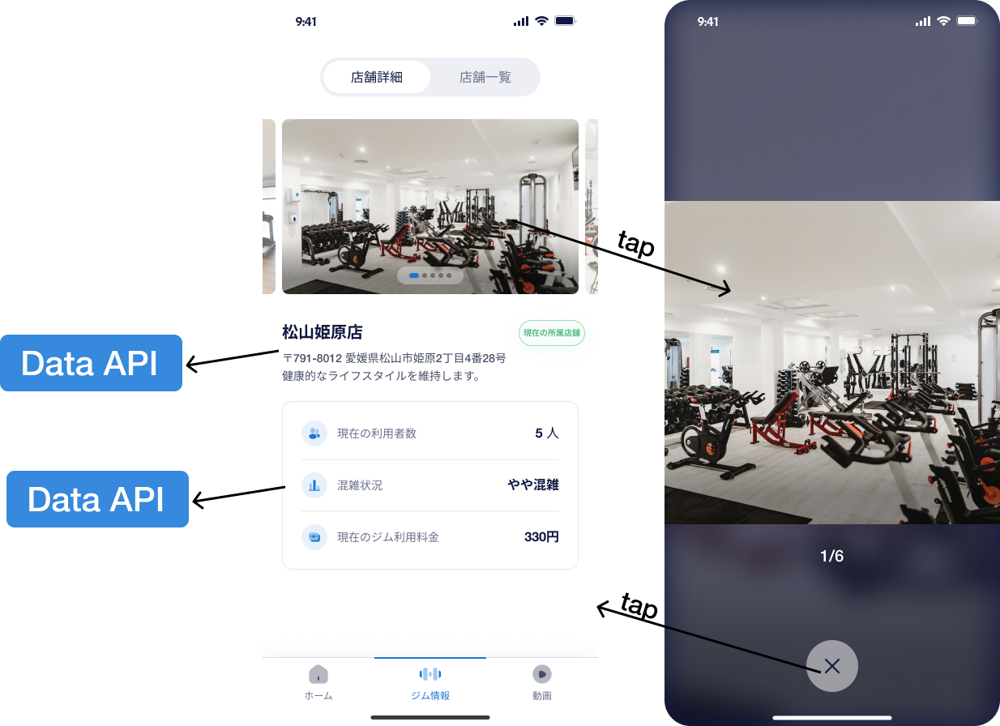
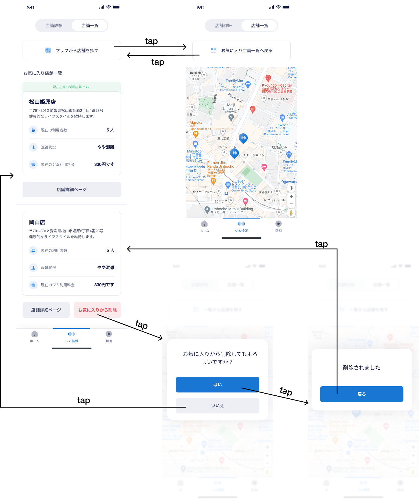
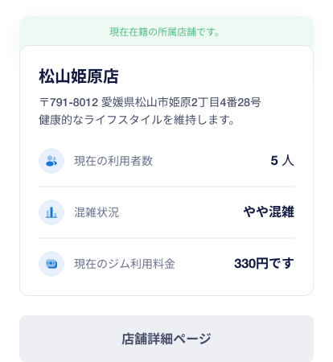
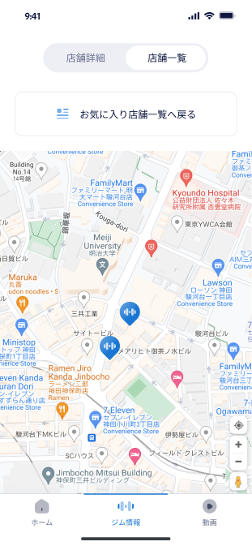
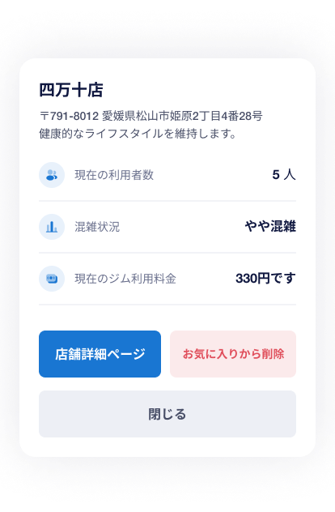
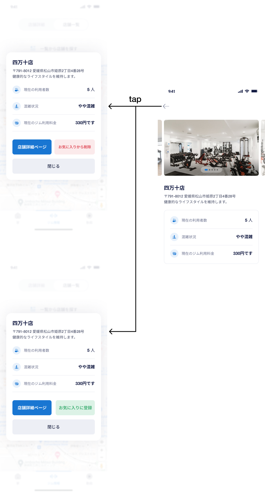

# 【MB】 **Gym Information**

-　Sau khi tap vào tab GYM  (icon thứ 2 trên tab bar) sẽ  chuyển đến màn hình **Gym detail** 

## Màn hình **Gym detail**

### Định nghĩa các thành phần có Action 

##### Top tab bar - bao gồm 2 Tab Item  - Gym Detail(**店舗詳細**) và Gym List (**店舗一覧**)

- Mỗi khi vào màn hình **Gym detail** sẽ lấy thông tin của cửa hàng hiện tại để hiển thị và hightlight tab `​​店舗詳細`
- Khi tap vào tab `​​店舗詳細`:
    - Nếu đang ở màn hình **Gym detail** thì không làm gì.
    - Nếu đang ở màn hình **Gym list** thì chuyển lại màn hình **Gym detail**, lấy cửa hàng hiện tại để hiển thị và highlight hightlight tab `​​店舗詳細`

- Khi tap vào tab`店舗一覧`：
    - Nếu đang ở màn hình **Gym list** thì không làm gì
    - Nếu đang ở màn hình **Gym detail** thì chuyển lại màn hình **Gym list** và highlight hightlight tab `店舗一覧`

##### Gym images slider `Gym images slider - bao gồm Slider hình ảnh của phòng gym có page indicator `

- Slider cho phép vuốt ngang trái phải để thay đổi hình ảnh. Nếu đang ở hình đầu mà quẹt trái thì sẽ hiển thị hình cuối. Nếu đang ở hình cuối mà quẹt phải thì sẽ hiển thị hình đầu
    - Trường hợp chưa set hình ảnh ở site admin thì không hiển thị cả page indicator
    - Trường hợp có 1 hình ảnh thì không quẹt được
    - Trường hợp có 2 hình ảnh thì 2 bên hình ảnh hiện tại sẽ lấy ảnh còn lại để hiển thị
- Page indicator sẽ highlight theo vị trí hiện tại của ảnh.
- Tap lên một ảnh sẽ mở **Popup Slider** cho phép xem hình ảnh to hơn.

##### Gym information   `Block`

- API データ
    - `松山姫原店`: Tên gym
    - `791-8012`: Mã bưu điện
    - `愛媛県松山市姫原2丁目4番28号`: địa chỉ
    - `健康的なライフスタイルを維持します。`: gym description
    - `5`: số người hiện tại đang sử dụng phòng gym
    - `やや混雑`: Tình trang đông/ vắng, tuỳ vô số người hiện tại đang sử dụng phòng gym mà phần hiển thị sẽ khác nhau. Nếu bên admin site chưa set phần này thì hiển thị là `未設定`
    - `300`：Số tiền charge khi mở cửa. tuỳ vô số người hiện tại đang sử dụng phòng gym mà phần hiển thị sẽ khác nhau. Nếu bên admin site chưa set phần này thì hiển thị `300円です` thành `未設定`

##### **Close** `Close popup slider` **Button**
- Đóng popup slider và quay lại màn hình **Gym detail** 

### Error List

`None`

## Màn hình **Gym list**

### Định nghĩa các thành phần có Action 

##### Top tab bar - bao gồm 2 Tab Item  - Gym Detail(**店舗詳細**) và Gym List (**店舗一覧**)

- Khi tap vào tab`店舗一覧`：
    - Nếu đang ở màn hình **Gym list** thì không làm gì
    - Nếu đang ở màn hình **Gym detail** thì chuyển lại màn hình **Gym list** và highlight hightlight tab `店舗一覧`

- Khi tap vào tab `​​店舗詳細`:
    - Nếu đang ở màn hình **Gym detail** thì không làm gì.
    - Nếu đang ở màn hình **Gym list** thì chuyển lại màn hình **Gym detail**, lấy cửa hàng hiện tại để hiển thị  và highlight hightlight tab `​​店舗詳細`

##### マップから店舗を探す  **Button**

- Khi tap vào nút này thì sẽ qua màn hình **Map**

##### List gym  **Block**

- Gồm cửa hàng hiện tại và danh sách các cửa hàng yêu thich. Item đầu tiên luôn luôn là cửa hàng hiện tai. Item thứ 2 trở đi là các cửa hàng yêu thích (nếu đã đăng kí cửa hàng yêu thích)
- Cửa hàng hiện tại:

    - Gym information: giống như màn hình **Gym detail** 
    - Nút `​​店舗詳細ページ`：tap vào sẽ qua màn hình タップしたら、**Gym detail_2**

- Cửa hàng yêu thích:

    - Gym information: giống như màn hình **Gym detail** 
    - Nút `​​店舗詳細ページ`：tap vào sẽ qua màn hình タップしたら、**Gym detail_2**
    - Nút `お気に入りから削除`: tap vào sẽ hiển thị popup xác nhận có muốn xoá cửa hàng này ra khỏi danh sách yêu thích không.
        - Nếu tap vào nút `はい` thì xoá cửa hàng này ra khỏi danh sách yêu thích và hiển thị popup đã xoá thành công. Nếu tap nút `戻る`, thì sẽ quay lại màn hình **Gym list** (cửa hàng vừa xoá không còn trong list) 
        - Nếu tap vào nút `いいえ` thì sẽ quay lại màn hình **Gym list** 

### Error List

`None`

## Màn hình **Map**

### Định nghĩa các thành phần có Action 

##### Top tab bar - bao gồm 2 Tab Item  - Gym Detail(**店舗詳細**) và Gym List (**店舗一覧**)

- Khi tap vào tab`店舗一覧`：
    - Nếu đang ở màn hình **Gym list** thì không làm gì
    - Nếu đang ở màn hình **Gym detail** thì chuyển lại màn hình **Gym list** và highlight hightlight tab `店舗一覧`

- Khi tap vào tab `​​店舗詳細`:
    - Nếu đang ở màn hình **Gym detail** thì không làm gì.
    - Nếu đang ở màn hình **Gym list** thì chuyển lại màn hình **Gym detail**, lấy cửa hàng hiện tại để hiển thị  và highlight hightlight tab `​​店舗詳細`

##### お気に入り店舗一覧へ戻る  **Button**

- Khi tap nút này thì sẽ qua màn hình **Gym list**

##### Map  **Block**

- Nếu máy đã có quyền vị trí thì lấy vị trí hiện tại làm trung tâm để hiển thị trên map
- Nếu máy chưa có quyền vị trí thì lấy vị trí của ga Tokyo làm trung tâm để hiển thị trên map
- Tìm phòng gym trên map và khi tap vào cửa hàng nào thì sẽ hiển thị popup chi tiết cửa hàng đó. Ở đây sẽ có 2 case
    - Phòng gym đã đăng kí yêu thích
    - Phòng gym chưa đăng kí yêu thích

##### Phòng gym đã đăng kí yêu thích  **Block**

- Gym information: giống như màn hình **Gym detail**
- Nút `​​店舗詳細`: khi tap vào nút này thì sẽ qua màn hình **Gym detail_2**
- Nút `お気に入りから削除`: tap vào sẽ hiển thị popup xác nhận có muốn xoá cửa hàng này ra khỏi danh sách yêu thích không.
      - Nếu tap vào nút `はい` thì xoá cửa hàng này ra khỏi danh sách yêu thích và hiển thị popup đã xoá thành công. Nếu tap nút `戻る`, thì sẽ quay lại màn hình **Gym list** (cửa hàng vừa xoá không còn trong list) 
      - Nếu tap vào nút `いいえ` thì sẽ quay lại màn hình có popup hiển thị thông tin chi tiết phòng gym
- Nút `閉じる`: tap vào sẽ quay lai màn hình **Map**

##### Phòng gym chưa đăng kí yêu thích  **Block**

- Gym information: giống như màn hình **Gym detail**
- Nút `​​店舗詳細`: khi tap vào nút này thì sẽ qua màn hình **Gym detail_2**
- Nút `お気に入りに登録`: tap vào sẽ thêm gym này vô danh sách yêu thích. Sau khi thêm thành công thì hiển thị popup đã thêm thành công.
    - Nếu tap vào nút `閉じる` thì sẽ quay lại màn hình có popup hiển thị thông tin chi tiết phòng gym
- Nút `閉じる`: tap vào sẽ quay lai màn hình **Map**

### Error List

`None`

## Màn hình **Gym detail_2**

### Định nghĩa các thành phần có Action

##### Back  **Button**

- Tap vào sẽ quay lại màn hình trước

##### Gym images slider `Gym images slider - bao gồm Slider hình ảnh của phòng gym có page indicator `

- Giống với Gym images slider của màn hình **Gym detail**

##### Gym information   `Block`

- Giống với Gym information của màn hình **Gym detail**

### Error List

`None`
