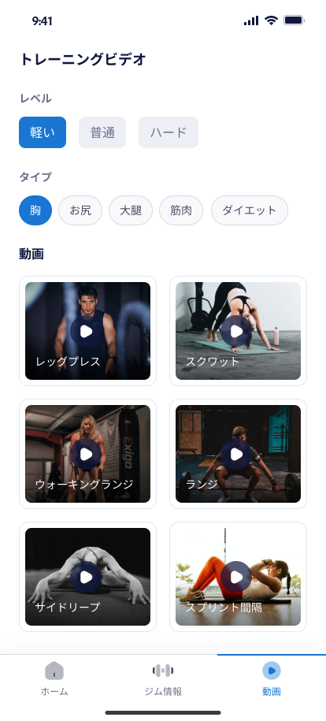
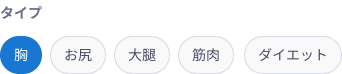
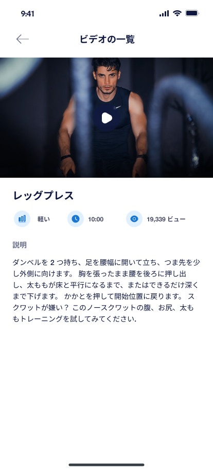
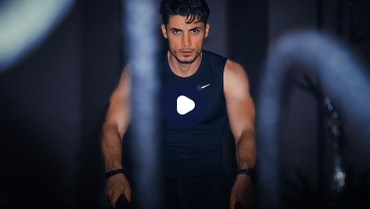
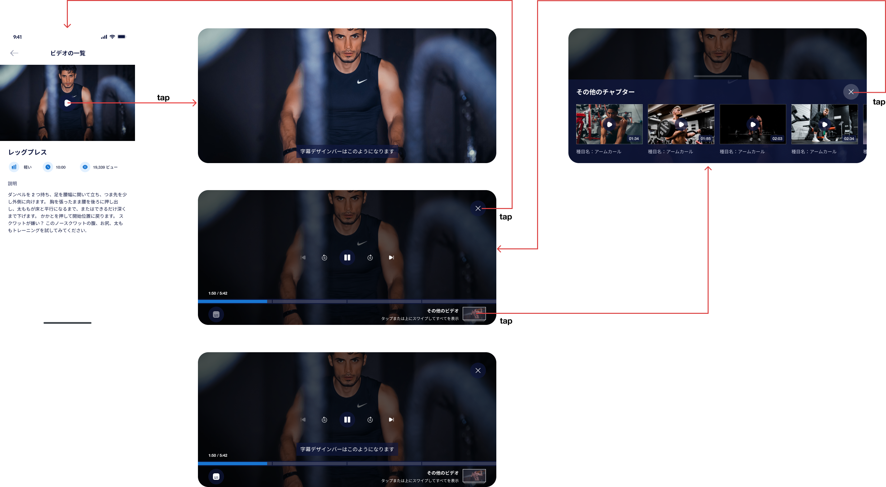

# 【MB】 **Online video**

- Tap vào icon 1 ở Navigation manu để vào mà hình **List video**

## Màn hình **List video**

### Định nghĩa các thành phần có Action 

##### レベル-Level `Block`

- Level có 3 mức độ: 軽い - nhẹ nhàng、普通 - bình thường 、ハード- nặng
- Tap vào level nào thì hightlight và filter những video của level đó. Có thể kết hợp filter chung với label 
- Tap vào level đang highlight thì bỏ highlight và bỏ filter. Hiển thị lại tất cả videos- all levels

##### ラベル-Label `Slider`

- Hiển thị tất cả label của toàn bộ videos
- Tap vào label nào thì hightlight và filter những video của label đó. Có thể kết hợp filter chung với level 
- Tap vào label đang highlight thì bỏ highlight và bỏ filter. Hiển thị lại tất cả videos- all label

##### List video `Block`

- Hiển thị list video

##### Video `Block`

- Hiển thị video thumbnail, title
- Tap vào video thì redirect qua màn hình **Video detail** đó

### Error List

`None`

## Màn hình **Video detail** 

### Định nghĩa các thành phần có Action 

##### ビデオ一覧- Back to list video `Button`

- Tap vào nút này thì quay lại màn hình **List video** 

##### Video thumnail + Play icon `Block`

- Tap vào block này sẽ play video ở chế độ full màn hình 
- Ở màn hình này không play video được

##### Video detail   `Block`

- API data：
    - `レッグプレス`: title
    - `軽い`：Level, tuỳ vô level mà icon sẽ thay đổi
    - `10:00`： thời lượng video
    - `19,339`： view, lấy từ youtube
    - `ダンベルを 2 つ持ち、足を腰幅に開いて立ち、つま先を少し外側に向けます。 胸を張ったまま腰を後ろに押し出し、太ももが床と平行になるまで、またはできるだけ深くまで下げます。 かかとを押して開始位置に戻ります。 スクワットが嫌い？ このノースクワットの腹、お尻、太ももトレーニングを試してみてください.`： video description

### Error List

`None`

## **Video full màn hình** 

### Định nghĩa các thành phần có Action 

##### Video Frame `Frame`

- Tap vào video frame sẽ hiển thị những nút controller của video đó
- Nếu các nút controller đang hiển thị và user tap vào video frame thì chúng sẽ ẩn đi. Hoặc nếu user không thao tác gì thì sau 5s những nút đó cũng sẽ được ẩn đi

##### Subtitle `Block`

- Hiển thị subtitle của video

##### 動画終了- Close video   `Button`

- Tap vào nút này sẽ tắt video và quay lại màn hình **Video detail**

##### 一時停止・再生 - Pause・Play `Button`

- Pause/Play video 
- Nếu user tap vào nút pause thì sẽ dừng video lại và đổi lại thành nút Play. Và ngược lại

##### 次の10秒- Next 10s  `Button`

- Tua video 10s tới

##### 10秒前- Previous 10s  `Button`

- Back lại video 10s trước

##### 次のビデオ- Next video   `Button`

- Nếu tap vào nút này thì sẽ play video tiếp theo trong list video. Nếu list video chỉ có 1 video hoặc video đang play là video cuối thì sẽ disabled nút này

##### 前のビデオ- Previous video   `Button`

- Nếu tap vào nút này thì sẽ play video trước đó trong list video. Nếu list video chỉ có 1 video hoặc video đang play là video đầu tiên thì sẽ disabled nút này

##### その他のチャプター - Other chapters    `Slider`

- Hiển thị danh sách chapter, có thể swipe để xem các chappter khác nếu có nhiều chapter không hiển thị đuọc hết trên màn hình
- Tap vào chapter nào thì sẽ đóng list chapter và di chuyển đến thời gian bắt đầu của chapter đó

##### その他のチャプター閉じる- Close other chapters   `Button`

- Đóng list chapter

##### 字幕スイッチ- Subtitle swich   `Button`

- Turn on/off subtitle

### Error List

`None`

## Màn hình **End video** 

### Định nghĩa các thành phần có Action 

##### 次の動画- Next video `Block`

- Play video tiếp theo. Nếu video này là video cuối trong list video thì hiển thị video đầu tiên
- Hiển thị bao gồm video thumbnail, title, thời lượng

##### 再生-Play   `Button`

- Play lại video này

##### 終了- Stop `Button`

- Dừng video và quay lại màn hình **List video**

### Error List

`None`
