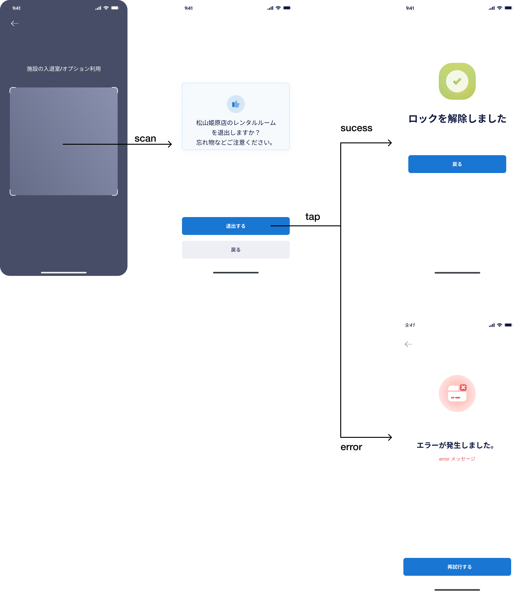

# 【MB】 **Check-in**

- User có thể quét mã QR của từng dịch vụ để sử dụng các dịch vụ mà Pocket cung cấp. Có các loại dịch vụ chính như sau:
    - Check-in
    - Phòng thay đồ
    - Nước uống
    - Check-out

## Màn hình **Quét mã QR** 

### Định nghĩa các thành phần có Action 

##### Back `Button`

- Tap vào nút này thì quay lại màn hình **Home** .

##### Scan QR code `Frame`

- Khi vào màn hình này thì sẽ tự động quét mã QR.
- Nếu user quét mã QR không hợp lệ thì sẽ hiển thị popup lỗi. Tap nào nút `戻る` thì sẽ quay lại màn hình **Quét mã QR**
- Nếu user chưa đến ngày sử dụng dịch vụ quét mã QR hợp lệ thì sẽ hiển thị popup lỗi. Tap nào nút `戻る` thì sẽ quay lại màn hình **Quét mã QR**
- Sau khi quét mã QR thành công, sẽ redirect qua màn hình **Xác nhận sử dụng dịch vụ** . Tuỳ vào từng mã QR mà sẽ redirect qua các màn hình khác nhau. Có 5 loại mã QR như sau:
    - Main door-cửa vào (Check-in)
    - Tebura-cửa vào (Phòng thay đồ)
    - Tebura-cửa ra (Phòng thay đồ)
    - Khoá nước
    - Main door-cửa ra (Check out)
    
### Error List

#### 画面エラー（Screen Error）

- Lỗi mã QR không hợp lệ: `QRコードが無効です`
- Lỗi user chưa đến ngày sử dụng dịch vụ quét mã QR: Hiển thị lỗi từ bên API trả về. Message lỗi: `利用開始日より前は利用できません`

## Màn hình **Xác nhận sử dụng dịch vụ - Main door-cửa vào**

- Tại màn hình này có 5 pattern như sau
    - Case １：Khi chưa đạt mức tiền tối đa
    - Case ２：Sau khi charge tiền và check-in lần đầu, user có thể mở cửa vào free trong vòng 4h. Không liên quan đến việc user có check-out hay không. Ví dụ user checkin tuy nhiên 30 phút sau user checkout, thì vẫn có thể check-in free. Logic này để cho user có thể quay lại lấy đồ trong trường hợp để quên đồ trong phòng gym mà không cần phải trả tiền lại để mở cửa.
    - Case ３：Lần charge tiền cuối. Số tiền cần trả nhỏ hơn hoặc bằng số tiền sử dụng dịch vụ hiên tại
    - Case ４：Đã đạt mức tiền tối đa
    - Case 5: Khi user đang trong thời gian free checkin của coupon. Case này sẽ không tính trường hợp 4h sau khi checkin

### Định nghĩa các thành phần có Action 

##### Thông tin phòng gym `区画`

- API data
    - `5`：Số người hiện tại
    - `やや混雑`: Tình trang đông/ vắng, tuỳ vô số người hiện tại đang sử dụng phòng gym mà phần hiển thị sẽ khác nhau. Nếu bên admin site chưa set phần này thì hiển thị là `未設定`
    - `300`：Số tiền charge khi mở cửa. tuỳ vô số người hiện tại đang sử dụng phòng gym mà phần hiển thị sẽ khác nhau. Nếu bên admin site chưa set phần này thì hiển thị `300円です` thành `未設定`

##### Xác nhận thông tin vào cửa　`Block nền màu xanh dương`

- Case 1- API data：
    - `松山姫原店`：Tên phòng gym
- Case ２- API data：
    - `松山姫原店`：Tên phòng gym
    - `12:32`：Thời gian chage tiền và check-in lần đầu
    - `16:32`：Thời gian cuối cùng có thể mở cửa vào free
- Case ３- API data：
    - `松山姫原店`：Tên phòng gym
- Case 4- API data：
    - `松山姫原店`：Tên phòng gym
- Case ５- API data：
    - `60` : số ngày free tiền checkin của coupon
    - `20日 16:06:09` : số ngày giờ còn lại cho đến khi coupon hết hiệu lực. ngày giờ này sẽ tự động đếm ngược

##### Thông tin mức tiền tối đa `Block nền màu xanh lá`

- Case １・２・５：3 case này không có hiển thị block này
- Case ３- API data：
    - `150`：Số tiền cần trả
    - `松山姫原店`：Tên phòng gym
- Case ４- API data：
    - `松山姫原店`：Tên phòng gym

##### 入室する `Button`

- Khi tap nút này thì sẽ xử lí các logic theo thứ tự như sau: 
    - Check kết nối của smart-lock xem có thể mở khoá được hay không. Nếu lỗi kết nối thì redirect qua màn hình **Xử lí lỗi** .
    - Nếu smart-lock kết nối ok thì bắt đầu gọi API để mở khoá. Sau khi user mở cửa thành công thì redirect qua màn hình **Tạo training menu** .　Tham khảo ở trang **Training menu** . 
    - Trong khoảng thời gian mở khoá cho đến khi user mở cửa thành công thì sẽ hiển thị màn hình loading (thời gian chờ tối đa 7s). Trong vòng 7s nếu user mở cửa thành công thì sẽ redirect qua màn hình **Tạo training menu** mà không cần chờ hết 7s. Tín hiệu user mở cửa thành công sẽ nhận từ bên IoT
    - Sau khi user mở cửa thành công sẽ bắt đầu xử lí charge tiền. **Case 2,4,5 không cần xử lí charge tiền**
- Có 1 case đặc biệt như sau: nếu user ở màn hình này một thời gian mà không bấm nút mở khoá. Đến lúc mà user bấm nút mở khoá, số tiền cần trả đã thay đổi thì vẫn lấy số tiền đang hiển thị trên màn hình để charge cho user. 

##### 戻る `Button`

- Tap vào nút này thì quay lại màn hình **Home** .

### Error List

`None`

## Màn hình **Xử lí lỗi** 画面

### Định nghĩa các thành phần có Action

##### Back `Button`

- Tap vào nút này thì quay lại màn hình **Home** .

##### Error mesage `Block`

- Hiển thị error mesage. Có 2 pattern như sau: 
    - Lỗi kết nối smart-lock：`内部サーバーエラー`

##### 再試行する　`Button`

- Giống như khi bấm nút mở khoá ở màn hình trước đó

### Error List

#### Screen Error

- Lỗi kết nối smart-lock：`内部サーバーエラー`

## Màn hình **Xác nhận sử dụng dịch vụ - Tebura-cửa vào**

- Ở màn hình này có 2 patter như sau:
    - Case １： User đã đăng kí option Tebura
    - Case ２： User chưa đăng kí option Tebura. Mỗi lần sử dụng sẽ charge 500 yên, trong vòng 4h có thể mở cửa free.

### Định nghĩa các thành phần có Action

##### Số tiền sử dụng `Block`

- Chỉ có ở case 2
- API data
    - `松山姫原店`：Tên phòng gym
    - `500`： Số tiền charge nếu sử dụng. Trong trường hợp user đã charge thành công trước đó, nếu trong vòng 4h thì hiển thị là `0`

##### 使用する `Button`

- Khi tap nút này thì sẽ xử lí các logic theo thứ tự như sau:   
    - Check kết nối của smart-lock xem có thể mở khoá được hay không. Nếu lỗi kết nối thì redirect qua màn hình **Xử lí lỗi** .
    - Nếu smart-lock kết nối ok thì bắt đầu gọi API để mở khoá. Sau khi user mở cửa thành công thì redirect qua màn hình thông báo đã mở khoá thành công. Ở màn hình thông báo đã mở khoá thành công nếu tap nút `戻る` thì sẽ quay lại màn hình **Home** .
    - Trong khoảng thời gian mở khoá cho đến khi user mở cửa thành công thì sẽ hiển thị màn hình loading (thời gian chờ tối đa 7s). Trong vòng 7s nếu user mở cửa thành công thì sẽ redirect qua màn hình thông báo đã mở khoá thành công mà không cần chờ hết 7s. Tín hiệu user mở cửa thành công sẽ nhận từ bên IoT
    - Sau khi user mở cửa thành công sẽ bắt đầu xử lí charge tiền. **Case 1, hoặc mở cửa lại trong vòng 4h không cần xử lí charge tiền**

##### 戻る `Button`

- Tap vào nút này thì quay lại màn hình **Home** .

### Error List

`None`

## Màn hình **Xác nhận sử dụng dịch vụ - Tebura-cửa ra**

### Định nghĩa các thành phần có Action

##### Xác nhận thông tin mơ khoá　`Block`

- API data：
    - `松山姫原店`：Tên phòng gym
  
##### 退出する `Button`

- Khi tap nút này thì sẽ xử lí các logic theo thứ tự như sau:   
    - Check kết nối của smart-lock xem có thể mở khoá được hay không. Nếu lỗi kết nối thì redirect qua màn hình **Xử lí lỗi** .
    - Nếu smart-lock kết nối ok thì bắt đầu gọi API để mở khoá. Sau khi mở khoá thành công thì redirect qua màn hình thông báo đã mở khoá thành công. Ở màn hình thông báo đã mở khoá thành công nếu tap nút `戻る` thì sẽ quay lại màn hình **Home** .
    - Trong khoảng thời gian mở khoá cho đến khi user mở cửa thành công thì sẽ hiển thị màn hình loading (thời gian chờ tối đa 7s). Trong vòng 7s nếu user mở cửa thành công thì sẽ redirect qua màn hình thông báo đã mở khoá thành công mà không cần chờ hết 7s. Tín hiệu user mở cửa thành công sẽ nhận từ bên IoT

##### 戻る　`Button`

- Tap vào nút này thì quay lại màn hình **Home** .

### Error List

`None`

## Màn hình **Xác nhận sử dụng dịch vụ - Water**

- Ở màn hình này có 2 pattern như sau: 
    - Case １：User đã đăng kí option water
    - Case ２：User chưa đăng kí option water. Trường hợp này thì sẽ không mở khoá nước được

### Định nghĩa các thành phần có Action

##### Xác nhận thông tin mơ khoá　`Block`

- API data：
    - `松山姫原店`：Tên phòng gym

##### 使用する `Button`

- Chỉ có ở case 1
- Khi tap nút này thì sẽ xử lí các logic theo thứ tự như sau:
    - Check kết nối của khoá nước xem có thể mở khoá được hay không. Nếu lỗi kết nối thì redirect qua màn hình **Xử lí lỗi** .
    - Nếu khoá nước kết nối ok thì bắt đầu gọi API để mở khoá. Sau khi mở khoá thành công thì redirect qua màn hình thông báo đã mở khoá thành công. Ở màn hình thông báo đã mở khoá thành công nếu tap nút `戻る` thì sẽ quay lại màn hình **Home** .
    

##### 戻る `Button`

- Tap vào nút này thì quay lại màn hình **Home** .

### Error List

`None`

## Màn hình **Xác nhận sử dụng dịch vụ - Cửa ra**

### Định nghĩa các thành phần có Action

##### Xác nhận thông tin mơ khoá　`Block`

- API data：
    - `松山姫原店`：Tên phòng gym
  
##### 退出する `Button`

- Khi tap nút này thì sẽ xử lí các logic theo thứ tự như sau:   
    - Check kết nối của smart-lock xem có thể mở khoá được hay không. Nếu lỗi kết nối thì redirect qua màn hình **Xử lí lỗi** .
    - Nếu smart-lock kết nối ok thì bắt đầu gọi API để mở khoá. Sau khi mở khoá thành công thì redirect qua màn hình thông báo đã mở khoá thành công. Ở màn hình thông báo đã mở khoá thành công nếu tap nút `戻る` thì sẽ quay lại màn hình **Home** .
    - Trong khoảng thời gian mở khoá cho đến khi user mở cửa thành công thì sẽ hiển thị màn hình loading (thời gian chờ tối đa 7s). Trong vòng 7s nếu user mở cửa thành công thì sẽ redirect qua màn hình thông báo đã mở khoá thành công mà không cần chờ hết 7s. Tín hiệu user mở cửa thành công sẽ nhận từ bên IoT

##### 戻る　`Button`

- Tap vào nút này thì quay lại màn hình **Home** .

### Error List

`None`