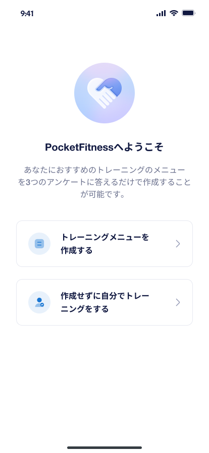
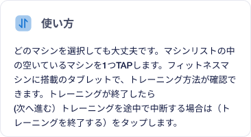
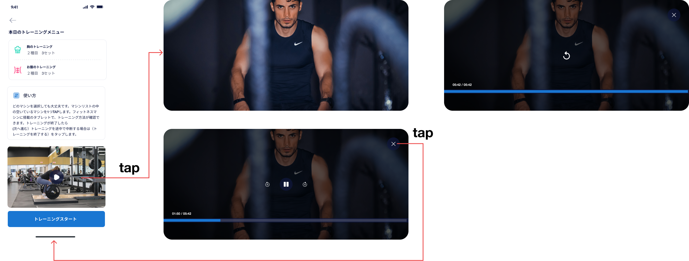
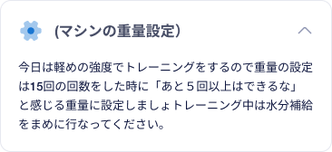
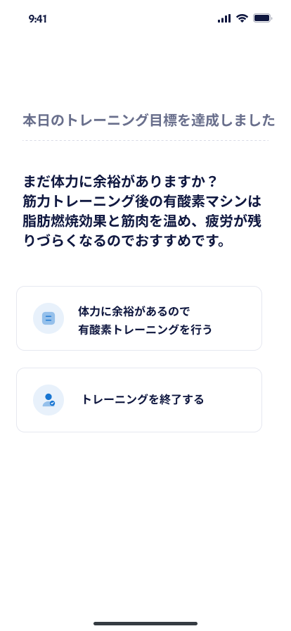
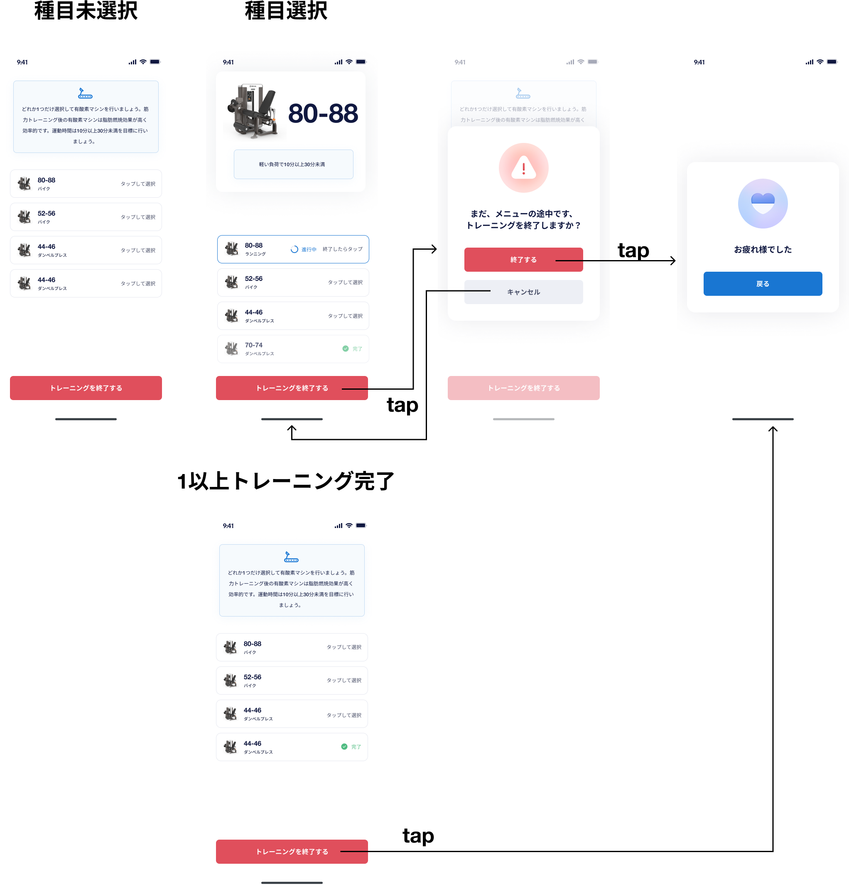

# 【MB】 **本日のトレーニングメーニュー**

- ユーザーがチェックインしてから、 **トレーニングメーニュー作成** 画面に移動され、トレーニングメーニュー作成できる。

## **トレーニングメーニュー作成** 画面

### 項目／イベント定義

##### トレーニングメニューを作成する `ボタン`

- このボタンをタップしたら、 **プラン質問** 画面に移動される

##### 作成せずに自分でトレーニングをする `ボタン`

- このボタンをタップしたら、チェックイン後の **ホーム** 画面に戻る

### 裏での処理

##### 自動的にホーム画面に戻る

- この画面に入ってから30分後、ユーザーが何も操作しなければ、自動的に **ホーム** 画面に戻る

### エラー一覧（Error List）

`None`

## **プラン質問** 画面

- 3つの質問に答えるだけで、システムはユーザーに適したトレーニングを推奨できる

### 質問１- 項目／イベント定義

##### 戻る `ボタン`

- このボタンをタップしたら、 **トレーニングメーニュー作成** 画面に戻る

##### 質問１の回答 `選択肢`

- デフォルトでは、最初の質問が選択される
- 質問１の回答によって、質問２の回答が異なる。 **質問マッピング**を参考

##### 次へ進む `ボタン`

- このボタンをタップしたら、 質問２の画面に移動される

### 質問２- 項目／イベント定義

##### 戻る `ボタン`

- このボタンをタップしたら、 質問１の画面に戻る

##### 質問２の回答 `選択肢`

- デフォルトでは、最初の質問が選択される
- 質問１の回答によって、質問２の回答が異なる。 **質問マッピング**を参考

##### 次へ進む `ボタン`

- このボタンをタップしたら、 質問３の画面に移動される

### 質問３- 項目／イベント定義

##### 戻る `ボタン`

- このボタンをタップしたら、 質問２の画面に戻る

##### 質問３の回答 `選択肢`

- トレーニングビデオのラベルとして回答リストを表示する
- ２つ回答を選択する必要がある。
- 2つ回答選択したら、他の回答が選択できなくなる
- ユーザが選択した順番が決められる。２つ選択している時に、１つ選択肢を外したら、残りの選択肢が自動的に１に変わる。

##### 次へ進む `ボタン`

- ２つ回答がまだ選択しなかったら、ボタンが無効になる
- このボタンをタップしたら、 **利用ガイド** 画面に移動される

### 参考データ

##### 質問マッピング`

### エラー一覧（Error List）

`None`

## **利用ガイド** 画面

### 項目／イベント定義

##### 戻る `ボタン`

- このボタンをタップしたら、 質問３の画面に戻る

##### トレーニングメーニュー `区画`

- ユーザーが選択した回答と順番に基づいて、トレーニングメニュー情報を表示する。 **質問マッピング**を参考

##### 使い方 `区画`

- デザイン通り表示

##### チュートリアルビデオ `区画`

- ビデオサムネイルと再生アイコン表示
- 再生アイコンをタップしたら、全画面表示でビデオを再生する。
- ビデオ全画面表示：
    - ビデオのフレームをタップしたら、すべてのビデオ関連のボタンが表示されます。
    - ビデオに関連するボタンがビデオ フレームに表示されている場合、ユーザーがもう一度タップすると非表示になります。 ユーザーが何もしない場合、ボタンは 5 秒後に非表示になります
    - `一時停止・再生`ボタンをタップしたら、ビデオを一時停止または再生する。 ユーザーが一時停止ボタンをタップしてからビデオを一時停止し、一時停止ボタンを再生ボタンに変更する、またはその逆の場合
    - `次の10秒`ボタンをタップしたら、動画を次の10秒進む
    - `10秒前`ボタンをタップしたら、動画を10秒前戻る
    - `動画終了`ボタンをタップしたら、動画を終了して、 **利用ガイド** 画面にに戻る
- 動画終了画面：
    - `再生`ボタンをタップしたら、動画を再生する。 
    - `動画終了`ボタンをタップしたら、動画を終了して、 **利用ガイド** 画面にに戻る

##### トレーニングスタート `ボタン`

- このボタンをタップしたら、 **トレーニング１種目目** 画面に移動される。

### エラー一覧（Error List）

`None`

## **トレーニング１種目目** 画面

- この外面には３つケースが想定される。
    - ケース１：種目選択しない
    - ケース２：トレーニング条件未達成
    - ケース３：トレーニング条件達成

### 項目／イベント定義

##### 種目情報 `区画`

- この区画は２つケースがあります。
    - ケース１：種目選択した時
    - ケース２：種目選択しない時
- ケース１
    - 画像スライダーとして、１種目目のマシン画像を表示する
    - スライダーを左右にスワイプして画像を変更できます。最初の画像を左にスライダしたら、最後の画像が表示される。最後の画像を右にスライダしたら、最初の画像が表示される。 **※実際のデータは画像が1枚の場合はありません**
    - `胸　1/2種目目`: 部位１
- ケース２
    - 選択したマシンの画像、シーケンス番号を表示する
    - ユーザーの回答に基づくトレーニングメーニュー内容の詳細表示。 **質問マッピング**を参考
    - `レッグプレス`: マシン名
    - `15回`: ユーザーの回答によって、異なる
    - `2セット`: ユーザーの回答によって、異なる

##### マシンの重量設定 `区画`

 

- 種目選択したケースのみ
- タップしたら、マシンの重量設定詳細が表示される

##### 種目一覧 `区画`

- ユーザーの回答に基づく種目一覧として、店舗のトレーニングマシンを表示する。
- 各マシンには 3 つの状態があります:
    - 未選択：未選択種目をタップしたら、進行中状態に変わる。画面上にある種目情報区画も更新される。
    - 進行中 -1：進行中の種目をそれ自体タップしたら、完了状態に変わる。画面上にある種目情報区画が種目未選択ケースのレイアウトに更新される。
    - 進行中 -2：進行中の状態で、他の未選択の種目をタップしたら、完了状態に変わると、選択した種目の状態を進行中に変わる。。画面上にある種目情報区画も更新される。
    - 進行中 -3：進行中の状態で、他の完了の種目をタップしたら、何も反応されない。
    - 完了：完了状態の種目をそれ自体タップしたら、未選択状態に変わる

##### トレーニング条件 `区画`

- ユーザーの回答に基づくトレーニング条件表示。 **質問マッピング**を参考

##### お腹のトレーニングへ進む `ボタン`

- ボタンのレベルは２種目目になる
- タップしたら、 **トレーニング２種目目** 画面に移動される。

##### トレーニングを終了する `ボタン`

- このボタンをタップしたら、トレーニング終了確認するポップアップが表示される
    - 終了するボタンをタップしたら、「お疲れ様でした」のポップアップが表示される。戻るボタンをタップしたら、チェックイン後の **ホーム** 画面に移動される
    - キャンセルボタンをタップしたら、 **トレーニング１種目目** 画面に戻る。

### エラー一覧（Error List）

`None`

## **トレーニング２種目目** 画面

- この外面には３つケースが想定される。
    - ケース１：種目選択しない
    - ケース２：トレーニング条件未達成
    - ケース３：トレーニング条件達成

### 項目／イベント定義

##### 種目情報 `区画`

- この区画は２つケースがあります。
    - ケース１：種目選択した時
    - ケース２：種目選択しない時
- ケース１
    - 画像スライダーとして、２種目目のマシン画像を表示する
    - スライダーを左右にスワイプして画像を変更できます。最初の画像を左にスライダしたら、最後の画像が表示される。最後の画像を右にスライダしたら、最初の画像が表示される。 **※実際のデータは画像が1枚の場合はありません**
    - `お腹　2/2種目目`: 部位２
- ケース２
    - 選択したマシンの画像、シーケンス番号を表示する
    - ユーザーの回答に基づくトレーニングメーニュー内容の詳細表示。 **質問マッピング**を参考
    - `レッグプレス`: マシン名
    - `15回`: ユーザーの回答によって、異なる
    - `2セット`: ユーザーの回答によって、異なる

##### マシンの重量設定 `区画`

 

- 種目選択したケースのみ
- タップしたら、マシンの重量設定詳細が表示される

##### 種目一覧 `区画`

- ユーザーの回答に基づく種目一覧として、店舗のトレーニングマシンを表示する。
- 各マシンには 3 つの状態があります:
    - 未選択：未選択種目をタップしたら、進行中状態に変わる。画面上にある種目情報区画も更新される。
    - 進行中 -1：進行中の種目をそれ自体タップしたら、完了状態に変わる。画面上にある種目情報区画が種目未選択ケースのレイアウトに更新される。
    - 進行中 -2：進行中の状態で、他の未選択の種目をタップしたら、完了状態に変わると、選択した種目の状態を進行中に変わる。。画面上にある種目情報区画も更新される。
    - 進行中 -3：進行中の状態で、他の完了の種目をタップしたら、何も反応されない。
    - 完了：進行中の種目をそれ自体タップしたら、未選択状態に変わる

##### トレーニング条件 `区画`

- ユーザーの回答に基づくトレーニング条件表示。 **質問マッピング**を参考

##### トレーニングを終了する `ボタン`

- このボタンをタップしたら、２つのケースが想定される：
    - ケース１：まだトレーニング条件が達成しない
    - ケース２：トレーニング条件が達成した
- ケース１：ボタンをタップしたら、トレーニング終了確認するポップアップが表示される
    - 終了するボタンをタップしたら、「お疲れ様でした」のポップアップが表示される。戻るボタンをタップしたら、チェックイン後の **ホーム** 画面に移動される
    - キャンセルボタンをタップしたら、 **トレーニング２種目目** 画面に戻る。
- ケース２：ボタンをタップしたら、 **有酸素トレーニング確認** 画面に移動される。

### エラー一覧（Error List）

`None`

## **有酸素トレーニング確認** 画面

### 項目／イベント定義

##### 体力に余裕があるので有酸素トレーニングを行う `ボタン`

- このボタンをタップしたら、 **有酸素トレーニングスタート** 画面に移動される

##### 作成せずに自分でトレーニングをする `ボタン`

- このボタンをタップしたら、「お疲れ様でした」のポップアップが表示される。戻るボタンをタップしたら、チェックイン後の **ホーム** 画面に移動される

### エラー一覧（Error List）

`None`

## **有酸素トレーニングスタート** 画面

- この画面には３つケースが想定される。
    - ケース１：種目選択しない
    - ケース２：種目選択した
    - ケース３：１つ以上トレーニング完了。進行中のトレーニングがない場合

### 項目／イベント定義

##### 種目情報 `区画`

- この区画は２つケースがあります。
    - ケース１：種目選択した時
    - ケース２：種目選択しない時
- ケース１
    - デザイン通り表示
- ケース２
    - 選択したマシンの画像、シーケンス番号を表示する

##### 種目一覧 `区画`

- 種目一覧として、店舗の有酸素マシンを表示する
- 各マシンには 3 つの状態があります:
    - 未選択：未選択種目をタップしたら、進行中状態に変わる。画面上にある種目情報区画も更新される。
    - 進行中 -1：進行中の種目をそれ自体タップしたら、完了状態に変わる。画面上にある種目情報区画が種目未選択ケースのレイアウトに更新される。
    - 進行中 -2：進行中の状態で、他の未選択の種目をタップしたら、完了状態に変わると、選択した種目の状態を進行中に変わる。。画面上にある種目情報区画も更新される。
    - 進行中 -3：進行中の状態で、他の完了の種目をタップしたら、何も反応されない。
    - 完了：進行中の種目をそれ自体タップしたら、未選択状態に変わる

##### トレーニングを終了する `ボタン`

- このボタンをタップしたら、３つのケースが想定される：
    - ケース１：種目選択しない
    - ケース２：トレーニング進行中
    - ケース３：１つ以上トレーニング完了
- ケース１・２：ボタンをタップしたら、トレーニング終了確認するポップアップが表示される
    - 終了するボタンをタップしたら、「お疲れ様でした」のポップアップが表示される。戻るボタンをタップしたら、チェックイン後の **ホーム** 画面に移動される
    - キャンセルボタンをタップしたら、 **有酸素トレーニングスタート** 画面に戻る。
- ケース３：ボタンをタップしたら、「お疲れ様でした」のポップアップが表示される。戻るボタンをタップしたら、チェックイン後の **ホーム** 画面に移動される

### エラー一覧（Error List）

`None`