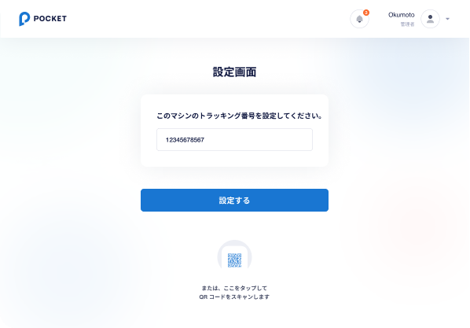
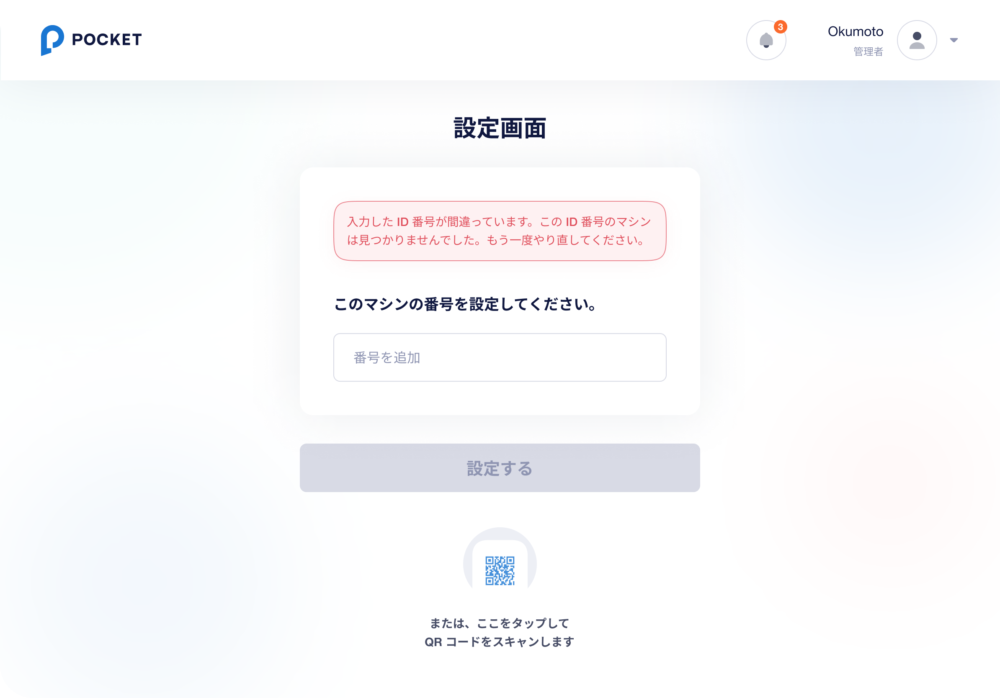
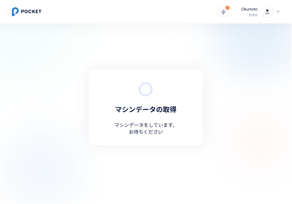
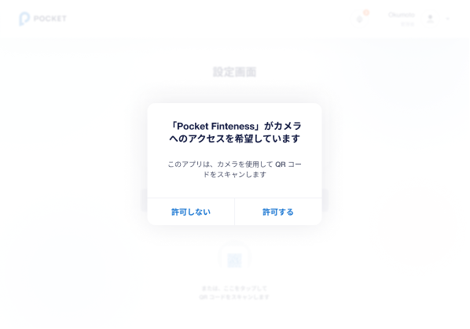
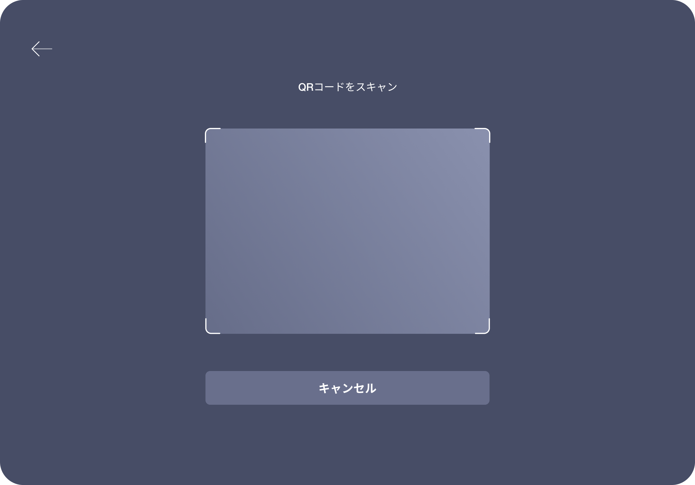
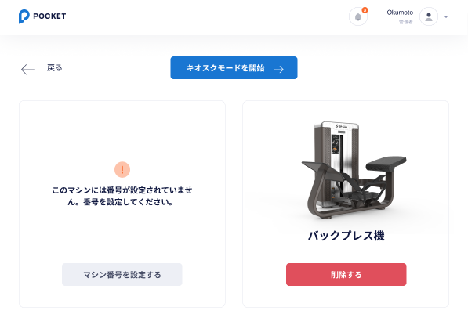
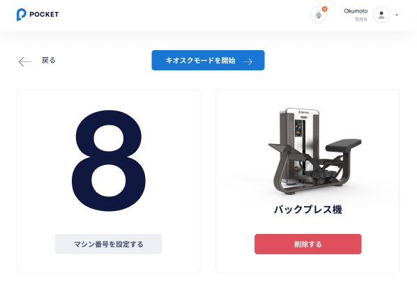

# 【TB】 **マシン設定**  `Machine setting`  

## **マシン番号入力**  `Enter machine number`

### 項目／イベント定義（Item Event Definition）

##### マシン番号  `Machine number`  **Number**

- required

##### 設定する  `Setting`  **Button**

- validate input info
- disabled when input is empty
- if response returns 200, then go to machine fetching screen and go to **マシン番号設定確認**   `Machine confirmation` screen when fetching data is done

##### QRコードスキャン  `Scan QR code`  **Button icon**
- show camera permission pop-up when there is no camera permission
- if already have camera permission, then go to **QRコードスキャン**   `Scan QR code` screen

### エラー一覧（Error List）

#### 画面エラー（Screen Error）

INVALID MACHINE NUMBER
:   `入力した ID 番号が間違っています。この ID 番号のマシンは見つかりませんでした。もう一度やり直してください。`

INVALID QR CODE
:   `スキャンしたQRコードに該当するマシンは見つかりませんでした。もう一度やり直してください。`

## **カメラ許可のリクエスト**  `Request for camera permission`

### 項目／イベント定義（Item Event Definition）

##### 許可する  `Allowed`  **Button**

- go to **QRコードスキャン**   `Scan QR code` screen

##### 許可しない  `Not allowed`  **Button**

- back to **マシン番号入力**   `Enter machine number` screen with an empty machine number input

### エラー一覧（Error List）

## **QRコードスキャン**  `Scan QR code`

### 項目／イベント定義（Item Event Definition）

##### QRコードスキャンフレーム  `Scan QR code frame`  **Frame**

- automatically scan QR code when entering this screen
- if the qr code is correct, then go to **マシン番号入力**  `Enter machine number` with the machine number filled in
- if the qr code is wrong, then back to **マシン番号入力**   `Enter machine number` screen and empty the machine number imput and show error message

##### キャンセル  ` Cancel`  **Button**

- go to **マシン番号入力**   `Enter machine number` screen with an empty machine number input

### エラー一覧（Error List）

## **マシン番号設定確認**  `Machine confirmation`

### 項目／イベント定義（Item Event Definition）

##### 設定する  `Setting`  **Button**

- go to **動画ダウンロード中**   `Dowloading video` screen and start downloading videos of the selected machine
- show downloading pop-up when video is dowloading
- when all video is finished downloading, go to **マシン設定成功**   `Successful setting` screen
- if there is an error during the video download, go to **マシン設定失敗**   `Error` screen

##### 戻る  ` Back`  **Button**

- go to **マシン番号入力**   `Enter machine number` screen with an empty machine number input

### エラー一覧（Error List）

## **動画ダウンロード中**   `Dowloading video`

### 項目／イベント定義（Item Event Definition）

##### ダッシュボード  ` Dashboard`  **Button**

- go to **ダッシュボード**   `Dashboard`　screen

##### ダウンロードした動画  ` Downloaded video`  ** Block**

- Display downloaded video. The first video in the above image corresponds to the video already downloaded
- inside this block, dislay video thumbnail, duration, title, description, tags of this video

##### ダウンロードした動画  ` Downloading video`  ** Block**

- Display downloading video. The second video in the above image corresponds to the downloading video
- inside this block, dislay video thumbnail, duration, title, description, tags of this video

##### 動画のダウンロード中にエラーが発生しました  ` error during video download`  ** Block**

- If the video downloads normally, this block will not be displayed
- If there is a error during video download, then this block will be displayed
- tap the 再試行する button to download the faulty video again

### エラー一覧（Error List）

## **ダッシュボード**   `Dashboard`

### 項目／イベント定義（Item Event Definition）

##### 戻る  `Back`  **Icon Button**

- back to **動画ダウンロード中**   `Dowloading video` screen

##### キオスクモード開始  `Enter Kiosk mode`  **Button**

- Enter Kiosk mode and go to **ホーム**   `Home` screen

##### マシン番号変更  ` Change sequence number`  **Button**

- If the result returned by api has a sequence number or sequence number is alrealdy set, then display this sequence number
- The sequence number must be unique. If the sequence number is set on other device, then it will not be set again
- go to **マシンシーケンス番号入力**   `Enter machine sequence number` screen

##### 削除する  ` Delete`  **Button**

- go to **動画削除確認**   `Video delete confirmation` screen

### エラー一覧（Error List）