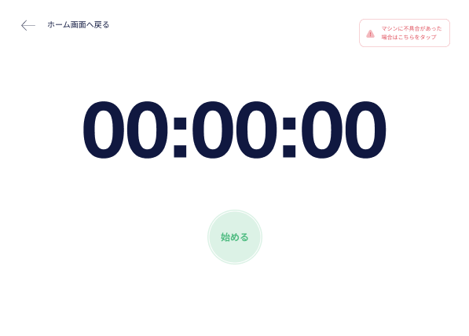
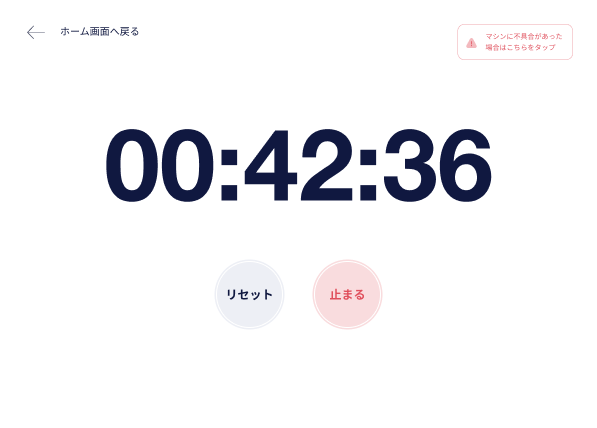

## 【TB】 **Kioskモードオペレーション**  `Kiosk mode operation`  

## **ホーム**  `Home`

### 項目／イベント定義（Item Event Definition）

##### ロゴ  `Logo`  **Icon button**

- After tape continuously 7 times, then go to the **キオスクモード終了**   `Exit Kiosk mode` screen
- need to tape continuously for 3s, if stop more than 3s, it will be counted from the beginning

##### マシンに不具合があった場合はこちらをタップ  `Report machine issue`  **Button**

- go to the **不具合報告**   `Report machine issue` screen

##### ビデオを開く  `Open video`  **Button**

- go to the **動画一覧**   `Video list` screen

##### タイマーを開始  `Start stop watch`  **Button**

- go to the **ストップウォッチ**   `Stop watch` screen

### エラー一覧（Error List）

## **キオスクモード終了**   `Exit Kiosk mode`

### 項目／イベント定義（Item Event Definition）

##### パスワード  `Password`  **Text**

- required, char(uppercase letters, lowercase letters, numbers), min:8char

##### キャンセル  `Cancel`  **Button**

- back to **ホーム**   `Home` screen

##### 終了  `Exit`  **Button**

- validate input info
- no error
  - exit kiosk mode, then go to **ダッシュボード**   `Dashboard` screen

### エラー一覧（Error List）

#### 項目エラー（Item Error）

##### パスワード  `Password`  ** Text**

EMPTY
:   `パスワードを入力してください。 これは必須です。`

INVALID FORMAT
:   `パスワードのフォーマットが無効です。`

MIN:8
:   `パスワードは8文字以内で入力してください。`

#### 画面エラー（Screen Error）

INVALID PHONENUMBER OR PASSWORD
:   `電話番号が間違っているかサポートされていないか、パスワードが間違っています。 もう一度やり直してください。`

## **不具合報告**   `Report machine issue`

### 項目／イベント定義（Item Event Definition）

##### 戻る  `Back`  **Icon button**

- back to **ホーム**   `Home` screen

##### 不具合内容  `Issue detail`  **List of button**

- list issue will be taken from the API
- each button corresponds to an issue detail
- When user tape the issue detail, it will call the API to send data to server and go to the **メンテナンス**   `Maintenance` screen

### エラー一覧（Error List）

## **メンテナンス**   `Maintenance`

### 項目／イベント定義（Item Event Definition）

##### ロゴ  `Logo`  **Icon button**

- After tape continuously 7 times, then go to the **キオスクモード終了**   `Exit Kiosk mode` screen
- need to tape continuously for 3s, if stop more than 3s, it will be counted from the beginning
- if admin returns to dashboard screen from this screen, dashboard screen will be in maintenance mode

##### 不具合内容  `Issue detail`  **Block**

- display the issue that user has submitted

### エラー一覧（Error List）

## **ダッシュボード_メンテナンスモード**   `Dashboard maintenance mode`

### 項目／イベント定義（Item Event Definition）

##### 閉じる  `Close pop-up`  **Button**

- Close the pop-up

##### 修理完了  `Repair completed`  **Button**

- enter Kiosk mode and go to **ホーム**  `Home` screen

##### キオスクモード開始  `Enter Kiosk mode`  **Button**

- If the pop-up is not closed, this button cannot be tape
- Enter Kiosk mode and go to **ホーム**   `Home` screen

##### マシン番号変更  ` Change sequence number`  **Button**

- If the pop-up is not closed, this button cannot be tape
- If the result returned by api has a sequence number, then display this sequence number
- The sequence number must be unique
- go to **マシンシーケンス番号入力**   `Enter machine sequence number` screen

##### 削除する  ` Delete`  **Button**

- If the pop-up is not closed, this button cannot be tape
- go to **動画削除確認**   `Video delete confirmation` screen

### エラー一覧（Error List）

## **動画一覧**   `Video List`

### 項目／イベント定義（Item Event Definition）

##### マシンに不具合があった場合はこちらをタップ  `Report machine issue`  **Button**

- go to the **不具合報告**   `Report machine issue` screen

##### ホーム画面に戻る  `Back to home`  **Icon Button**

- back to the **ホーム**  `Home`

##### 動画タッグリスト  `List video tags`  **Block**

- show all tags of videos included in this screen
- When user click on a tag, it will highlight that tag
- the first tag is the tag that includes all videos. When clicking this tag will display all videos
- When user click on other tags, the video of that tag will be displayed

##### 動画一覧  `List video`  **Block**

- show the downloaded videos of the selected machine

##### 動画  `Video`  **Block**

- dislay video thumbnail, duration, title, description, tags
- When user clicks on a video, it will play that video in fullscreen

#### 動画再生  `Play Video`  ** Button**

- When user clicks on button, it will play that video in fullscreen

### エラー一覧（Error List）

## **動画再生中**   `Video playing in fullscreen`

### 項目／イベント定義（Item Event Definition）

##### 動画フレーム  `Video Frame`  ** Frame**

- when user tap on video frame then it will show all video related buttons. 
- If the buttons related to the video are showing on video frame, and user tap again then they will be hidden. If user don't do anything, the buttons will be hidden after 5s

##### 字幕  `Subtitle`  **Block**

- Display subtitle of video in real-time

##### 動画終了  `Stop video`  **Icon button**

- stop video and back to **動画一覧**   `Video list` screen

#### 次の10秒  `Next 10s`  **Icon button**

- next 10s

#### 10秒前  ` Previous 10s`  **Icon button**

- previous 10s

##### 一時停止・再生  `Pause/ Play`  **Icon button**

- pause or play video. When user click pause button then pause video and change pause button to play button, and vice visar

#### チャプター  `Chapter`  **  button**

- When user click on a chapter, it will move to the start time of that chapter
- display up to 4 chapters on video frame.

#### その他のチャプター  `Other Chapter`  ** Button**

- Open a div in the bottom of video frame which show other chapter. Can swipe to view other chapters if more than 4 chapters
- When user click on a chapter, it will close div and move to the start time of that chapter

#### その他のチャプター閉じる  `Close other chapter`  ** Button**

- Close a div in the bottom of video frame which show other chapter

##### 字幕スイッチ  `On\off Subtitle`  ** button**

- Turn on／off subtitle of video

### エラー一覧（Error List）

## **動画終了**   `End of video`

## **ストップウォッチ**   `Stop watch`

### 項目／イベント定義（Item Event Definition）

##### マシンに不具合があった場合はこちらをタップ  `Report machine issue`  **Button**

- go to the **不具合報告**   `Report machine issue` screen

##### ホーム画面に戻る  `Back to home`  **Icon Button**

- back to the **ホーム**  `Home`

##### 始める  `Start`  **Icon Button**

- start stop watch and change layout

##### リセット  `Reset`  **Icon Button**

- reset stop watch and change layout

##### 止まる  `Pause`  **Icon Button**

- pause stop watch

### エラー一覧（Error List）