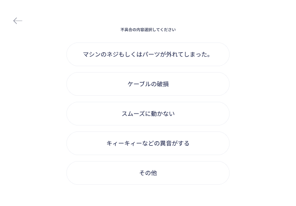
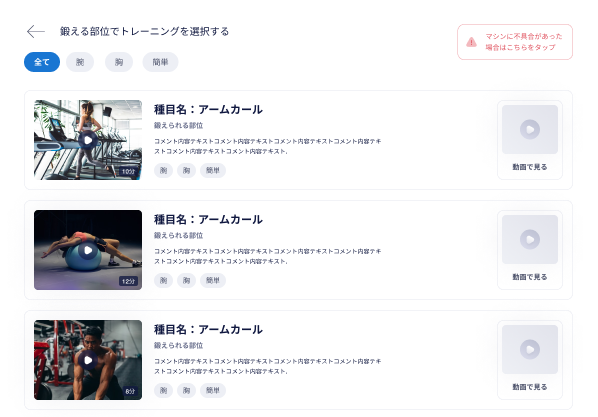
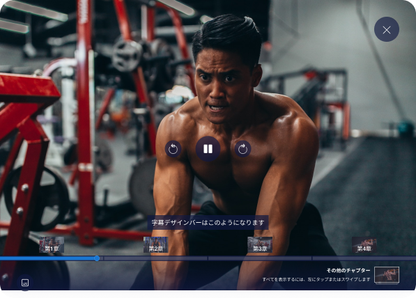

## 【TB】 **Kioskモードオペレーション**  `Kiosk mode operation`  

## **ホーム**  `Home`

### 項目／イベント定義（Item Event Definition）

##### ロゴ  `Logo`  **Icon button**

- After tape continuously 7 times, then go to the **キオスクモード終了**   `Exit Kiosk mode` screen
- need to tape continuously for 3s, if stop more than 3s, it will be counted from the beginning

##### マシンに不具合があった場合はこちらをタップ  `Report machine issue`  **Button**

- go to the **不具合報告**   `Report machine issue` screen

##### ビデオを開く  `Open video`  **Button**

- go to the **動画一覧**   `Video list` screen

##### タイマーを開始  `Start stop watch`  **Button**

- go to the **ストップウォッチ**   `Stop watch` screen

### エラー一覧（Error List）

## **キオスクモード終了**   `Exit Kiosk mode`

### 項目／イベント定義（Item Event Definition）

##### 携帯番号  `Phone number`  **Number**

- required, number,min:10char, max:11char、start from 070, 080, 090

##### パスワード  `Password`  **Text**

- required, char(uppercase letters, lowercase letters, numbers), min:8char

##### パスワード隠れ・パスワード明らか  `Password hide/reveal`  **Icon**

- reveal or hide password

##### キャンセル  `Cancel`  **Button**

- back to **ホーム**   `Home` screen

##### 終了  `Exit`  **Button**

- validate input info
- no error
  - exit kiosk mode, then go to **ダッシュボード**   `Dashboard` screen

### エラー一覧（Error List）

#### 項目エラー（Item Error）

##### 電話番号  `Phone number`  ** Number**

EMPTY
:   `電話番号を入力してください。これは必須です。`

INVALID FORMAT
:   `電話番号のフォーマットが無効です。`

MIN:10
:   `電話番号は10~11桁以内で入力してください。`

MAX:11
:   `電話番号は10~11桁以内で入力してください。`

##### パスワード  `Password`  ** Text**

EMPTY
:   `パスワードを入力してください。 これは必須です。`

INVALID FORMAT
:   `パスワードのフォーマットが無効です。`

MIN:8
:   `パスワードは8文字以内で入力してください。`

#### 画面エラー（Screen Error）

INVALID PHONENUMBER OR PASSWORD
:   `電話番号が間違っているかサポートされていないか、パスワードが間違っています。 もう一度やり直してください。`

## **不具合報告**   `Report machine issue`

### 項目／イベント定義（Item Event Definition）

##### 戻る  `Back`  **Icon button**

- back to **ホーム**   `Home` screen

##### 不具合内容  `Issue detail`  **List of button**

- list issue will be taken from the API
- each button corresponds to an issue detail
- When user tape the issue detail, it will call the API to send data to server and go to the **メンテナンス**   `Maintenance` screen

### エラー一覧（Error List）

## **メンテナンス**   `Maintenance`

### 項目／イベント定義（Item Event Definition）

##### ロゴ  `Logo`  **Icon button**

- After tape continuously 7 times, then go to the **キオスクモード終了**   `Exit Kiosk mode` screen
- need to tape continuously for 3s, if stop more than 3s, it will be counted from the beginning
- if admin returns to dashboard screen from this screen, dashboard screen will be in maintenance mode

##### 不具合内容  `Issue detail`  **Block**

- display the issue that user has submitted

### エラー一覧（Error List）

## **ダッシュボード_メンテナンスモード**   `Dashboard maintenance mode`

### 項目／イベント定義（Item Event Definition）

##### 閉じる  `Close pop-up`  **Button**

- Close the pop-up

##### 修理完了  `Repair completed`  **Button**

- enter Kiosk mode and go to **ホーム**  `Home` screen

##### キオスクモード開始  `Enter Kiosk mode`  **Button**

- If the pop-up is not closed, this button cannot be tape
- Enter Kiosk mode and go to **ホーム**   `Home` screen

##### マシン番号変更  ` Change sequence number`  **Button**

- If the pop-up is not closed, this button cannot be tape
- If the result returned by api has a sequence number, then display this sequence number
- The sequence number must be unique
- go to **マシンシーケンス番号入力**   `Enter machine sequence number` screen

##### 削除する  ` Delete`  **Button**

- If the pop-up is not closed, this button cannot be tape
- go to **動画削除確認**   `Video delete confirmation` screen

### エラー一覧（Error List）

## **動画一覧**   `Video List`

### 項目／イベント定義（Item Event Definition）

##### マシンに不具合があった場合はこちらをタップ  `Report machine issue`  **Button**

- go to the **不具合報告**   `Report machine issue` screen

##### 鍛える部位でトレーニングを選択する  `Back to video list`  **Icon Button**

- back to the **動画一覧**   `Video list` screen

##### 動画タッグリスト  `List video tags`  **Block**

- show all tags of videos included in this screen
- When user click on a tag, it will highlight that tag
- the first tag is the tag that includes all videos. When clicking this tag will display all videos
- When user click on other tags, the video of that tag will be displayed

##### 動画一覧  `List video`  **Block**

- show the downloaded videos of the selected machine

##### 動画  `Video`  **Block**

- dislay video thumbnail, duration, title, description, tags
- When user clicks on a video, it will play that video in fullscreen

#### 動画再生  `Play Video`  ** Button**

- When user clicks on button, it will play that video in fullscreen

### エラー一覧（Error List）

## **動画再生中**   `Video playing in fullscreenVideo playing in fullscreen`

### 項目／イベント定義（Item Event Definition）

##### 動画フレーム  `Video Frame`  ** Frame**

- when user tap on video frame then it will show all video related buttons. 

##### 鍛える部位でトレーニングを選択する  `Back to video list`  **Icon Button**

- back to the **動画一覧**   `Video list` screen

##### 動画タッグリスト  `List video tags`  **Block**

- show all tags of videos included in this screen
- When user click on a tag, it will highlight that tag
- the first tag is the tag that includes all videos. When clicking this tag will display all videos
- When user click on other tags, the video of that tag will be displayed

##### 動画一覧  `List video`  **Block**

- show the downloaded videos of the selected machine

##### 動画  `Video`  **Block**

- dislay video thumbnail, duration, title, description, tags
- When user clicks on a video, it will play that video in fullscreen

#### 動画再生  `Play Video`  ** Button**

- When user clicks on button, it will play that video in fullscreen

### エラー一覧（Error List）