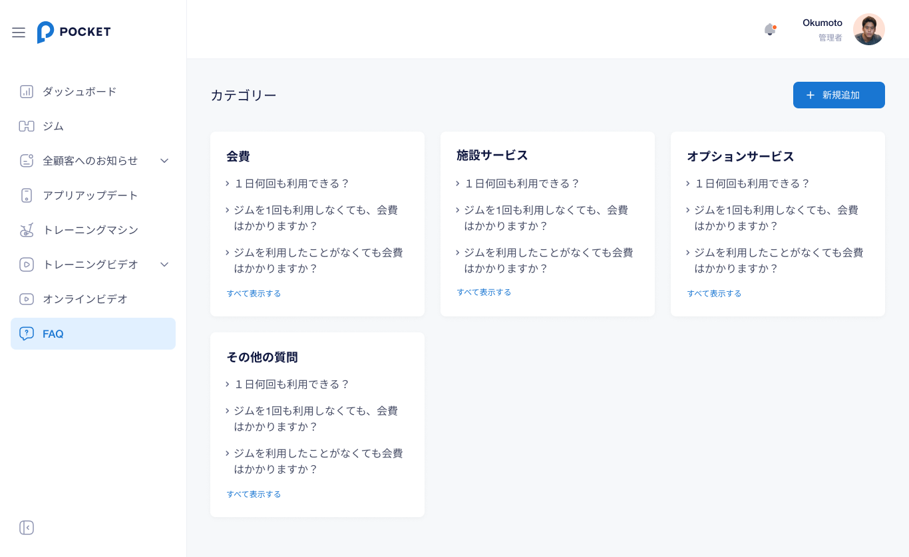

# 【CMS】 **FAQ** 画面

##　1．カテゴリー画面
カテゴリーごとに質問を見れる画面である。この画面で操作することによって、カテゴリーの詳細確認、カテゴリーを新規作成することができる。

#### 1.1 項目／イベント定義

この画面のカテゴリーごとは最大3つの質問まで表示すること。カテゴリごとの構成は以下になる。

- APIデータ：
    - `施設サービス`：カテゴリー名
    - `>1日何回も利用できる？`：質問
    - `>ジムを1回も利用しなくても、会費はかかりますか？`：質問。押下すると **該当の質問詳細画面** に遷移する。
    - `ジムを利用したことがなくても会費はかかりますか`：質問。押下すると **該当の質問詳細画面** に遷移する。

#### 1.2　すべて表示する `ボタン`

- カテゴリーごとの質問が２つ以下の場合、すべて表示する`ボタン`を表示しない。その場合、質問をタップすると、 **3．質問詳細画面** に直接に遷移する。

- カテゴリーごとの質問が3つ以上の場合、すべて表示する`ボタン`を表示する。すべて表示する`ボタン`を押下すると、 **2．カテゴリー詳細画面** に遷移する。

#### 1.3　新規作成 `ボタン`

- 新規作成`ボタン`を押下すると、 **4．カテゴリー新規作成画面** に遷移する

#### 1.4 エラー一覧（Error List）

`None`

##　2．カテゴリー詳細画面

カテゴリー内にある質問をすべて表示する画面である。この画面で、カテゴリー名の更新・カテゴリーの削除/新規追加をすることができる。

#### 2.1 項目／イベント定義

- APIデータ：
    - `会費`：カテゴリー名
    - `質問リスト`：リストのタイトル
    - `>1日何回も利用できる？`：質問。押下すると **該当の質問詳細画面** に遷移する。
    - `>ジムを1回も利用しなくても、会費はかかりますか？`：質問。押下すると **該当の質問詳細画面** に遷移する。
    - `ジムを利用したことがなくても会費はかかりますか`：質問。押下すると **該当の質問詳細画面** に遷移する。

####　2.2 更新 `ボタン`

- 更新`ボタン`を押下すると、 **カテゴリー名更新画面** に遷移する。

####　2.3 新規作成 `ボタン`

- 新規作成`ボタン`を押下すると、 **5．質問・回答の新規作成画面** に遷移する。

####　2.4 削除 `ボタン`

- 削除`ボタン`を押下すると、削除かどうかのポップアップが表示される。
   - `はい、削除します`ボタンを押下すると、カテゴリーのFAQを全て削除し、 **1．カテゴリー画面** に遷移する。
   - `キャンセル`ボタンを押下すると、 削除せずに **2．カテゴリー詳細画面** に戻る。

####  2.5 エラー一覧（Error List）

`None`

##　3．FAQ詳細画面

質問と回答の内容を確認できる。この画面で操作することによって、質問と回答の内容を更新・削除することができる。

#### 3.1 項目／イベント定義
- APIデータ：
    - `1日何回も利用できる？`：質問。押下不可。
    - `何度もご利用可能ですが、退出後再度入室の際にジム利用料金が発生致します`：回答。押下不可。

#### 3.2 ←戻る `ボタン`

- ←戻る`ボタン`を押下すると、 **2．カテゴリー詳細画面** に遷移する。

#### 3.3 更新 `ボタン`

- 更新`ボタン`を押下すると、 **5.2　FAQの更新画面** に遷移する。

#### 3.4 削除 `ボタン`

- 削除`ボタン`を押下すると、削除かどうかのポップアップが表示される。
   - `はい、削除します`ボタンを押下すると、FAQを削除し、 **2．カテゴリー詳細画面** に遷移する。
   - `キャンセル`ボタンを押下すると、 **3．FAQ詳細画面** に戻る

####  3.5 エラー一覧（Error List）

`None`

##　4．カテゴリー新規作成画面

新しいカテゴリーを新規作成する画面である。

#### 4.1 項目／イベント定義

- APIデータ：
    - `新しいカテゴリーを作成`：タイトル
    - `カテゴリー名`：項目名
- カテゴリー名を追加：
入力欄。必須入力。文字のみ入力可能。100文字までとする。

#### 4.2 保存せずに戻る `ボタン`

- 保存せずに戻る`ボタン`を押下すると、保存させずに **1．カテゴリー画面** に遷移する。

#### 4.3 保存 `ボタン`

- 保存`ボタン`を押下すると、データを保存し、 **1．カテゴリー画面** に遷移する。質問のエリアが空白で、すべて表示する `ボタン`を表示しないこと。

#### 4.4 エラー一覧（Error List）

- 「カテゴリー名を追加」の入力欄が未入力、または100文字を超えた場合、エラーとする。`「カテゴリー名を100文字以内で入力してください。」`のメッセージを表示する。

##　5．FAQの新規作成・更新画面

### 5.1 FAQの新規作成画面

新しいFAQを新規作成する画面である。

- APIデータ：
    - `質問を追加`：タイトル

### 5.2　FAQの更新画面

FAQを更新する画面である。

- APIデータ：
    - `質問変更`：タイトル

### 5.1と5.2の共通
#### APIデータ：
- `質問`：項目名
- `答え`：項目名
- 質問を書く：
入力欄。必須入力。文字のみ入力可能。100文字までとする。
- 答えを書く：
入力欄。必須入力。文字のみ入力可能。255文字までとする。

#### 保存せずに戻る `ボタン`

- 保存せずに戻る`ボタン`を押下すると、保存させずに **2．カテゴリー詳細画面** に遷移する。

#### 保存 `ボタン`

- 保存`ボタン`を押下すると、データを保存し、 **2．カテゴリー詳細画面** に遷移する。新規作成した質問と回答を表示すること。

#### エラー一覧（Error List）

-　保存`ボタン`を押下する時にバリデーションチェックを行う。

- 「質問を書く」の入力欄が未入力、または、100文字を超えた場合、エラーとする。`「質問を100文字以内で入力してください。」`のメッセージを表示する。

- 「答えを書く」の入力欄が未入力、または、255文字を超えた場合、エラーとする。`「答えを255文字以内で入力してください。」`のメッセージを表示する。

##　6．カテゴリー名更新・新規作成画面

### 6.1 カテゴリーの新規作成画面

新しいカテゴリーを新規作成する画面である。

- APIデータ：
    - `新しいカテゴリーを作成`：タイトル

### 6.2 カテゴリー名更新画面

カテゴリー名を更新する画面である。

- APIデータ：
    - `カテゴリー変更`：タイトル

### 6.1と6.2の共通

- APIデータ：
    - `新カテゴリー名を更新`：タイトル
    - `カテゴリー名`：項目名
- カテゴリー名を更新：
入力欄。必須入力。文字のみ入力可能。100文字までとする。

#### 保存せずに戻る `ボタン`

- 保存せずに戻る`ボタン`を押下すると、保存させずに **2．カテゴリー詳細画面** に遷移する。

#### 保存 `ボタン`

- 保存`ボタン`を押下すると、データを保存し、 **2．カテゴリー詳細画面** に遷移する。更新したカテゴリー名を表示すること。

#### エラー一覧（Error List）

- 「カテゴリー名を更新」の入力欄が未入力、または100文字を超えた場合、エラーとする。`「カテゴリー名を100文字以内で入力してください。」`のメッセージを表示する。