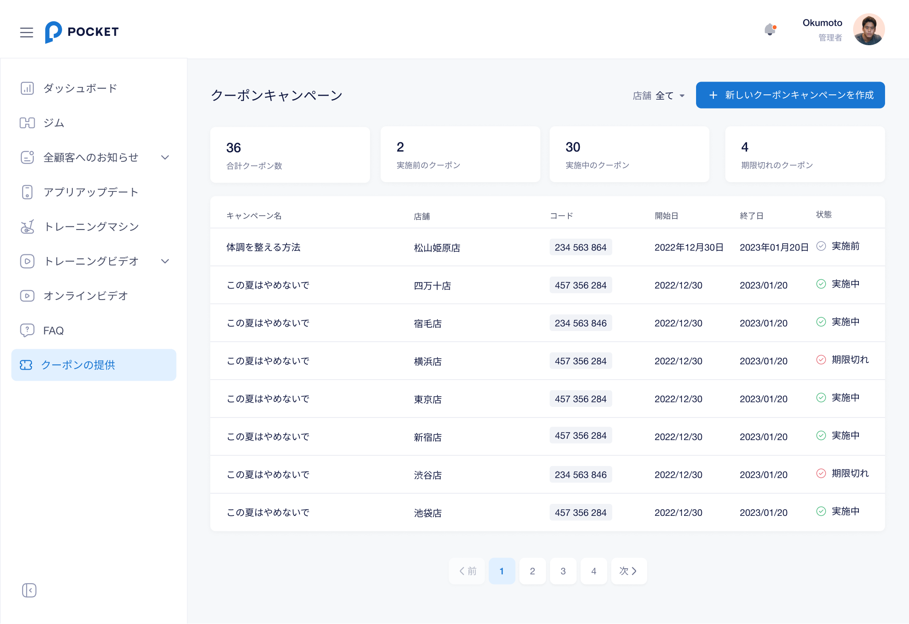
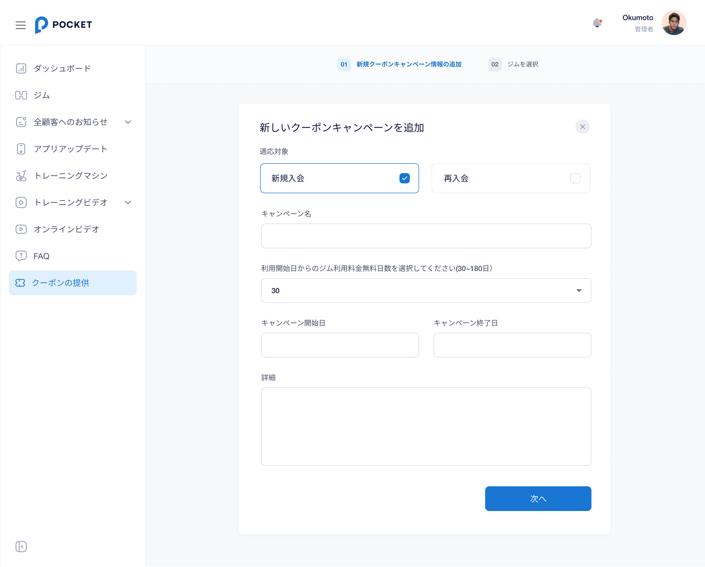
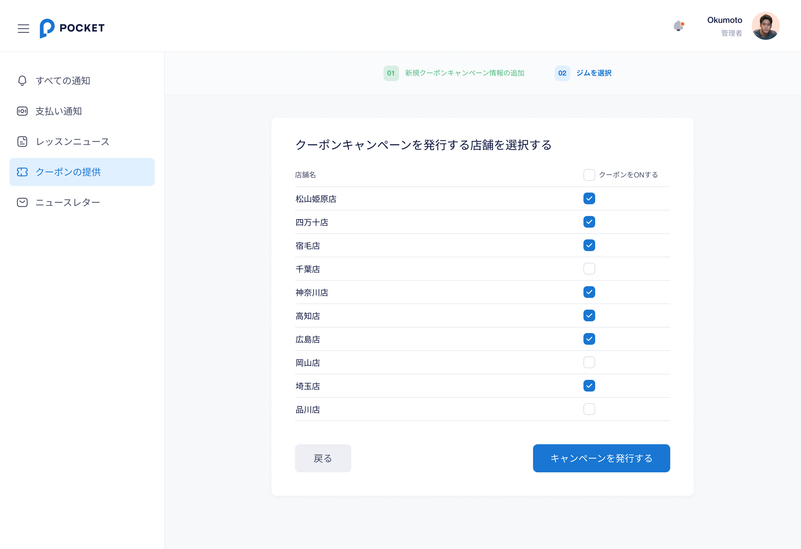
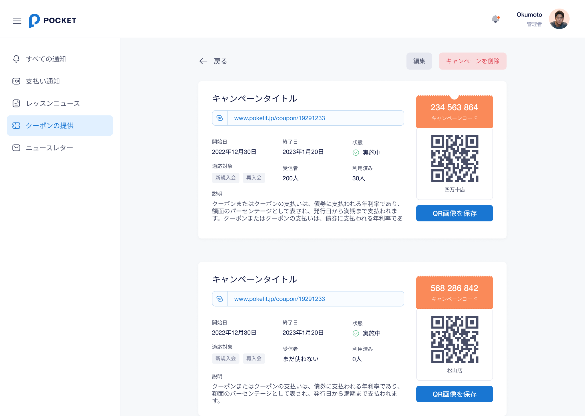

# 【CMS-MANAGER】 **クーポン** `Coupon`

## **クーポン一覧** 画面

### 項目／イベント定義

#### 店舗フィルター `フィルター`

- 店舗を選択して、その店舗のクーポン情報をフィルターして表示される

#### 新しいクーポンを作成 `ボタン`

- ボタンをタップしたら、 **クーポン追加・変更ステップ１** 画面に移動される。

#### 合計クーポン数 `区画`

- フィルタされている店舗の合計クーポン数を表示される
- 店舗を選択して、フィルターしたら、この数字が更新される

#### 実施前のクーポン `区画`

- フィルタされている店舗の実施前のクーポンを表示される
- 店舗を選択して、フィルターしたら、この数字が更新される

#### 実施中のクーポン `区画`

- フィルタされている店舗の実施中のクーポンを表示される
- 店舗を選択して、フィルターしたら、この数字が更新される

#### 期限切れのクーポン `区画`

- フィルタされている店舗の期限切れのクーポンを表示される
- 店舗を選択して、フィルターしたら、この数字が更新される

#### クーポン一覧 `区画`

- クーポン一覧はページに分かれており、1ページには10件のクーポンが含まれています
- クーポンのどこかをクリックすると、その **クーポン詳細** 画面に遷移される。
- 各クーポンのAPIデータ：
    - `体調を整える方法`：クーポン名
    - `松山姫原店`：クーポンの所属店舗
    - `234 563 864`：クーポンコード
    - `2022年12月30日`：クーポンの開始日。フォーマット：`YYYY年mm月dd日`
    - `2023年01月20日`：クーポンの終了日。フォーマット：`YYYY年mm月dd日`
    - `実施前`：クーポンの状態。状態には、実施前と実施中と期限切れの３種類があります

### エラー一覧（Error List）

`None`

## **クーポン追加・変更ステップ１** 画面

### 項目／イベント定義

#### ステップバー

- ジム作成の各ステップである。 **01　新規キャンペーン情報の追加/ 02　ジムを選択** の2ステップがある。
- 色分け：
    - 青：現在のステップ
    - グレー：未完了のステップ
    - 緑：完了のステップ

#### X `ボタン`

- このボタンをタップしたら、 **クーポン一覧** 画面に戻る

#### 適応対象 `チェックボックス`

- デフォルトには、新規入会のオプションが選択される。
- 1 つのオプションのみを選択している場合、そのオプションの選択を解除することはできません
- 両方選択可能
- クーポン開始日がスタートしたら適応対象の変更はできない。

#### クーポン名 `インプット`

- 必要、255文字以下
- 255文字以上入力できない
- 終了日前であればタイトルを変更できます

#### 利用開始日からのジム利用料金無料日数を選択してください(30~180日） `選択肢`

- 必要
- デフォルトには、30オプションが選択される
- 選択肢は30 ~ 180含まれる
- クーポン開始日がスタートしたら日数の変更はできない。

#### クーポン開始日 `インプット`

- 必要
- クーポン開始日がスタートしたら開始日の変更はできない。
- キャンペーンの開始日は、他のキャンペーンの有効期間内にすることはできません

#### クーポン終了日 `インプット`

- 必要
- 終了日前であればクーポン終了日を変更できます

#### 詳細 `インプット`

- 必要、1000文字以下
- 1000文字以上入力できない
- 終了日前であれば説明を変更できます

#### 次へ `ボタン`

- ボタンをタップしたら、入力された情報を検証する
- エラーがなかったら、 **クーポン追加・変更ステップ２** 画面に移動される

### エラー一覧（Error List）

#### 項目エラー（Item Error）

- クーポン名
    - 必要： `クーポン名を入力してください`

- クーポン開始日
    - 必要： `クーポン開始日を入力してください`
    - 開始日が他のキャンペーンの有効期間内である: `別のキャンペーンが実施されているため、作成できませんでした`

- クーポン終了日
    - 必要： `クーポン終了日を入力してください`

- 詳細
    - 必要： `詳細を入力してください`

## **クーポン追加・変更ステップ２** 画面

### 項目／イベント定義

#### ステップバー

- ジム作成の各ステップである。 **01　新規キャンペーン情報の追加/ 02　ジムを選択** の2ステップがある。
- 色分け：
    - 青：現在のステップ
    - グレー：未完了のステップ
    - 緑：完了のステップ

#### X `ボタン`

- このボタンをタップしたら、 **クーポン一覧** 画面に戻る

#### 店舗選択 `選択肢`

- 情報登録済みの店舗をリストする
- 店舗をタップしたら、その店舗が選択される
- 1 つの店舗のみを選択している場合、その店舗を解除することはできません
- 店舗の開始日がクーポンの開始日クーポンの開始日以降の店舗が選択できない
- クーポン変更時に、店舗再選択できない

#### 戻る `ボタン`

- このボタンをタップしたら、 **クーポン追加・変更ステップ１** 画面に戻る

#### クーポンを発行する `ボタン`

- 店舗がまだ選択されなかったら、このボタンが非活性になる
- ボタンをタップしたら、クーポンを発行される。処理が終わったら、 **クーポン一覧** 画面に移動される
- クーポンコードのフォマット
    - 一般クーポン： 9XX XXX XXX

### エラー一覧（Error List）

`None`

## **クーポン詳細** 画面

### 項目／イベント定義

#### 戻る `ボタン`

- このボタンをタップしたら、 **クーポン一覧** 画面に戻る

#### 編集 `ボタン`

- クーポンの期限が切れたら、このボタンが隠れる
- ボタンをクリックしたら、 **クーポン追加・変更ステップ１** 画面に遷移する。

#### クーポンを削除 `ボタン`

- ボタンをクリックしたら、削除かどうかのポップアップが表示される。
   - `はい、削除します`ボタンをクリックしたら、クーポンを削除して、 **クーポン一覧** 画面に遷移する。
   - `キャンセル`ボタンをクリックしたら、 削除せずに **クーポン詳細** に戻る。

#### クーポン詳細 `区画`

- 各クーポンのAPIデータ：
    - `キャンペーンタイトル`：クーポン名
    - `www.pokefit.jp/coupon/19291233`：クーポンURL
    - `2022年12月30日`：クーポンの開始日。フォーマット：`YYYY年mm月dd日`
    - `2023年01月20日`：クーポンの終了日。フォーマット：`YYYY年mm月dd日`
    - `実施中`：クーポンの状態。状態には、実施前と実施中と期限切れの３種類があります
    - `新規入会`、`再入会`：適応対象。適応対象には、新規入会と再入会の２種類があります
    - `200人`：受信者数。クーポンがまだ適応しない場合は、`まだ使わない`で表示する
    - `30人`：利用済み者数
    - `クーポンまたはクーポンの支払いは、債券に支払われる年利率であり、額面のパーセンテージとして表され、発行日から満期まで支払われます。クーポンまたはクーポンの支払いは、債券に支払われる年利率であ`：クーポン詳細
    - `234 563 864`：クーポンコード
    - QRコード：クーポンURLの情報が入る
    - `四万十店`：クーポンの所属店舗
   
#### QR画像を保存 `ボタン`

- ボタンをクリックしたら、QRコードの画像をPNGフォマットでダウンロードする

### エラー一覧（Error List）

`None`