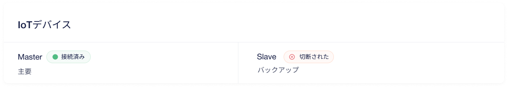
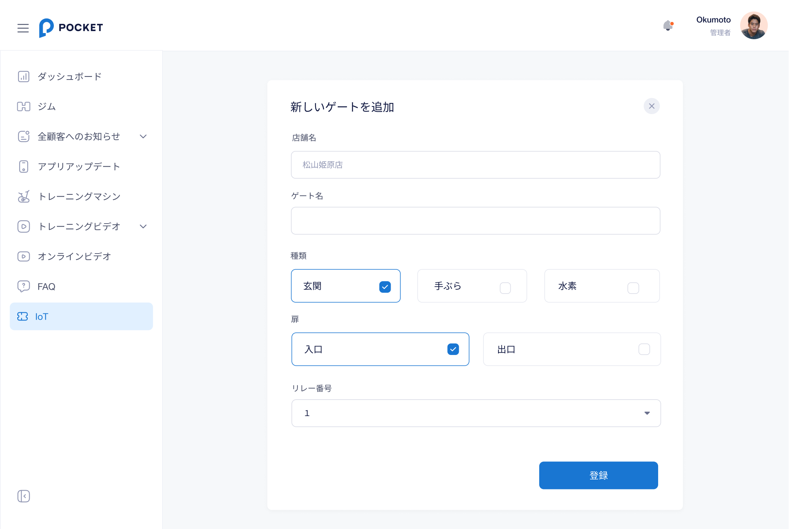

# 【CMS-MANAGER】 **IoT** `IoT`

## **デバイスとゲート一覧** 画面

### 項目／イベント定義

#### 店舗フィルター `フィルター`

- 店舗を選択して、その店舗のIoT情報をフィルターして表示される
- 全店舗のオプションがフィルターできない

#### 新しいIoTデバイスを作成 `ボタン`

- まだデバイスが登録しなかったら、このボタンが表示される
- ボタンをタップしたら、 **デバイス追加・変更** 画面に移動して、店舗のパラメータを渡す。

#### IoTデバイスを変更`ボタン`

- デバイスが登録済みの場合、このボタンが表示される
- ボタンをタップしたら、 **デバイス追加・変更** 画面に移動して、店舗のパラメータを渡す。

#### デバイス一覧 `区画`

- 店舗のIoTデバイス一覧を表示する
- 各デバイスのAPIデータ：
    - `Master`：デバイス名
    - `接続済み`：デバイスの状態。状態には、接続済みと切断されたの２種類があります
    - `主要`：デバイスの種類。デバイスの種類には、主要とバックアップの２種類があります

#### 新しいゲートを作成 `ボタン`

- まだデバイスが登録しなかったら、このボタンが非活性になる
- ボタンをタップしたら、 **ゲート追加・変更** 画面に移動して、店舗のパラメータを渡す。

#### ゲート一覧 `区画`

- リレーの番号付きの店舗のゲート一覧を表示する。
- 各ゲートのAPIデータ：
    - `玄関 1ー入口`：ゲート名
    - `玄関`：ゲートの種類。ゲートの種類には、玄関と手ぶらと水素の３種類があります
    - `入口`：扉。扉には、入口と出口の２種類があります。水素の場合は、扉がない
    - `1`：リレー番号。
    - `接続済み`：デバイスの状態。状態には、接続済みと切断されたの２種類があります
    -  ボタンをタップしたら、 **ゲート追加・変更** 画面に移動される。
    -  ボタンをタップしたら、削除かどうかのポップアップが表示される。`はい、削除します`ボタンをクリックしたら、ゲートを削除して、 **デバイスとゲート一覧** 画面に遷移する。`キャンセル`ボタンをクリックしたら、 削除せずに **デバイスとゲート一覧** に戻る。

#### ログ アクティビティ一覧 `区画`

- 店舗の来店履歴一覧を表示する
- 各履歴のAPIデータ：
    - `玄関 1ー入口`：ゲート名
    - `Truong`：ユーザー名
    - `1`：リレー番号。
    - `2023年1月9日 21:12:00`：ゲートを開けた日時。フォーマット：YYYY年MM月dd日 hh:mm:ss
    - `opening`：ゲートの種類。ゲートの種類の種類には、openingとopenedとlockedの3種類があります

### エラー一覧（Error List）

`None`

## **デバイス追加・変更** 画面

### 項目／イベント定義

#### X `ボタン`

- このボタンをタップしたら、 **デバイスとゲート一覧** 画面に戻る

#### 店舗名 `インプット`

- このインプットが固定され、変更できない

#### 主要デバイス名 `インプット`

- 必要、25文字以下
- 25文字以上入力できない

#### バックアップデバイス名 `インプット`

- 必要、25文字以下
- 25文字以上入力できない

#### 登録 `ボタン`

- ボタンをタップしたら、入力された情報を検証する
- エラーがなかったら、主要デバイスとバックアップデバイスを登録して、 **デバイスとゲート一覧** 画面に移動される

### エラー一覧（Error List）

#### 項目エラー（Item Error）

- 主要デバイス名
    - 必要： `主要デバイス名を入力してください`

- バックアップデバイス名
    - 必要： `バックアップデバイス名を入力してください`

## **ゲート追加・変更** 画面

### 項目／イベント定義

#### X `ボタン`

- このボタンをタップしたら、 **デバイスとゲート一覧** 画面に戻る

#### 店舗名 `インプット`

- このインプットが固定され、変更できない

#### ゲート名 `インプット`

- 必要、25文字以下
- 25文字以上入力できない

#### 種類 `選択ボックス`

- デフォルトには、玄関のオプションが選択される。
- ゲートの種類には、玄関と手ぶらと水素の３種類があります
- 1 つのオプションのみを選択できる

#### 扉 `選択ボックス`

- デフォルトには、入口のオプションが選択される。
- 扉には、入口と出口の２種類があります
- 1 つのオプションのみを選択できる
- 水素を選択したら、この選択ボックスが非活性になる

#### リレー番号 `選択肢`

- デフォルトには、1オプションが選択される
- 選択肢は1~7含まれる
- 玄関と手ぶらの場合は１リレー番号で最大２つのゲート（入口と出口１つづつ）が登録できる。水素の場合は１リレー番号で最大１つのゲートが登録できる

#### 登録 `ボタン`

- ボタンをタップしたら、入力された情報を検証する
- エラーがなかったら、ゲートを登録して、 **デバイスとゲート一覧** 画面に移動される

### エラー一覧（Error List）

#### 項目エラー（Item Error）

- ゲート名
    - 必要： `ゲート名を入力してください`

#### 画面エラー（Screen Error）

- 最大のリレー番号: `このリレー番号が別のゲートが登録されますので、他のオプションを選択してください。`